```python
import scanpy as sc
import numpy as np
import scipy as sp
import matplotlib.pyplot as plt
from matplotlib import rcParams
from matplotlib import colors
import seaborn as sb
from gprofiler import GProfiler

import rpy2.rinterface_lib.callbacks
import logging

import warnings

from rpy2.robjects import pandas2ri
import anndata2ri
import pandas as pd
plt.rcParams['figure.figsize']=(8,8) #rescale figures
sc.settings.verbosity = 3
sc.set_figure_params(dpi=80, dpi_save=150)
sc.logging.print_versions()
import scanpy.external as sce
import scprep
```

    /home/spuccio/miniconda3/envs/scrnaseq2/lib/python3.6/site-packages/anndata/_core/anndata.py:21: FutureWarning: pandas.core.index is deprecated and will be removed in a future version.  The public classes are available in the top-level namespace.
      from pandas.core.index import RangeIndex
    /home/spuccio/miniconda3/envs/scrnaseq2/lib/python3.6/site-packages/rpy2/robjects/pandas2ri.py:34: UserWarning: pandas >= 1.0 is not supported.
      warnings.warn('pandas >= 1.0 is not supported.')


    scanpy==1.4.7.dev48+g41563144 anndata==0.7.1 umap==0.4.1 numpy==1.15.4 scipy==1.4.1 pandas==1.0.3 scikit-learn==0.22.1 statsmodels==0.11.0 python-igraph==0.7.1 louvain==0.6.1


# Import Raw Data


```python
adata=sc.read("/home/spuccio/datadisk2/SP007_RNA_Seq_Overexpression_MEOX1/scrnaseqmelanoma/Melanoma.txt",delimiter='\t',cache=True,first_column_names=True).transpose()
```

    ... reading from cache file cache/home-spuccio-datadisk2-SP007_RNA_Seq_Overexpression_MEOX1-scrnaseqmelanoma-Melanoma.h5ad


```python
adata
```


    AnnData object with n_obs × n_vars = 16291 × 55737 


# Import Metadata


```python
Metadata = pd.read_csv("/home/spuccio/datadisk2/SP007_RNA_Seq_Overexpression_MEOX1/scrnaseqmelanoma/MelanomaNewMeta.txt",sep="\t",header=None)
```


```python
Metadata.head()
```


<div>
<style scoped>
    .dataframe tbody tr th:only-of-type {
        vertical-align: middle;
    }

    .dataframe tbody tr th {
        vertical-align: top;
    }

    .dataframe thead th {
        text-align: right;
    }
</style>
<table border="1" class="dataframe">
  <thead>
    <tr style="text-align: right;">
      <th></th>
      <th>0</th>
      <th>1</th>
      <th>2</th>
      <th>3</th>
      <th>4</th>
      <th>5</th>
      <th>6</th>
      <th>7</th>
    </tr>
  </thead>
  <tbody>
    <tr>
      <th>0</th>
      <td>A10_P3_M11</td>
      <td>Sample-1</td>
      <td>Melanoma</td>
      <td>Biopsy</td>
      <td>SmartSeq2</td>
      <td>Pre</td>
      <td>P1</td>
      <td>Responder</td>
    </tr>
    <tr>
      <th>1</th>
      <td>A11_P1_M11</td>
      <td>Sample-2</td>
      <td>Melanoma</td>
      <td>Biopsy</td>
      <td>SmartSeq2</td>
      <td>Pre</td>
      <td>P1</td>
      <td>Responder</td>
    </tr>
    <tr>
      <th>2</th>
      <td>A11_P3_M11</td>
      <td>Sample-3</td>
      <td>Melanoma</td>
      <td>Biopsy</td>
      <td>SmartSeq2</td>
      <td>Pre</td>
      <td>P1</td>
      <td>Responder</td>
    </tr>
    <tr>
      <th>3</th>
      <td>A11_P4_M11</td>
      <td>Sample-4</td>
      <td>Melanoma</td>
      <td>Biopsy</td>
      <td>SmartSeq2</td>
      <td>Pre</td>
      <td>P1</td>
      <td>Responder</td>
    </tr>
    <tr>
      <th>4</th>
      <td>A12_P3_M11</td>
      <td>Sample-5</td>
      <td>Melanoma</td>
      <td>Biopsy</td>
      <td>SmartSeq2</td>
      <td>Pre</td>
      <td>P1</td>
      <td>Responder</td>
    </tr>
  </tbody>
</table>
</div>


```python
adata.obs['CellID'] = Metadata[1].to_list()
adata.obs['SampleID'] = Metadata[6].to_list()
adata.obs['Therapy'] = Metadata[5].to_list()
adata.obs['Outcome'] = Metadata[7].to_list()

```


```python
adata
```


    AnnData object with n_obs × n_vars = 16291 × 55737 
        obs: 'CellID', 'SampleID', 'Therapy', 'Outcome'


# Quality control


```python
scprep.plot.plot_library_size(adata[:, ].to_df()>0,log=False)
```


    <matplotlib.axes._subplots.AxesSubplot at 0x7f6c4a310ba8>


```python
scprep.plot.plot_gene_set_expression(adata[:, ].to_df())
```

    /home/spuccio/.local/lib/python3.6/site-packages/scprep/select.py:362: UserWarning: No selection conditions provided. Returning all columns.
      "No selection conditions provided. " "Returning all columns.", UserWarning


    <matplotlib.axes._subplots.AxesSubplot at 0x7f6c140a3a90>


```python
#sc.pp.log1p(adata)
```


```python
adata.var_names_make_unique() 
```


```python
# Quality control - calculate QC covariates
adata.obs['n_counts'] = adata.X.sum(1)
adata.obs['log_counts'] = np.log(adata.obs['n_counts'])
adata.obs['n_genes'] = (adata.X > 0).sum(1)
```


```python
mito_genes = adata.var_names.str.startswith('MT-')
ribo_genes = adata.var_names.str.startswith(("RPS","RPL"))
print(sum(mito_genes))
print(sum(ribo_genes))
```

    37
    927


```python
adata.obs['mt_frac'] = np.sum(
    adata[:, mito_genes].X, axis=1) / np.sum(adata.X, axis=1)
```


```python
adata.obs['ribo_frac'] = np.sum(
    adata[:, ribo_genes].X, axis=1) / np.sum(adata.X, axis=1)
```


```python
sc.pl.violin(adata, ['n_counts', 'n_genes','mt_frac','ribo_frac'],
             jitter=0.4, groupby = 'Therapy',save='QC_before.png')
```

    ... storing 'SampleID' as categorical
    ... storing 'Therapy' as categorical
    ... storing 'Outcome' as categorical


    WARNING: saving figure to file figures/violinQC_before.png


```python
print(adata.obs['Therapy'].value_counts())
```

    Post    10363
    Pre      5928
    Name: Therapy, dtype: int64


```python
print(adata.obs['Outcome'].value_counts())
```

    Non-responder    10727
    Responder         5564
    Name: Outcome, dtype: int64


```python
cc_genes_file ="/home/spuccio/datadisk2/SP007_RNA_Seq_Overexpression_MEOX1/MelanomaDurante/single-cell-tutorial/regev_lab_cell_cycle_genes.txt"
```

# Preprocessing


```python
sc.pl.scatter(adata, x='n_counts', y='mt_frac')
sc.pl.scatter(adata, x='n_counts', y='n_genes')
```


```python
scprep.plot.plot_gene_set_expression(adata[:, ].to_df())
```

    /home/spuccio/.local/lib/python3.6/site-packages/scprep/select.py:362: UserWarning: No selection conditions provided. Returning all columns.
      "No selection conditions provided. " "Returning all columns.", UserWarning


    <matplotlib.axes._subplots.AxesSubplot at 0x7f6c4a0aee80>


```python
sc.pp.log1p(adata)
```


```python
adata.raw = adata
```


```python
sc.pp.highly_variable_genes(adata, min_mean=0.0125, max_mean=3, min_disp=0.5)
```

    extracting highly variable genes
        finished (0:00:11)
    --> added
        'highly_variable', boolean vector (adata.var)
        'means', float vector (adata.var)
        'dispersions', float vector (adata.var)
        'dispersions_norm', float vector (adata.var)


```python
sc.pl.highly_variable_genes(adata)
```


```python
sc.pp.regress_out(adata[:, adata[:,].to_df().sum(axis=0) > 0], ['n_counts', 'mt_frac'])
```

    regressing out ['n_counts', 'mt_frac']
        finished (0:12:37)


# Principal component analysis


```python
sc.tl.pca(adata,n_comps=50, svd_solver='arpack')
```

        on highly variable genes
    computing PCA with n_comps = 50
        finished (0:00:06)


```python
sc.pl.pca(adata, color=['Therapy','Outcome'])
```


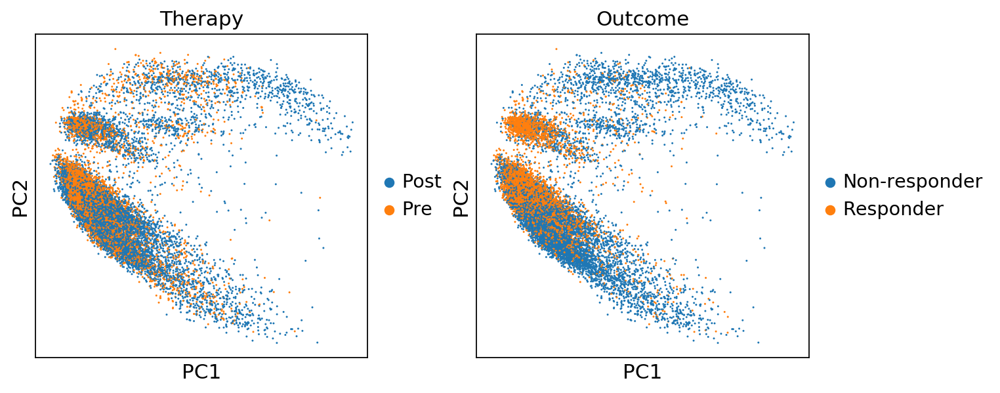


```python
sc.pl.pca(adata, color='n_counts')
```


```python
sc.pl.pca_variance_ratio(adata, log=True)
```


```python
sc.pp.neighbors(adata, n_neighbors=10, n_pcs=40)
```

    computing neighbors
        using 'X_pca' with n_pcs = 40
        finished: added to `.uns['neighbors']`
        `.obsp['distances']`, distances for each pair of neighbors
        `.obsp['connectivities']`, weighted adjacency matrix (0:00:09)


# Umap


```python
sc.tl.umap(adata,n_components=3,random_state=10)
```

    computing UMAP
        finished: added
        'X_umap', UMAP coordinates (adata.obsm) (0:00:14)


```python
sc.pl.umap(adata, color=['CD3E', 'CD8A', 'CD4'])
```


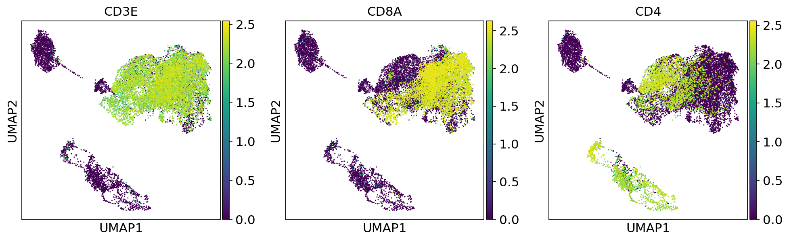


```python
fig, (ax1, ax2,ax3) = plt.subplots(1,3, figsize=(33/2.54, 17/2.54))

scprep.plot.scatter(x=adata[:, ['CD3E']].to_df(), y=adata[:, ['CD8A']].to_df(), c=adata[:, ['CD8A']].to_df(),  ax=ax1,
                    xlabel='CD3E Normalized Count Log2(TPM)', ylabel='CD8A Normalized Count Log2(TPM)', legend_title="CD8A", title='CD8A+ Cells')

scprep.plot.scatter(x=adata[:, ['CD3E']].to_df(), y=adata[:, ['CD4']].to_df(), c=adata[:, ['CD4']].to_df(),  ax=ax2,
                    xlabel='CD3E Normalized Count Log2(TPM)', ylabel='CD3E Normalized Count Log2(TPM)', legend_title="CD8A", title='CD4+ Cells')
scprep.plot.plot_gene_set_expression(adata[:, ['CD8A']].to_df().loc[adata[:, ['CD8A']].to_df()['CD8A']>=0.001],xlabel='CD8A Normalized Count Log2(TPM)',cutoff=2,ax=ax3,title="CD8A+ Threshold")

plt.tight_layout()
plt.show()
```

    /home/spuccio/.local/lib/python3.6/site-packages/scprep/select.py:362: UserWarning: No selection conditions provided. Returning all columns.
      "No selection conditions provided. " "Returning all columns.", UserWarning


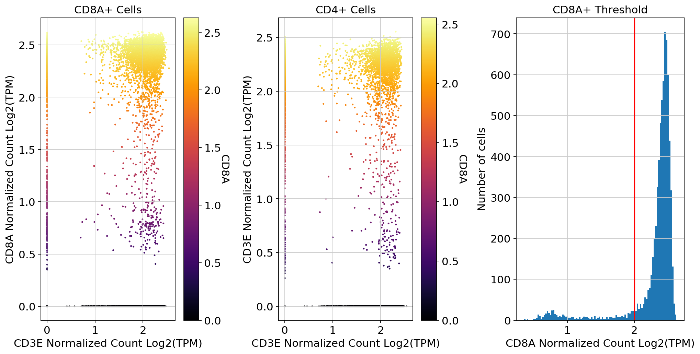


# Magic Imputation on CD45+


```python
adata_magic = adata.copy()
import scanpy.external as sce
#sce.pp.magic(adata_magic[:, adata_magic[:,].to_df().sum(axis=0) > 0.01], name_list="all_genes", knn=5)
sce.pp.magic(adata_magic, name_list="all_genes", knn=10)
```

    computing MAGIC


    /home/spuccio/.local/lib/python3.6/site-packages/magic/magic.py:472: UserWarning: Input matrix contains unexpressed genes. Please remove them prior to running MAGIC.
      "Input matrix contains unexpressed genes. "


      Running MAGIC with `solver='exact'` on 55737-dimensional data may take a long time. Consider denoising specific genes with `genes=<list-like>` or using `solver='approximate'`.
        finished (0:02:23)


```python
colors2 = plt.cm.Reds(np.linspace(0, 1, 128))
colors3 = plt.cm.Greys_r(np.linspace(0.7,0.8,20))
colorsComb = np.vstack([colors3, colors2])
mymap = colors.LinearSegmentedColormap.from_list('my_colormap', colorsComb)
```

# UMAP plot of CD45+ Before Imputation plotting some marker genes


```python
#sc.pp.scale(adata_fil)
sc.pl.umap(adata, color=['IL7R', 'CD8A', 'CD8B','CD4',  
                'LGALS3',  'GNLY', 'NKG7', 'KLRB1',
                'MEOX1','PRF1','GZMK','TOX'], use_raw=False, color_map=mymap)
```


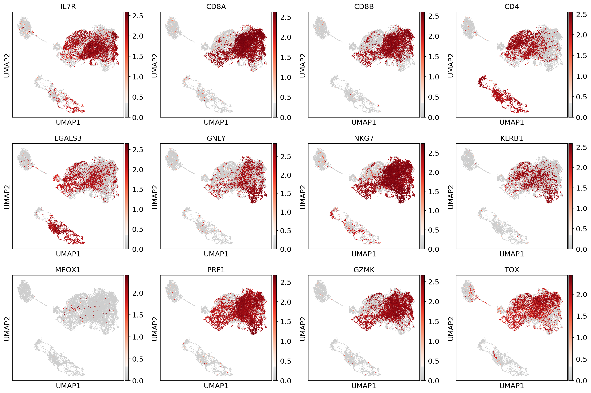


# UMAP plot of CD45+ After Imputation plotting some marker genes


```python
#sc.pp.scale(adata_fil)
sc.pl.umap(adata_magic, color=['IL7R', 'CD8A', 'CD8B','CD4',  
                'LGALS3',  'GNLY', 'NKG7', 'KLRB1',
                'MEOX1','PRF1','GZMK','TOX'], use_raw=False, color_map=mymap)
```


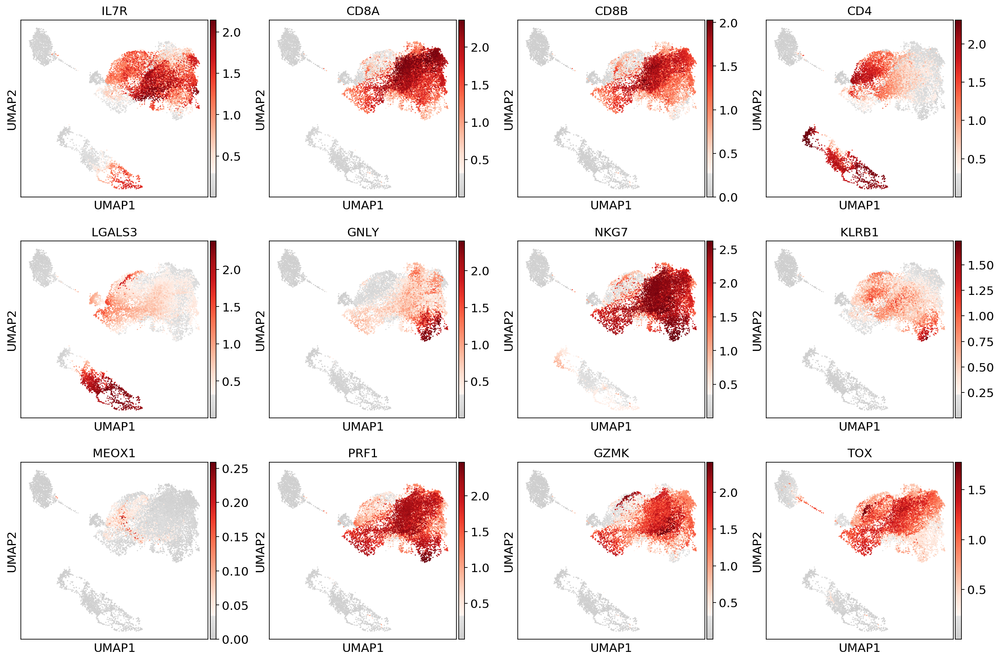


# MEOX1 Expression Before/After Imputation 


```python
#fig, (ax1, ax2,ax3) = plt.subplots(1,3, figsize=(33/2.54, 17/2.54))
fig, (ax1, ax2) = plt.subplots(1,2, figsize=(33/2.54, 17/2.54))
scprep.plot.scatter(x=adata[:, ['CD3E']].to_df(), y=adata[:, ['CD8A']].to_df(), c=adata[:, ['MEOX1']].to_df(),  ax=ax1,cmap=mymap,
                    xlabel='CD3E Normalized Count Log2(TPM)', ylabel='CD8A Normalized Count Log2(TPM)', legend_title="MEOX1", title='CD45+ Before MAGIC')


scprep.plot.scatter(x=adata_magic[:, ['CD3E']].to_df(), y=adata_magic[:, ['CD8A']].to_df(), c=adata_magic[:, ['MEOX1']].to_df(),cmap=mymap,  ax=ax2,
                    xlabel='CD3E Normalized Log2(TPM) (Imputed) ', ylabel='CD8A Normalized Count  Log2(TPM) (Imputed) ', legend_title="MEOX1", title='CD45+ After MAGIC')

plt.tight_layout()
plt.show()
#plt.savefig("/mnt/hpcserver1_datadisk2_spuccio/SP007_RNA_Seq_Overexpression_MEOX1/MelanomaDurante/figures/MAGIC.png")
```


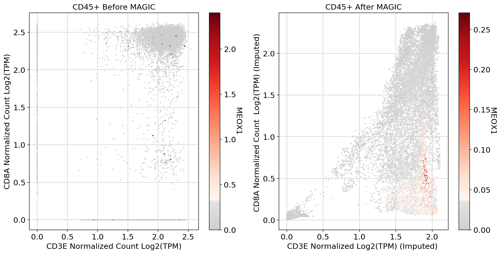


# Filter CD8+ Cells using >=2 Log2 TPM  as threshold


```python
adata_sub_CD8_POS = adata[(adata[:,'CD8A'].X>=2).flatten(), : ] 
```

## Guide lines suggest to start from row data and perform analysis step applied only to the selected cells


```python
adata_sub_CD8_POS
```


    View of AnnData object with n_obs × n_vars = 6423 × 55737 
        obs: 'CellID', 'SampleID', 'Therapy', 'Outcome', 'n_counts', 'log_counts', 'n_genes', 'mt_frac', 'ribo_frac'
        var: 'highly_variable', 'means', 'dispersions', 'dispersions_norm'
        uns: 'Therapy_colors', 'log1p', 'pca', 'Outcome_colors', 'neighbors', 'umap'
        obsm: 'X_pca', 'X_umap'
        varm: 'PCs'
        obsp: 'distances', 'connectivities'


```python
adata=sc.read("/home/spuccio/datadisk2/SP007_RNA_Seq_Overexpression_MEOX1/scrnaseqmelanoma/Melanoma.txt",delimiter='\t',cache=True,first_column_names=True).transpose()
```

    ... reading from cache file cache/home-spuccio-datadisk2-SP007_RNA_Seq_Overexpression_MEOX1-scrnaseqmelanoma-Melanoma.h5ad


```python
adata.obs['CellID'] = Metadata[1].to_list()
adata.obs['SampleID'] = Metadata[6].to_list()
adata.obs['Therapy'] = Metadata[5].to_list()
adata.obs['Outcome'] = Metadata[7].to_list()
```


```python
adata_CD8 =  adata[adata_sub_CD8_POS.obs_names].copy()
```


```python
# Quality control - calculate QC covariates
adata_CD8.obs['n_counts'] = adata_CD8.X.sum(1)
adata_CD8.obs['log_counts'] = np.log(adata_CD8.obs['n_counts'])
adata_CD8.obs['n_genes'] = (adata_CD8.X > 0).sum(1)
```


```python
adata_CD8.obs['mt_frac'] = np.sum(
    adata_CD8[:, mito_genes].X, axis=1) / np.sum(adata_CD8.X, axis=1)
```


```python
adata_CD8.obs['ribo_frac'] = np.sum(
    adata_CD8[:, ribo_genes].X, axis=1) / np.sum(adata_CD8.X, axis=1)
```


```python
sc.pl.violin(adata_CD8, ['n_counts', 'n_genes','mt_frac','ribo_frac'],
             jitter=0.4, groupby = 'Therapy')
```

    ... storing 'SampleID' as categorical
    ... storing 'Therapy' as categorical
    ... storing 'Outcome' as categorical


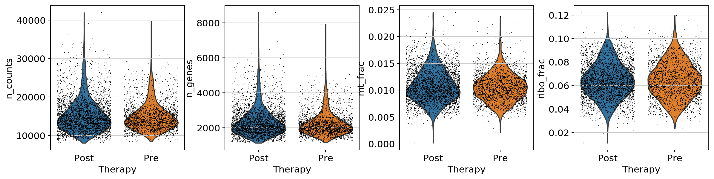


```python
print(adata_CD8.obs['Therapy'].value_counts())
```

    Post    3937
    Pre     2486
    Name: Therapy, dtype: int64


```python
print(adata_CD8.obs['Outcome'].value_counts())
```

    Non-responder    4459
    Responder        1964
    Name: Outcome, dtype: int64


```python
sc.pl.scatter(adata_CD8, x='n_counts', y='mt_frac')
sc.pl.scatter(adata_CD8, x='n_counts', y='n_genes')
```


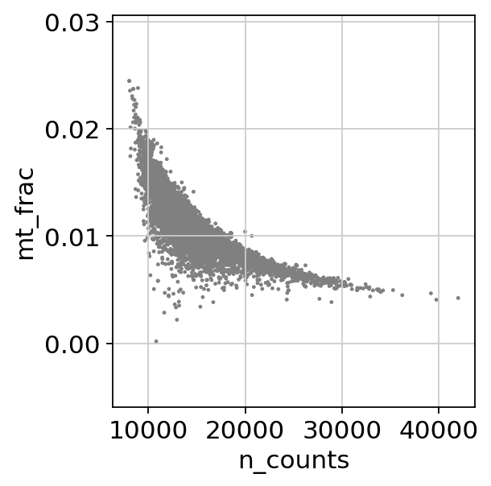


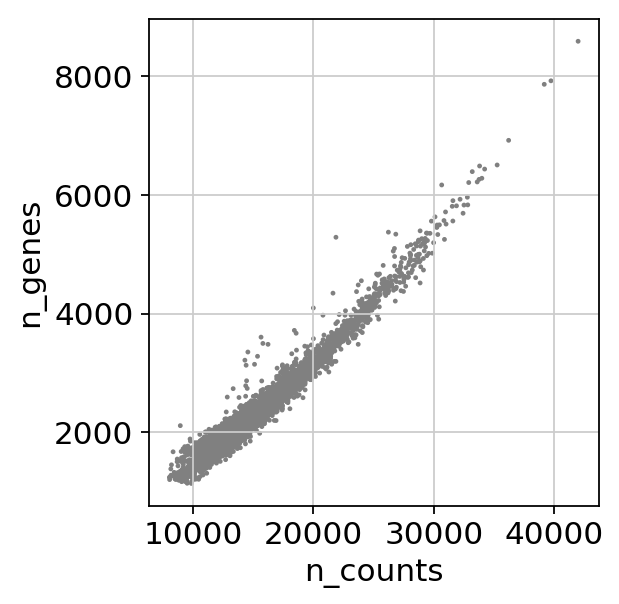


```python
sc.pp.log1p(adata_CD8)
```


```python
sc.pp.highly_variable_genes(adata_CD8, min_mean=0.0125, max_mean=3, min_disp=0.5)
```

    extracting highly variable genes
        finished (0:00:06)
    --> added
        'highly_variable', boolean vector (adata.var)
        'means', float vector (adata.var)
        'dispersions', float vector (adata.var)
        'dispersions_norm', float vector (adata.var)


```python
sc.pl.highly_variable_genes(adata_CD8)
```


```python
sc.pp.regress_out(adata_CD8[:, adata_CD8[:,].to_df().sum(axis=0) > 0], ['n_counts', 'mt_frac'])
```

    regressing out ['n_counts', 'mt_frac']
        finished (0:05:33)


```python
sc.tl.pca(adata_CD8,n_comps=50, svd_solver='arpack')
```

        on highly variable genes
    computing PCA with n_comps = 50
        finished (0:00:04)


```python
sc.pl.pca(adata_CD8, color=['Therapy','Outcome'])
```


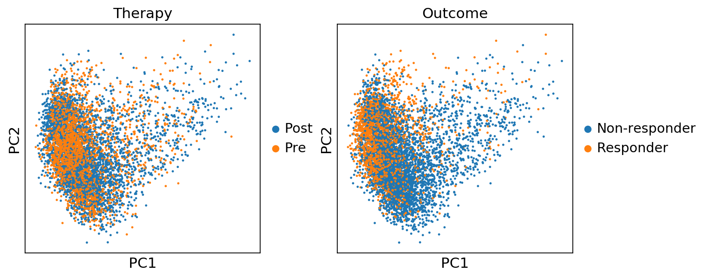


```python
sc.pp.neighbors(adata_CD8, n_neighbors=10, n_pcs=40)
```

    computing neighbors
        using 'X_pca' with n_pcs = 40
        finished: added to `.uns['neighbors']`
        `.obsp['distances']`, distances for each pair of neighbors
        `.obsp['connectivities']`, weighted adjacency matrix (0:00:01)


```python
sc.tl.umap(adata_CD8,n_components=3,random_state=10)
```

    computing UMAP
        finished: added
        'X_umap', UMAP coordinates (adata.obsm) (0:00:14)


```python
sc.pl.umap(adata_CD8, color=['CD3E', 'CD8A', 'CD4'])
```


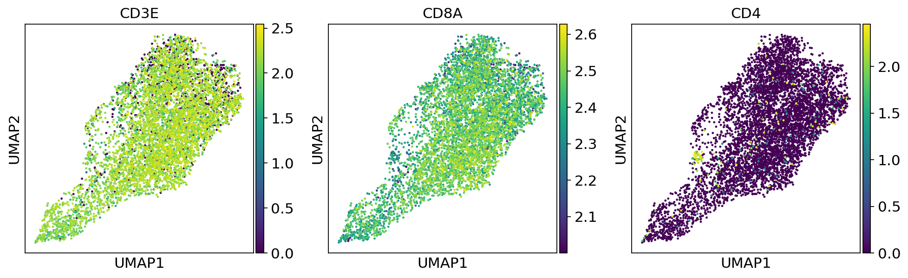


```python
sc.pl.umap(adata_CD8, color=['Outcome','Therapy','SampleID'])
```


# Imputation of CD8+ Cells


```python
adata_magic_CD8 = adata_CD8.copy()
import scanpy.external as sce
#sce.pp.magic(adata_magic[:, adata_magic[:,].to_df().sum(axis=0) > 0.01], name_list="all_genes", knn=5)
sce.pp.magic(adata_magic_CD8, name_list="all_genes", knn=5)
```

    computing MAGIC


    /home/spuccio/.local/lib/python3.6/site-packages/magic/magic.py:472: UserWarning: Input matrix contains unexpressed genes. Please remove them prior to running MAGIC.
      "Input matrix contains unexpressed genes. "


      Running MAGIC with `solver='exact'` on 55737-dimensional data may take a long time. Consider denoising specific genes with `genes=<list-like>` or using `solver='approximate'`.
        finished (0:00:29)


# UMAP plot of CD8+ Before Imputation plotting some marker genes


```python
#sc.pp.scale(adata_fil)
sc.pl.umap(adata_CD8, color=['IL7R', 'CD8A', 'CD8B','CD4',  
                'LGALS3',  'GNLY', 'NKG7', 'KLRB1',
                'MEOX1','PRF1','GZMK','TOX'], use_raw=False, color_map=mymap)
```


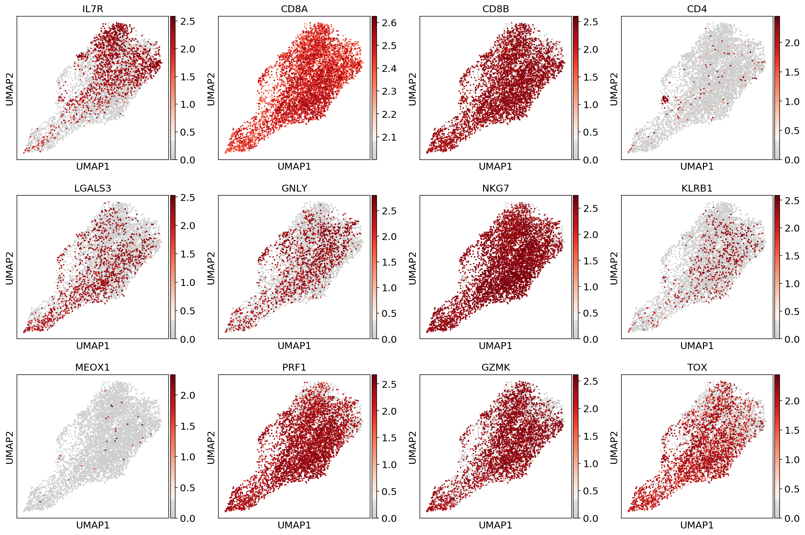


# UMAP plot of CD8+ After Imputation plotting some marker genes


```python
#sc.pp.scale(adata_fil)
sc.pl.umap(adata_magic_CD8, color=['IL7R', 'CD8A', 'CD8B','CD4',  
                'LGALS3',  'GNLY', 'NKG7', 'KLRB1',
                'MEOX1','PRF1','GZMK','TOX'], use_raw=False, color_map=mymap)
```


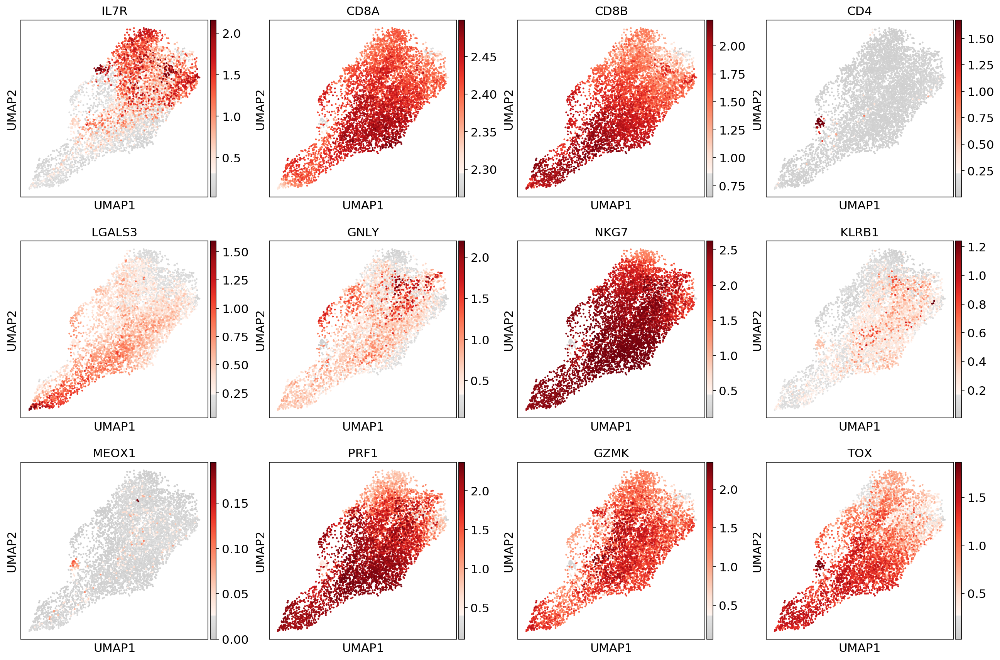


# MEOX1 Expression Before/After Imputation 


```python
#fig, (ax1, ax2,ax3) = plt.subplots(1,3, figsize=(33/2.54, 17/2.54))
fig, (ax1, ax2) = plt.subplots(1,2, figsize=(33/2.54, 17/2.54))
scprep.plot.scatter(x=adata_CD8[:, ['CD3E']].to_df(), y=adata_CD8[:, ['CD8A']].to_df(), c=adata_CD8[:, ['MEOX1']].to_df(),  ax=ax1,cmap=mymap,
                    xlabel='CD3E Normalized Log2(TPM)', ylabel='CD8A Normalized Count Log2(TPM)', legend_title="MEOX1", title='CD8+ Before MAGIC')


scprep.plot.scatter(x=adata_magic_CD8[:, ['CD3E']].to_df(), y=adata_magic_CD8[:, ['CD8A']].to_df(), c=adata_magic_CD8[:, ['MEOX1']].to_df(),cmap=mymap,  ax=ax2,
                    xlabel='CD3E Normalized Log2(TPM) (Imputed)', ylabel='CD8A Normalized Count  Log2(TPM) (Imputed) ', legend_title="MEOX1", title='CD8+ After MAGIC')

plt.tight_layout()
plt.show()
```


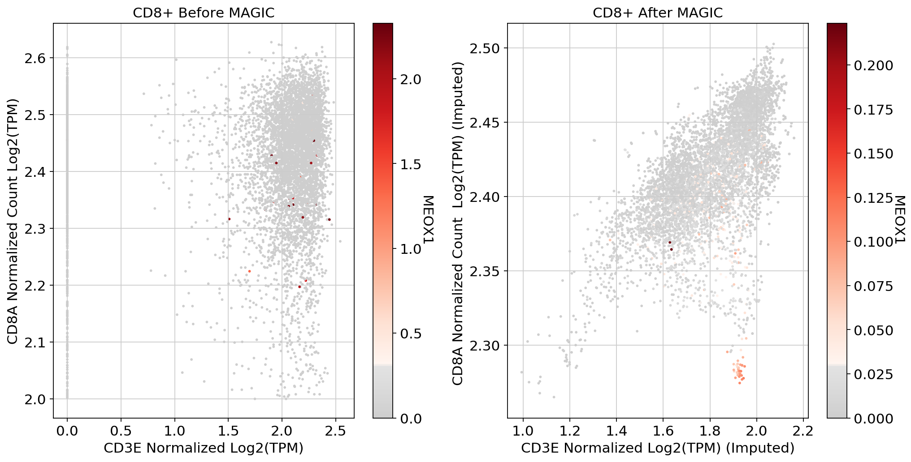


# Analysis Metrics


```python
fig, (ax1, ax2) = plt.subplots(1,2, figsize=(33/2.54, 17/2.54))
adata.obs['SampleID'].value_counts().sort_index().plot.bar(x=adata.obs['SampleID'].value_counts().sort_index().index, y=adata.obs['SampleID'].value_counts().sort_index(),color=adata_CD8.uns['SampleID_colors'],ax = ax1)
adata_CD8.obs['SampleID'].value_counts().sort_index().plot.bar(x=adata_CD8.obs['SampleID'].value_counts().sort_index().index, y=adata_CD8.obs['SampleID'].value_counts().sort_index(),color=adata_CD8.uns['SampleID_colors'],ax = ax2)
ax1.set_ylabel("SampleID Cell count")
ax1.set_title("TME Cells")
ax2.set_title("CD8+ Cells")


plt.tight_layout()
plt.show()
```


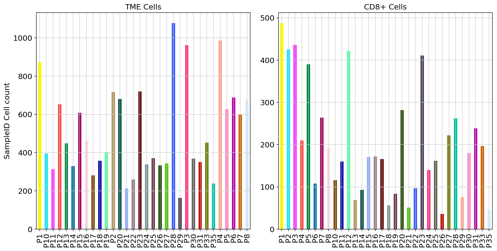


```python
fig, (ax1, ax2) = plt.subplots(1,2, figsize=(33/2.54, 17/2.54))
adata.obs['Therapy'].value_counts().sort_index().plot.bar(x=adata.obs['Therapy'].value_counts().sort_index().index, y=adata.obs['Therapy'].value_counts().sort_index(),ax = ax1)
adata_CD8.obs['Therapy'].value_counts().sort_index().plot.bar(x=adata_CD8.obs['Therapy'].value_counts().sort_index().index, y=adata_CD8.obs['Therapy'].value_counts().sort_index(),ax = ax2)
ax1.set_ylabel("Therapy Cell count")
ax1.set_title("TME Cells")
ax2.set_title("CD8+ Cells")

plt.tight_layout()
plt.show()
```


```python
fig, (ax1, ax2) = plt.subplots(1,2, figsize=(33/2.54, 17/2.54))
adata.obs['Outcome'].value_counts().sort_index().plot.bar(x=adata.obs['Outcome'].value_counts().sort_index().index, y=adata.obs['Outcome'].value_counts().sort_index(),rot=90,ax = ax1)
adata_CD8.obs['Outcome'].value_counts().sort_index().plot.bar(x=adata_CD8.obs['Outcome'].value_counts().sort_index().index, y=adata_CD8.obs['Outcome'].value_counts().sort_index(),rot=90,ax = ax2)
ax1.set_ylabel("Outcome  Cell count")
ax1.set_title("TME Cells")
ax2.set_title("CD8+ Cells")
plt.tight_layout()
plt.show()
```


```python

```
