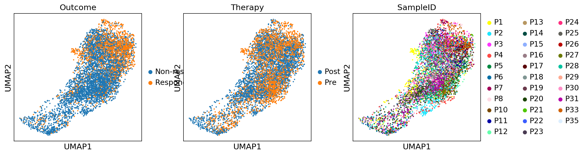
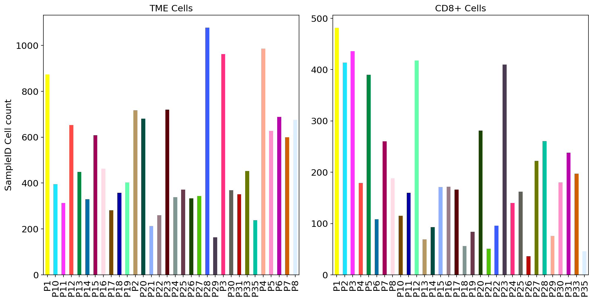
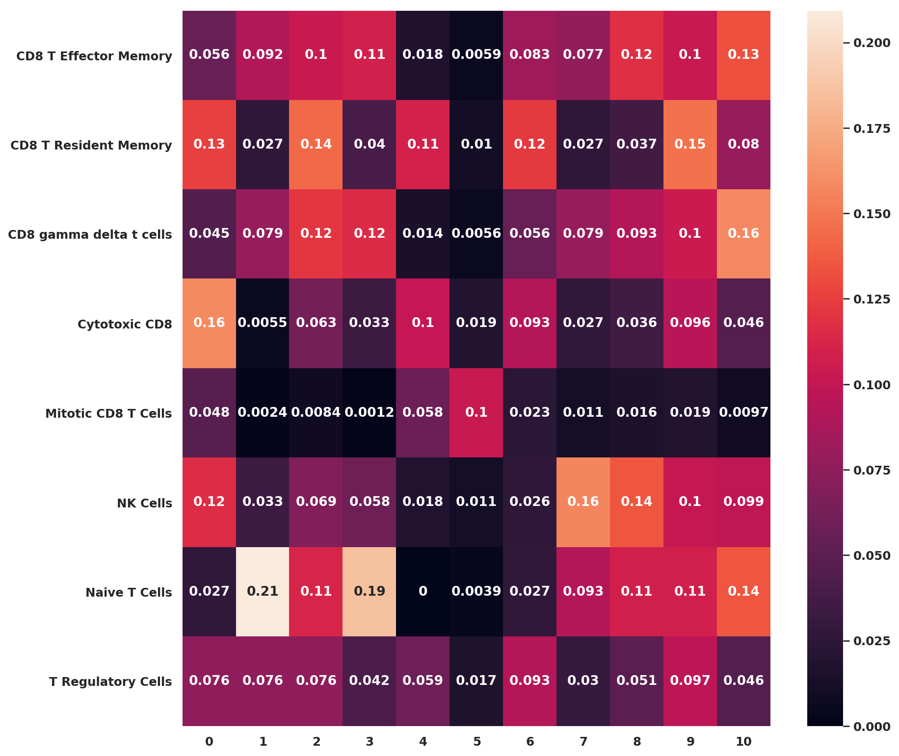
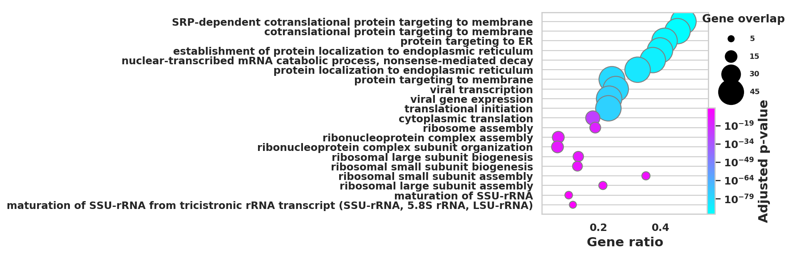
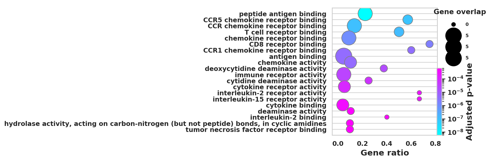
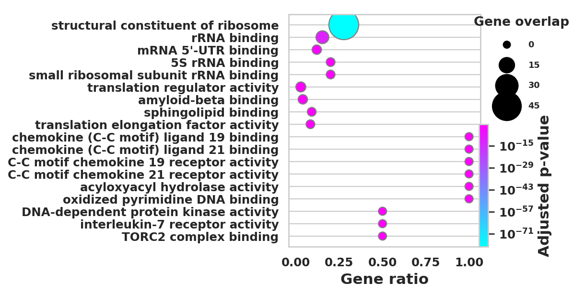
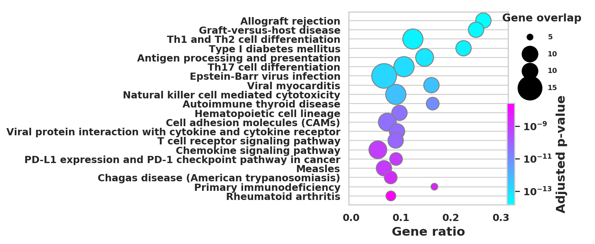
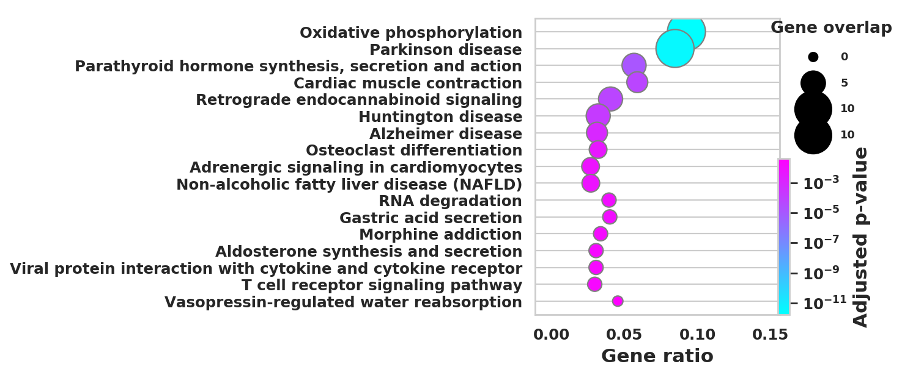
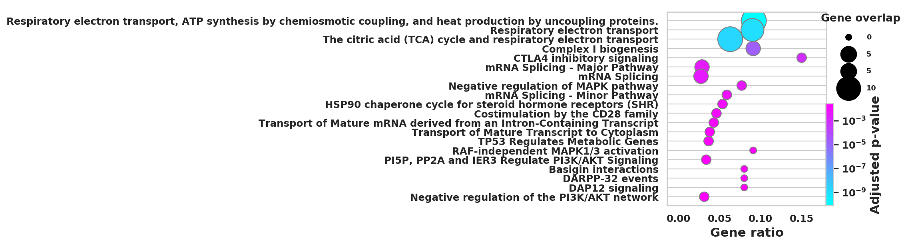

```python
import scanpy as sc
import numpy as np
import scipy as sp
import matplotlib.pyplot as plt
from matplotlib import rcParams
from matplotlib import colors
import seaborn as sb
from gprofiler import GProfiler

import rpy2.rinterface_lib.callbacks
import logging

import warnings

from rpy2.robjects import pandas2ri
import anndata2ri
import pandas as pd
plt.rcParams['figure.figsize']=(8,8) #rescale figures
sc.settings.verbosity = 3
sc.set_figure_params(dpi=80, dpi_save=150)
sc.logging.print_versions()
import scanpy.external as sce
import scprep
```

    /home/spuccio/miniconda3/envs/scrnaseq2/lib/python3.6/site-packages/anndata/_core/anndata.py:21: FutureWarning: pandas.core.index is deprecated and will be removed in a future version.  The public classes are available in the top-level namespace.
      from pandas.core.index import RangeIndex
    /home/spuccio/miniconda3/envs/scrnaseq2/lib/python3.6/site-packages/rpy2/robjects/pandas2ri.py:34: UserWarning: pandas >= 1.0 is not supported.
      warnings.warn('pandas >= 1.0 is not supported.')


    scanpy==1.4.7.dev48+g41563144 anndata==0.7.1 umap==0.4.1 numpy==1.15.4 scipy==1.4.1 pandas==1.0.3 scikit-learn==0.22.1 statsmodels==0.11.0 python-igraph==0.7.1 louvain==0.6.1


# Import Raw Data


```python
adata=sc.read("/home/spuccio/datadisk2/SP007_RNA_Seq_Overexpression_MEOX1/scrnaseqmelanoma/Melanoma.txt",delimiter='\t',cache=True,first_column_names=True).transpose()
```

    ... reading from cache file cache/home-spuccio-datadisk2-SP007_RNA_Seq_Overexpression_MEOX1-scrnaseqmelanoma-Melanoma.h5ad


```python
adata
```


    AnnData object with n_obs × n_vars = 16291 × 55737 


# Import Metadata


```python
Metadata = pd.read_csv("/home/spuccio/datadisk2/SP007_RNA_Seq_Overexpression_MEOX1/scrnaseqmelanoma/MelanomaNewMeta.txt",sep="\t",header=None)
```


```python
Metadata.head()
```


<div>
<style scoped>
    .dataframe tbody tr th:only-of-type {
        vertical-align: middle;
    }

    .dataframe tbody tr th {
        vertical-align: top;
    }

    .dataframe thead th {
        text-align: right;
    }
</style>
<table border="1" class="dataframe">
  <thead>
    <tr style="text-align: right;">
      <th></th>
      <th>0</th>
      <th>1</th>
      <th>2</th>
      <th>3</th>
      <th>4</th>
      <th>5</th>
      <th>6</th>
      <th>7</th>
    </tr>
  </thead>
  <tbody>
    <tr>
      <th>0</th>
      <td>A10_P3_M11</td>
      <td>Sample-1</td>
      <td>Melanoma</td>
      <td>Biopsy</td>
      <td>SmartSeq2</td>
      <td>Pre</td>
      <td>P1</td>
      <td>Responder</td>
    </tr>
    <tr>
      <th>1</th>
      <td>A11_P1_M11</td>
      <td>Sample-2</td>
      <td>Melanoma</td>
      <td>Biopsy</td>
      <td>SmartSeq2</td>
      <td>Pre</td>
      <td>P1</td>
      <td>Responder</td>
    </tr>
    <tr>
      <th>2</th>
      <td>A11_P3_M11</td>
      <td>Sample-3</td>
      <td>Melanoma</td>
      <td>Biopsy</td>
      <td>SmartSeq2</td>
      <td>Pre</td>
      <td>P1</td>
      <td>Responder</td>
    </tr>
    <tr>
      <th>3</th>
      <td>A11_P4_M11</td>
      <td>Sample-4</td>
      <td>Melanoma</td>
      <td>Biopsy</td>
      <td>SmartSeq2</td>
      <td>Pre</td>
      <td>P1</td>
      <td>Responder</td>
    </tr>
    <tr>
      <th>4</th>
      <td>A12_P3_M11</td>
      <td>Sample-5</td>
      <td>Melanoma</td>
      <td>Biopsy</td>
      <td>SmartSeq2</td>
      <td>Pre</td>
      <td>P1</td>
      <td>Responder</td>
    </tr>
  </tbody>
</table>
</div>


```python
adata.obs['CellID'] = Metadata[1].to_list()
adata.obs['SampleID'] = Metadata[6].to_list()
adata.obs['Therapy'] = Metadata[5].to_list()
adata.obs['Outcome'] = Metadata[7].to_list()

```


```python
adata
```


    AnnData object with n_obs × n_vars = 16291 × 55737 
        obs: 'CellID', 'SampleID', 'Therapy', 'Outcome'


# Quality control


```python
scprep.plot.plot_library_size(adata[:, ].to_df()>0,log=False)
```


    <matplotlib.axes._subplots.AxesSubplot at 0x7f1e64b6bba8>


```python
scprep.plot.plot_gene_set_expression(adata[:, ].to_df())
```

    /home/spuccio/.local/lib/python3.6/site-packages/scprep/select.py:362: UserWarning: No selection conditions provided. Returning all columns.
      "No selection conditions provided. " "Returning all columns.", UserWarning


    <matplotlib.axes._subplots.AxesSubplot at 0x7f1e2c0c1898>


```python
#sc.pp.log1p(adata)
```


```python
adata.var_names_make_unique() 
```


```python
# Quality control - calculate QC covariates
adata.obs['n_counts'] = adata.X.sum(1)
adata.obs['log_counts'] = np.log(adata.obs['n_counts'])
adata.obs['n_genes'] = (adata.X > 0).sum(1)
```


```python
mito_genes = adata.var_names.str.startswith('MT-')
ribo_genes = adata.var_names.str.startswith(("RPS","RPL"))
print(sum(mito_genes))
print(sum(ribo_genes))
```

    37
    927


```python
adata.obs['mt_frac'] = np.sum(
    adata[:, mito_genes].X, axis=1) / np.sum(adata.X, axis=1)
```


```python
adata.obs['ribo_frac'] = np.sum(
    adata[:, ribo_genes].X, axis=1) / np.sum(adata.X, axis=1)
```


```python
sc.pl.violin(adata, ['n_counts', 'n_genes','mt_frac','ribo_frac'],
             jitter=0.4, groupby = 'Therapy',save='QC_before.png')
```

    ... storing 'SampleID' as categorical
    ... storing 'Therapy' as categorical
    ... storing 'Outcome' as categorical


    WARNING: saving figure to file figures/violinQC_before.png


```python
print(adata.obs['Therapy'].value_counts())
```

    Post    10363
    Pre      5928
    Name: Therapy, dtype: int64


```python
print(adata.obs['Outcome'].value_counts())
```

    Non-responder    10727
    Responder         5564
    Name: Outcome, dtype: int64


```python
cc_genes_file ="/home/spuccio/datadisk2/SP007_RNA_Seq_Overexpression_MEOX1/MelanomaDurante/single-cell-tutorial/regev_lab_cell_cycle_genes.txt"
```

# Preprocessing


```python
sc.pl.scatter(adata, x='n_counts', y='mt_frac')
sc.pl.scatter(adata, x='n_counts', y='n_genes')
```


```python
scprep.plot.plot_gene_set_expression(adata[:, ].to_df())
```

    /home/spuccio/.local/lib/python3.6/site-packages/scprep/select.py:362: UserWarning: No selection conditions provided. Returning all columns.
      "No selection conditions provided. " "Returning all columns.", UserWarning


    <matplotlib.axes._subplots.AxesSubplot at 0x7f1e62ee0198>


```python
sc.pp.log1p(adata)
```


```python
adata.raw = adata
```


```python
sc.pp.highly_variable_genes(adata, min_mean=0.0125, max_mean=3, min_disp=0.5)
```

    extracting highly variable genes
        finished (0:00:11)
    --> added
        'highly_variable', boolean vector (adata.var)
        'means', float vector (adata.var)
        'dispersions', float vector (adata.var)
        'dispersions_norm', float vector (adata.var)


```python
sc.pl.highly_variable_genes(adata)
```


```python
sc.settings.n_jobs
```


    1


```python
sc.pp.regress_out(adata[:, adata[:,].to_df().sum(axis=0) > 0], ['n_counts', 'mt_frac','ribo_frac'])
```

    regressing out ['n_counts', 'mt_frac', 'ribo_frac']
        finished (0:12:55)


# Principal component analysis


```python
sc.tl.pca(adata,n_comps=50, svd_solver='arpack')
```

        on highly variable genes
    computing PCA with n_comps = 50
        finished (0:00:06)


```python
sc.pl.pca(adata, color=['Therapy','Outcome'])
```


```python
sc.pl.pca(adata, color='n_counts')
```


```python
sc.pl.pca_variance_ratio(adata, log=True)
```


```python
sc.pp.neighbors(adata, n_neighbors=10, n_pcs=40)
```

    computing neighbors
        using 'X_pca' with n_pcs = 40
        finished: added to `.uns['neighbors']`
        `.obsp['distances']`, distances for each pair of neighbors
        `.obsp['connectivities']`, weighted adjacency matrix (0:00:09)


# Umap


```python
sc.tl.umap(adata,n_components=3,random_state=10)
```

    computing UMAP
        finished: added
        'X_umap', UMAP coordinates (adata.obsm) (0:00:14)


```python
sc.pl.umap(adata, color=['CD3E', 'CD8A', 'CD4'])
```


```python
fig, (ax1, ax2,ax3) = plt.subplots(1,3, figsize=(33/2.54, 17/2.54))

scprep.plot.scatter(x=adata[:, ['CD3E']].to_df(), y=adata[:, ['CD8A']].to_df(), c=adata[:, ['CD8A']].to_df(),  ax=ax1,
                    xlabel='CD3E Normalized Count Log2(TPM)', ylabel='CD8A Normalized Count Log2(TPM)', legend_title="CD8A", title='CD8A+ Cells')

scprep.plot.scatter(x=adata[:, ['CD3E']].to_df(), y=adata[:, ['CD4']].to_df(), c=adata[:, ['CD4']].to_df(),  ax=ax2,
                    xlabel='CD3E Normalized Count Log2(TPM)', ylabel='CD3E Normalized Count Log2(TPM)', legend_title="CD8A", title='CD4+ Cells')
scprep.plot.plot_gene_set_expression(adata[:, ['CD8A']].to_df().loc[adata[:, ['CD8A']].to_df()['CD8A']>=0.001],xlabel='CD8A Normalized Count Log2(TPM)',cutoff=2,ax=ax3,title="CD8A+ Threshold")

plt.tight_layout()
plt.show()
```

    /home/spuccio/.local/lib/python3.6/site-packages/scprep/select.py:362: UserWarning: No selection conditions provided. Returning all columns.
      "No selection conditions provided. " "Returning all columns.", UserWarning


# Magic Imputation on CD45+


```python
adata_magic = adata.copy()
import scanpy.external as sce
#sce.pp.magic(adata_magic[:, adata_magic[:,].to_df().sum(axis=0) > 0.01], name_list="all_genes", knn=5)
sce.pp.magic(adata_magic, name_list="all_genes", knn=10)
```

    computing MAGIC


    /home/spuccio/.local/lib/python3.6/site-packages/magic/magic.py:472: UserWarning: Input matrix contains unexpressed genes. Please remove them prior to running MAGIC.
      "Input matrix contains unexpressed genes. "


      Running MAGIC with `solver='exact'` on 55737-dimensional data may take a long time. Consider denoising specific genes with `genes=<list-like>` or using `solver='approximate'`.
        finished (0:02:19)


```python
colors2 = plt.cm.Reds(np.linspace(0, 1, 128))
colors3 = plt.cm.Greys_r(np.linspace(0.7,0.8,20))
colorsComb = np.vstack([colors3, colors2])
mymap = colors.LinearSegmentedColormap.from_list('my_colormap', colorsComb)
```

# UMAP plot of CD45+ Before Imputation plotting some marker genes


```python
#sc.pp.scale(adata_fil)
sc.pl.umap(adata, color=['IL7R', 'CD8A', 'CD8B','CD4',  
                'LGALS3',  'BAG3', 'IFNG', 'PRDM1',
                'MEOX1','TRPC1','MAF','SOX7'], use_raw=False, color_map=mymap)
```


# UMAP plot of CD45+ After Imputation plotting some marker genes


```python
#sc.pp.scale(adata_fil)
sc.pl.umap(adata_magic, color=['IL7R', 'CD8A', 'CD8B','CD4',  
                'LGALS3',  'BAG3', 'IFNG', 'PRDM1',
                'MEOX1','TRPC1','MAF','SOX7'], use_raw=False, color_map=mymap)
```


# MEOX1 Expression Before/After Imputation 


```python
#fig, (ax1, ax2,ax3) = plt.subplots(1,3, figsize=(33/2.54, 17/2.54))
fig, (ax1, ax2) = plt.subplots(1,2, figsize=(33/2.54, 17/2.54))
scprep.plot.scatter(x=adata[:, ['CD3E']].to_df(), y=adata[:, ['CD8A']].to_df(), c=adata[:, ['MEOX1']].to_df(),  ax=ax1,cmap=mymap,
                    xlabel='CD3E Normalized Count Log2(TPM)', ylabel='CD8A Normalized Count Log2(TPM)', legend_title="MEOX1", title='CD45+ Before MAGIC')


scprep.plot.scatter(x=adata_magic[:, ['CD3E']].to_df(), y=adata_magic[:, ['CD8A']].to_df(), c=adata_magic[:, ['MEOX1']].to_df(),cmap=mymap,  ax=ax2,
                    xlabel='CD3E Normalized Log2(TPM) (Imputed) ', ylabel='CD8A Normalized Count  Log2(TPM) (Imputed) ', legend_title="MEOX1", title='CD45+ After MAGIC')

plt.tight_layout()
plt.show()
#plt.savefig("/mnt/hpcserver1_datadisk2_spuccio/SP007_RNA_Seq_Overexpression_MEOX1/MelanomaDurante/figures/MAGIC.png")
```


# Filter CD8+ Cells using >=2 Log2 TPM  as threshold


```python
adata_sub_CD8_POS = adata[(adata[:,'CD8A'].X>=2).flatten(), : ] 
```

## Guide lines suggest to start from row data and perform analysis step applied only to the selected cells


```python
adata_sub_CD8_POS
```


    View of AnnData object with n_obs × n_vars = 6423 × 55737 
        obs: 'CellID', 'SampleID', 'Therapy', 'Outcome', 'n_counts', 'log_counts', 'n_genes', 'mt_frac', 'ribo_frac'
        var: 'highly_variable', 'means', 'dispersions', 'dispersions_norm'
        uns: 'Therapy_colors', 'log1p', 'pca', 'Outcome_colors', 'neighbors', 'umap'
        obsm: 'X_pca', 'X_umap'
        varm: 'PCs'
        obsp: 'distances', 'connectivities'


```python
adata=sc.read("/home/spuccio/datadisk2/SP007_RNA_Seq_Overexpression_MEOX1/scrnaseqmelanoma/Melanoma.txt",delimiter='\t',cache=True,first_column_names=True).transpose()
```

    ... reading from cache file cache/home-spuccio-datadisk2-SP007_RNA_Seq_Overexpression_MEOX1-scrnaseqmelanoma-Melanoma.h5ad


```python
adata.obs['CellID'] = Metadata[1].to_list()
adata.obs['SampleID'] = Metadata[6].to_list()
adata.obs['Therapy'] = Metadata[5].to_list()
adata.obs['Outcome'] = Metadata[7].to_list()
```


```python
adata_CD8 =  adata[adata_sub_CD8_POS.obs_names].copy()
```


```python
# Quality control - calculate QC covariates
adata_CD8.obs['n_counts'] = adata_CD8.X.sum(1)
adata_CD8.obs['log_counts'] = np.log(adata_CD8.obs['n_counts'])
adata_CD8.obs['n_genes'] = (adata_CD8.X > 0).sum(1)
```


```python
adata_CD8.obs['mt_frac'] = np.sum(
    adata_CD8[:, mito_genes].X, axis=1) / np.sum(adata_CD8.X, axis=1)
```


```python
adata_CD8.obs['ribo_frac'] = np.sum(
    adata_CD8[:, ribo_genes].X, axis=1) / np.sum(adata_CD8.X, axis=1)
```


```python
sc.pl.violin(adata_CD8, ['n_counts', 'n_genes','mt_frac','ribo_frac'],
             jitter=0.4, groupby = 'Therapy')
```

    ... storing 'SampleID' as categorical
    ... storing 'Therapy' as categorical
    ... storing 'Outcome' as categorical


```python
print(adata_CD8.obs['Therapy'].value_counts())
```

    Post    3937
    Pre     2486
    Name: Therapy, dtype: int64


```python
print(adata_CD8.obs['Outcome'].value_counts())
```

    Non-responder    4459
    Responder        1964
    Name: Outcome, dtype: int64


```python
sc.pl.scatter(adata_CD8, x='n_counts', y='mt_frac')
sc.pl.scatter(adata_CD8, x='n_counts', y='n_genes')
```


```python
sc.pp.log1p(adata_CD8)
```


```python
sc.pp.highly_variable_genes(adata_CD8, min_mean=0.0125, max_mean=3, min_disp=0.5)
```

    extracting highly variable genes
        finished (0:00:06)
    --> added
        'highly_variable', boolean vector (adata.var)
        'means', float vector (adata.var)
        'dispersions', float vector (adata.var)
        'dispersions_norm', float vector (adata.var)


```python
sc.pl.highly_variable_genes(adata_CD8)
```


```python
sc.pp.regress_out(adata_CD8[:, adata_CD8[:,].to_df().sum(axis=0) > 0], ['n_counts', 'mt_frac','ribo_frac'])
```

    regressing out ['n_counts', 'mt_frac', 'ribo_frac']
        finished (0:06:04)


```python
sc.tl.pca(adata_CD8,n_comps=50, svd_solver='arpack')
```

        on highly variable genes
    computing PCA with n_comps = 50
        finished (0:00:04)


```python
sc.pl.pca(adata_CD8, color=['Therapy','Outcome'])
```


```python
sc.pp.neighbors(adata_CD8, n_neighbors=10, n_pcs=40)
```

    computing neighbors
        using 'X_pca' with n_pcs = 40
        finished: added to `.uns['neighbors']`
        `.obsp['distances']`, distances for each pair of neighbors
        `.obsp['connectivities']`, weighted adjacency matrix (0:00:01)


```python
sc.tl.umap(adata_CD8,n_components=3,random_state=10)
```

    computing UMAP
        finished: added
        'X_umap', UMAP coordinates (adata.obsm) (0:00:14)


```python
sc.pl.umap(adata_CD8, color=['CD3E', 'CD8A', 'CD4'])
```


```python
sc.pl.umap(adata_CD8, color=['Outcome','Therapy','SampleID'])
```


# Imputation of CD8+ Cells


```python
adata_magic_CD8 = adata_CD8.copy()
import scanpy.external as sce
#sce.pp.magic(adata_magic[:, adata_magic[:,].to_df().sum(axis=0) > 0.01], name_list="all_genes", knn=5)
sce.pp.magic(adata_magic_CD8, name_list="all_genes", knn=5)
```

    computing MAGIC


    /home/spuccio/.local/lib/python3.6/site-packages/magic/magic.py:472: UserWarning: Input matrix contains unexpressed genes. Please remove them prior to running MAGIC.
      "Input matrix contains unexpressed genes. "


      Running MAGIC with `solver='exact'` on 55737-dimensional data may take a long time. Consider denoising specific genes with `genes=<list-like>` or using `solver='approximate'`.
        finished (0:00:29)


# UMAP plot of CD8+ Before Imputation plotting some marker genes


```python
#sc.pp.scale(adata_fil)
sc.pl.umap(adata_CD8, color=['IL7R', 'CD8A', 'CD8B','CD4',  
                'FOXP3',  'GNLY', 'NKG7', 'KLRB1',
                'MEOX1','PRF1','GZMK','TOX'], use_raw=False, color_map=mymap)
```


# UMAP plot of CD8+ After Imputation plotting some marker genes


```python
#sc.pp.scale(adata_fil)
sc.pl.umap(adata_magic_CD8, color=['IL7R', 'CD8A', 'CD8B','CD4',  
                'FOXP3',  'GNLY', 'NKG7', 'KLRB1',
                'MEOX1','PRF1','GZMK','TOX'], use_raw=False, color_map=mymap)
```


# MEOX1 Expression Before/After Imputation 


```python
#fig, (ax1, ax2,ax3) = plt.subplots(1,3, figsize=(33/2.54, 17/2.54))
fig, (ax1, ax2) = plt.subplots(1,2, figsize=(33/2.54, 17/2.54))
scprep.plot.scatter(x=adata_CD8[:, ['CD3E']].to_df(), y=adata_CD8[:, ['CD8A']].to_df(), c=adata_CD8[:, ['MEOX1']].to_df(),  ax=ax1,cmap=mymap,
                    xlabel='CD3E Normalized Log2(TPM)', ylabel='CD8A Normalized Count Log2(TPM)', legend_title="MEOX1", title='CD8+ Before MAGIC')


scprep.plot.scatter(x=adata_magic_CD8[:, ['CD3E']].to_df(), y=adata_magic_CD8[:, ['CD8A']].to_df(), c=adata_magic_CD8[:, ['MEOX1']].to_df(),cmap=mymap,  ax=ax2,
                    xlabel='CD3E Normalized Log2(TPM) (Imputed)', ylabel='CD8A Normalized Count  Log2(TPM) (Imputed) ', legend_title="MEOX1", title='CD8+ After MAGIC')

plt.tight_layout()
plt.show()
```


# Analysis Metrics


```python
fig, (ax1, ax2) = plt.subplots(1,2, figsize=(33/2.54, 17/2.54))
adata.obs['SampleID'].value_counts().sort_index().plot.bar(x=adata.obs['SampleID'].value_counts().sort_index().index, y=adata.obs['SampleID'].value_counts().sort_index(),color=adata_CD8.uns['SampleID_colors'],ax = ax1)
adata_CD8.obs['SampleID'].value_counts().sort_index().plot.bar(x=adata_CD8.obs['SampleID'].value_counts().sort_index().index, y=adata_CD8.obs['SampleID'].value_counts().sort_index(),color=adata_CD8.uns['SampleID_colors'],ax = ax2)
ax1.set_ylabel("SampleID Cell count")
ax1.set_title("TME Cells")
ax2.set_title("CD8+ Cells")
ax1.grid(False)
ax2.grid(False)
plt.tight_layout()
plt.show()
```


```python
fig, (ax1, ax2) = plt.subplots(1,2, figsize=(33/2.54, 17/2.54))
adata.obs['Therapy'].value_counts().sort_index().plot.bar(x=adata.obs['Therapy'].value_counts().sort_index().index, y=adata.obs['Therapy'].value_counts().sort_index(),ax = ax1)
adata_CD8.obs['Therapy'].value_counts().sort_index().plot.bar(x=adata_CD8.obs['Therapy'].value_counts().sort_index().index, y=adata_CD8.obs['Therapy'].value_counts().sort_index(),ax = ax2)
ax1.set_ylabel("Therapy Cell count")
ax1.set_title("TME Cells")
ax2.set_title("CD8+ Cells")
ax1.grid(False)
ax2.grid(False)
plt.tight_layout()
plt.show()
```


```python
fig, (ax1, ax2) = plt.subplots(1,2, figsize=(33/2.54, 17/2.54))
adata.obs['Outcome'].value_counts().sort_index().plot.bar(x=adata.obs['Outcome'].value_counts().sort_index().index, y=adata.obs['Outcome'].value_counts().sort_index(),rot=90,ax = ax1)
adata_CD8.obs['Outcome'].value_counts().sort_index().plot.bar(x=adata_CD8.obs['Outcome'].value_counts().sort_index().index, y=adata_CD8.obs['Outcome'].value_counts().sort_index(),rot=90,ax = ax2)
ax1.set_ylabel("Outcome  Cell count")
ax1.set_title("TME Cells")
ax2.set_title("CD8+ Cells")
ax1.grid(False)
ax2.grid(False)
plt.tight_layout()
plt.show()
```


```python
#fig, (ax1, ax2,ax3) = plt.subplots(1,3, figsize=(33/2.54, 17/2.54))
fig, (ax1, ax2) = plt.subplots(1,2, figsize=(33/2.54, 17/2.54))
scprep.plot.scatter(x=adata_sub_CD8_POS[:, ['CD3E']].to_df(), y=adata_sub_CD8_POS[:, ['CD8A']].to_df(), c=adata_sub_CD8_POS[:, ['MEOX1']].to_df(),  ax=ax1,cmap=mymap,
                    xlabel='CD3E Normalized Count (CPM)', ylabel='CD8A Normalized Count  (CPM)', legend_title="MEOX1", title='Before MAGIC')


scprep.plot.scatter(x=adata_magic_CD8[:, ['CD3E']].to_df(), y=adata_magic_CD8[:, ['CD8A']].to_df(), c=adata_magic_CD8[:, ['MEOX1']].to_df(),cmap=mymap,  ax=ax2,
                    xlabel='CD3E Normalized Count (CPM)', ylabel='CD8A Normalized Count  (CPM)', legend_title="MEOX1", title='After MAGIC')

plt.tight_layout()
plt.show()
#plt.savefig("/mnt/hpcserver1_datadisk2_spuccio/SP007_RNA_Seq_Overexpression_MEOX1/MelanomaDurante/figures/MAGIC.png")
```


# Keep cells with CD8A>2.3


```python
adata_sub_CD8_POS = adata_magic_CD8[(adata_magic_CD8[:,'CD8A'].X>=2.3).flatten(), : ] 
```


```python
adata=sc.read("/home/spuccio/datadisk2/SP007_RNA_Seq_Overexpression_MEOX1/scrnaseqmelanoma/Melanoma.txt",delimiter='\t',cache=True,first_column_names=True).transpose()
```

    ... reading from cache file cache/home-spuccio-datadisk2-SP007_RNA_Seq_Overexpression_MEOX1-scrnaseqmelanoma-Melanoma.h5ad


```python
adata.obs['CellID'] = Metadata[1].to_list()
adata.obs['SampleID'] = Metadata[6].to_list()
adata.obs['Therapy'] = Metadata[5].to_list()
adata.obs['Outcome'] = Metadata[7].to_list()
```


```python
adata_CD8_2 =  adata[adata_sub_CD8_POS.obs_names].copy()
```


```python
# Quality control - calculate QC covariates
adata_CD8_2.obs['n_counts'] = adata_CD8_2.X.sum(1)
adata_CD8_2.obs['log_counts'] = np.log(adata_CD8_2.obs['n_counts'])
adata_CD8_2.obs['n_genes'] = (adata_CD8_2.X > 0).sum(1)
```


```python
adata_CD8_2.obs['mt_frac'] = np.sum(
    adata_CD8_2[:, mito_genes].X, axis=1) / np.sum(adata_CD8_2.X, axis=1)
```


```python
adata_CD8_2.obs['ribo_frac'] = np.sum(
    adata_CD8_2[:, ribo_genes].X, axis=1) / np.sum(adata_CD8_2.X, axis=1)
```


```python
sc.pp.log1p(adata_CD8_2)
```


```python
sc.pp.highly_variable_genes(adata_CD8_2, min_mean=0.0125, max_mean=3, min_disp=0.5)
```

    extracting highly variable genes
        finished (0:00:06)
    --> added
        'highly_variable', boolean vector (adata.var)
        'means', float vector (adata.var)
        'dispersions', float vector (adata.var)
        'dispersions_norm', float vector (adata.var)


```python
sc.pp.regress_out(adata_CD8_2[:, adata_CD8_2[:,].to_df().sum(axis=0) > 0], ['n_counts', 'mt_frac','ribo_frac'])
```

    regressing out ['n_counts', 'mt_frac', 'ribo_frac']


    /home/spuccio/miniconda3/envs/scrnaseq2/lib/python3.6/site-packages/anndata/_core/anndata.py:1172: ImplicitModificationWarning: Initializing view as actual.
      "Initializing view as actual.", ImplicitModificationWarning
    Trying to set attribute `.obs` of view, copying.
    ... storing 'SampleID' as categorical
    Trying to set attribute `.obs` of view, copying.
    ... storing 'Therapy' as categorical
    Trying to set attribute `.obs` of view, copying.
    ... storing 'Outcome' as categorical


        finished (0:06:07)


```python
sc.tl.pca(adata_CD8_2,n_comps=50, svd_solver='arpack')
```

        on highly variable genes
    computing PCA with n_comps = 50
        finished (0:00:04)


```python
sc.pp.neighbors(adata_CD8_2, n_neighbors=10, n_pcs=40)
```

    computing neighbors
        using 'X_pca' with n_pcs = 40
        finished: added to `.uns['neighbors']`
        `.obsp['distances']`, distances for each pair of neighbors
        `.obsp['connectivities']`, weighted adjacency matrix (0:00:01)


```python
sc.tl.umap(adata_CD8_2,n_components=3,random_state=10)
```

    computing UMAP
        finished: added
        'X_umap', UMAP coordinates (adata.obsm) (0:00:14)


```python
sc.pl.umap(adata_CD8_2, color=['CD3E', 'CD8A', 'CD4'])
```

    ... storing 'SampleID' as categorical
    ... storing 'Therapy' as categorical
    ... storing 'Outcome' as categorical


```python
sc.pl.umap(adata_CD8_2, color=['Outcome','Therapy','SampleID'])
```





# Imputation


```python
adata_CD8_2_magic = adata_CD8_2.copy()
import scanpy.external as sce
#sce.pp.magic(adata_magic[:, adata_magic[:,].to_df().sum(axis=0) > 0.01], name_list="all_genes", knn=5)
sce.pp.magic(adata_CD8_2_magic, name_list="all_genes", knn=5)
```

    computing MAGIC


    /home/spuccio/.local/lib/python3.6/site-packages/magic/magic.py:472: UserWarning: Input matrix contains unexpressed genes. Please remove them prior to running MAGIC.
      "Input matrix contains unexpressed genes. "


      Running MAGIC with `solver='exact'` on 55737-dimensional data may take a long time. Consider denoising specific genes with `genes=<list-like>` or using `solver='approximate'`.
        finished (0:00:29)


# UMAP Plot before Imputation


```python
#sc.pp.scale(adata_fil)
sc.pl.umap(adata_CD8_2, color=['IL7R', 'CD8A', 'CD8B','CD4',  
                'FOXP3',  'GNLY', 'NKG7', 'KLRB1',
                'MEOX1','PRF1','GZMK','TOX'], use_raw=False, color_map=mymap)
```


# UMAP Plot after Imputation


```python
#sc.pp.scale(adata_fil)
sc.pl.umap(adata_CD8_2_magic, color=['IL7R', 'CD8A', 'CD8B','CD4',  
                'FOXP3',  'GNLY', 'NKG7', 'KLRB1',
                'MEOX1','PRF1','GZMK','TOX'], use_raw=False, color_map=mymap)
```


# MEOX1 before/after imputation


```python
#fig, (ax1, ax2,ax3) = plt.subplots(1,3, figsize=(33/2.54, 17/2.54))
fig, (ax1, ax2) = plt.subplots(1,2, figsize=(33/2.54, 17/2.54))
scprep.plot.scatter(x=adata_CD8_2[:, ['CD3E']].to_df(), y=adata_CD8_2[:, ['CD8A']].to_df(), c=adata_CD8_2[:, ['MEOX1']].to_df(),  ax=ax1,cmap=mymap,
                    xlabel='CD3E Normalized Log2(TPM)', ylabel='CD8A Normalized Count Log2(TPM)', legend_title="MEOX1", title='CD8+ Before MAGIC')


scprep.plot.scatter(x=adata_CD8_2_magic[:, ['CD3E']].to_df(), y=adata_CD8_2_magic[:, ['CD8A']].to_df(), c=adata_CD8_2_magic[:, ['MEOX1']].to_df(),cmap=mymap,  ax=ax2,
                    xlabel='CD3E Normalized Log2(TPM) (Imputed)', ylabel='CD8A Normalized Count  Log2(TPM) (Imputed) ', legend_title="MEOX1", title='CD8+ After MAGIC')

ax1.grid(False)
ax2.grid(False)
plt.tight_layout()
plt.show()
```


```python
fig, (ax1, ax2) = plt.subplots(1,2, figsize=(33/2.54, 17/2.54))
scprep.plot.scatter(x=adata_CD8_2[:, ['CD4']].to_df(), y=adata_CD8_2[:, ['CD8A']].to_df(), c=adata_CD8_2[:, ['MEOX1']].to_df(),  ax=ax1,cmap=mymap,
                    xlabel='CD4 Normalized Log2(TPM)', ylabel='CD8A Normalized Count Log2(TPM)', legend_title="MEOX1", title='CD4/CD8 Before MAGIC')


scprep.plot.scatter(x=adata_CD8_2_magic[:, ['CD4']].to_df(), y=adata_CD8_2_magic[:, ['CD8A']].to_df(), c=adata_CD8_2_magic[:, ['MEOX1']].to_df(),cmap=mymap,  ax=ax2,
                    xlabel='CD4 Normalized Log2(TPM) (Imputed)', ylabel='CD8A Normalized Count  Log2(TPM) (Imputed) ', legend_title="MEOX1", title='CD4/CD8 After MAGIC')

ax1.grid(False)
ax2.grid(False)
plt.tight_layout()
plt.show()
```


# Metrics


```python
fig, (ax1, ax2) = plt.subplots(1,2, figsize=(33/2.54, 17/2.54))
adata.obs['SampleID'].value_counts().sort_index().plot.bar(x=adata.obs['SampleID'].value_counts().sort_index().index, y=adata.obs['SampleID'].value_counts().sort_index(),color=adata_CD8.uns['SampleID_colors'],ax = ax1)
adata_CD8_2.obs['SampleID'].value_counts().sort_index().plot.bar(x=adata_CD8_2.obs['SampleID'].value_counts().sort_index().index, y=adata_CD8_2.obs['SampleID'].value_counts().sort_index(),color=adata_CD8_2.uns['SampleID_colors'],ax = ax2)
ax1.set_ylabel("SampleID Cell count")
ax1.set_title("TME Cells")
ax2.set_title("CD8+ Cells")
ax1.grid(False)
ax2.grid(False)
plt.tight_layout()
plt.show()
```





```python
fig, (ax1, ax2) = plt.subplots(1,2, figsize=(33/2.54, 17/2.54))
adata.obs['Therapy'].value_counts().sort_index().plot.bar(x=adata.obs['Therapy'].value_counts().sort_index().index, y=adata.obs['Therapy'].value_counts().sort_index(),ax = ax1)
adata_CD8_2.obs['Therapy'].value_counts().sort_index().plot.bar(x=adata_CD8_2.obs['Therapy'].value_counts().sort_index().index, y=adata_CD8_2.obs['Therapy'].value_counts().sort_index(),ax = ax2)
ax1.set_ylabel("Therapy Cell count")
ax1.set_title("TME Cells")
ax2.set_title("CD8+ Cells")
ax1.grid(False)
ax2.grid(False)
plt.tight_layout()
plt.show()
```


```python
fig, (ax1, ax2) = plt.subplots(1,2, figsize=(33/2.54, 17/2.54))
adata.obs['Outcome'].value_counts().sort_index().plot.bar(x=adata.obs['Outcome'].value_counts().sort_index().index, y=adata.obs['Outcome'].value_counts().sort_index(),rot=90,ax = ax1)
adata_CD8_2.obs['Outcome'].value_counts().sort_index().plot.bar(x=adata_CD8_2.obs['Outcome'].value_counts().sort_index().index, y=adata_CD8_2.obs['Outcome'].value_counts().sort_index(),rot=90,ax = ax2)
ax1.set_ylabel("Outcome  Cell count")
ax1.set_title("TME Cells")
ax2.set_title("CD8+ Cells")
ax1.grid(False)
ax2.grid(False)
plt.tight_layout()
plt.show()
```


# Clustering with Louvain algorithm (Similar to Phenograph approach)


```python
sc.tl.louvain(adata_CD8_2_magic,resolution=0.8, key_added='louvain_r0.8',random_state=10,use_weights=True)
```

    running Louvain clustering
        using the "louvain" package of Traag (2017)
        finished: found 11 clusters and added
        'louvain_r0.8', the cluster labels (adata.obs, categorical) (0:00:00)


```python
sc.pl.umap(adata_CD8_2_magic, color=['louvain_r0.8'])
```


```python
sc.pl.umap(adata_CD8_2_magic, color=['CD8A','CD4','MEOX1'], use_raw=False, color_map=mymap)
```


# Check Expression of MEOX1 over different Louvain clustering resolution


```python
sc.pl.violin(adata_CD8_2_magic,['MEOX1'], groupby='louvain_r0.8')
```


# Compute DEGs for Louvain Res=0.8 


```python
sc.tl.rank_genes_groups(adata_CD8_2_magic, 'louvain_r0.8', method='wilcoxon')
```

    ranking genes
        finished: added to `.uns['rank_genes_groups']`
        'names', sorted np.recarray to be indexed by group ids
        'scores', sorted np.recarray to be indexed by group ids
        'logfoldchanges', sorted np.recarray to be indexed by group ids
        'pvals', sorted np.recarray to be indexed by group ids
        'pvals_adj', sorted np.recarray to be indexed by group ids (0:00:46)


## First 50 DEGs for each cluster (1 vs All)


```python
pd.DataFrame(adata_CD8_2_magic.uns['rank_genes_groups']['names']).head(50)
```


<div>
<style scoped>
    .dataframe tbody tr th:only-of-type {
        vertical-align: middle;
    }

    .dataframe tbody tr th {
        vertical-align: top;
    }

    .dataframe thead th {
        text-align: right;
    }
</style>
<table border="1" class="dataframe">
  <thead>
    <tr style="text-align: right;">
      <th></th>
      <th>0</th>
      <th>1</th>
      <th>2</th>
      <th>3</th>
      <th>4</th>
      <th>5</th>
      <th>6</th>
      <th>7</th>
      <th>8</th>
      <th>9</th>
      <th>10</th>
    </tr>
  </thead>
  <tbody>
    <tr>
      <th>0</th>
      <td>CCL5</td>
      <td>MALAT1</td>
      <td>CXCR4</td>
      <td>TNFAIP3</td>
      <td>RP5-940J5.9</td>
      <td>STMN1</td>
      <td>HSP90AB1</td>
      <td>GZMH</td>
      <td>CD69</td>
      <td>GZMK</td>
      <td>CREM</td>
    </tr>
    <tr>
      <th>1</th>
      <td>NKG7</td>
      <td>RPL13</td>
      <td>TSC22D3</td>
      <td>NR4A2</td>
      <td>CD27</td>
      <td>TUBA1B</td>
      <td>DNAJA1</td>
      <td>GNLY</td>
      <td>VIM</td>
      <td>TSC22D3</td>
      <td>EZR</td>
    </tr>
    <tr>
      <th>2</th>
      <td>PDCD1</td>
      <td>IL7R</td>
      <td>ZFP36L2</td>
      <td>YPEL5</td>
      <td>GAPDH</td>
      <td>HMGN2</td>
      <td>DUSP4</td>
      <td>FGFBP2</td>
      <td>AHNAK</td>
      <td>CCL5</td>
      <td>FAM177A1</td>
    </tr>
    <tr>
      <th>3</th>
      <td>TRAC</td>
      <td>RPS3</td>
      <td>TMEM2</td>
      <td>SLC2A3</td>
      <td>TIGIT</td>
      <td>TUBB</td>
      <td>HSP90AA1</td>
      <td>FCGR3A</td>
      <td>FOS</td>
      <td>PRDM1</td>
      <td>TUBA4A</td>
    </tr>
    <tr>
      <th>4</th>
      <td>CCL3</td>
      <td>RPL3</td>
      <td>TMEM66</td>
      <td>MALAT1</td>
      <td>CD38</td>
      <td>RP11-386G11.10</td>
      <td>HSPB1</td>
      <td>PXN</td>
      <td>TMSB4XP8</td>
      <td>DUSP2</td>
      <td>FTH1</td>
    </tr>
    <tr>
      <th>5</th>
      <td>PTPRCAP</td>
      <td>RPS14</td>
      <td>TNFAIP3</td>
      <td>EIF1</td>
      <td>HLA-DRA</td>
      <td>TYMS</td>
      <td>HSPA1A</td>
      <td>NKG7</td>
      <td>ANXA1</td>
      <td>CRTAM</td>
      <td>NR4A2</td>
    </tr>
    <tr>
      <th>6</th>
      <td>HAVCR2</td>
      <td>TCF7</td>
      <td>MT-ND1</td>
      <td>CD55</td>
      <td>GBP2</td>
      <td>KIAA0101</td>
      <td>HSPH1</td>
      <td>PLAC8</td>
      <td>GPR183</td>
      <td>ISG20</td>
      <td>YPEL5</td>
    </tr>
    <tr>
      <th>7</th>
      <td>CD8A</td>
      <td>RPL10</td>
      <td>RGS1</td>
      <td>LMNA</td>
      <td>CALM3</td>
      <td>RPL12P38</td>
      <td>VCAM1</td>
      <td>TGFBR3</td>
      <td>TMSB4X</td>
      <td>BCL2L11</td>
      <td>UBB</td>
    </tr>
    <tr>
      <th>8</th>
      <td>PRF1</td>
      <td>RPL13A</td>
      <td>MT-ND2</td>
      <td>ZFP36</td>
      <td>FKBP1A</td>
      <td>RP5-940J5.9</td>
      <td>HSPA8</td>
      <td>S1PR5</td>
      <td>ANXA2P2</td>
      <td>ZNF331</td>
      <td>SRGN</td>
    </tr>
    <tr>
      <th>9</th>
      <td>GZMA</td>
      <td>RPL41</td>
      <td>MALAT1</td>
      <td>FTH1</td>
      <td>HAVCR2</td>
      <td>GAPDH</td>
      <td>UBB</td>
      <td>FLNA</td>
      <td>RAC2</td>
      <td>TMEM2</td>
      <td>BTG1</td>
    </tr>
    <tr>
      <th>10</th>
      <td>HLA-H</td>
      <td>RPLP2</td>
      <td>RNF19A</td>
      <td>FOSB</td>
      <td>HLA-DRB5</td>
      <td>HMGB2</td>
      <td>UBC</td>
      <td>CX3CR1</td>
      <td>EEF1A1P5</td>
      <td>CXCR4</td>
      <td>LMNA</td>
    </tr>
    <tr>
      <th>11</th>
      <td>TRBC2</td>
      <td>RPS12</td>
      <td>MT-CYB</td>
      <td>EEF1A1P5</td>
      <td>UCP2</td>
      <td>HMGN2P5</td>
      <td>CREM</td>
      <td>MALAT1</td>
      <td>SAMD3</td>
      <td>RGS1</td>
      <td>REL</td>
    </tr>
    <tr>
      <th>12</th>
      <td>CXCR6</td>
      <td>RPS18</td>
      <td>MT-ND4</td>
      <td>ANXA1</td>
      <td>ITM2A</td>
      <td>MCM7</td>
      <td>HSPD1</td>
      <td>A2M</td>
      <td>ITM2C</td>
      <td>JUNB</td>
      <td>GPR183</td>
    </tr>
    <tr>
      <th>13</th>
      <td>SIRPG</td>
      <td>RPS6</td>
      <td>ZNF331</td>
      <td>JUNB</td>
      <td>HLA-DQA1</td>
      <td>H2AFZ</td>
      <td>PHLDA1</td>
      <td>KLRG1</td>
      <td>SLC2A3</td>
      <td>CNOT6L</td>
      <td>SLC2A3</td>
    </tr>
    <tr>
      <th>14</th>
      <td>GBP5</td>
      <td>EEF1A1</td>
      <td>DUSP4</td>
      <td>IL7R</td>
      <td>FCRL3</td>
      <td>RRM2</td>
      <td>TNFRSF9</td>
      <td>RPL3</td>
      <td>RHOF</td>
      <td>PIK3R1</td>
      <td>HSP90AA1</td>
    </tr>
    <tr>
      <th>15</th>
      <td>RP11-94L15.2</td>
      <td>RPL23A</td>
      <td>PPP2R5C</td>
      <td>MYADM</td>
      <td>SERPINB1</td>
      <td>MKI67</td>
      <td>RP11-138I1.4</td>
      <td>KLRD1</td>
      <td>GZMA</td>
      <td>HLA-DRB5</td>
      <td>RP11-138I1.4</td>
    </tr>
    <tr>
      <th>16</th>
      <td>HLA-A</td>
      <td>RPS25</td>
      <td>MTND2P28</td>
      <td>DNAJB1</td>
      <td>SNAP47</td>
      <td>PPIA</td>
      <td>DNAJB1</td>
      <td>PRF1</td>
      <td>TCF7</td>
      <td>MTRNR2L8</td>
      <td>CTB-36O1.7</td>
    </tr>
    <tr>
      <th>17</th>
      <td>CCL4</td>
      <td>RPL28</td>
      <td>SRGN</td>
      <td>EEF1A1</td>
      <td>TOX</td>
      <td>PCNA</td>
      <td>AHSA1</td>
      <td>FCGR3B</td>
      <td>CD52</td>
      <td>ZFP36L2</td>
      <td>SLC38A2</td>
    </tr>
    <tr>
      <th>18</th>
      <td>CCL4L2</td>
      <td>RPL9P8</td>
      <td>SLA</td>
      <td>DNAJA1</td>
      <td>TNFRSF9</td>
      <td>ACTB</td>
      <td>CACYBP</td>
      <td>FAM65B</td>
      <td>ANXA2</td>
      <td>MTRNR2L2</td>
      <td>HSPH1</td>
    </tr>
    <tr>
      <th>19</th>
      <td>IFNG</td>
      <td>SORL1</td>
      <td>PFKFB3</td>
      <td>PABPC1</td>
      <td>RPL12</td>
      <td>HMGB1P5</td>
      <td>HSPE1</td>
      <td>BIN2</td>
      <td>IFITM2</td>
      <td>BTG1</td>
      <td>ZFP36L2</td>
    </tr>
    <tr>
      <th>20</th>
      <td>RNF213</td>
      <td>RPS3A</td>
      <td>NR4A2</td>
      <td>FOS</td>
      <td>SIRPG</td>
      <td>CKS1B</td>
      <td>UBBP4</td>
      <td>GPR56</td>
      <td>GLIPR2</td>
      <td>SRGN</td>
      <td>HSPD1</td>
    </tr>
    <tr>
      <th>21</th>
      <td>CD3G</td>
      <td>CTD-2031P19.4</td>
      <td>MT-CO1</td>
      <td>CXCR4</td>
      <td>ATP5G2</td>
      <td>NUSAP1</td>
      <td>HAVCR2</td>
      <td>S1PR1</td>
      <td>HLA-C</td>
      <td>ZFP36</td>
      <td>ELL2</td>
    </tr>
    <tr>
      <th>22</th>
      <td>CD2</td>
      <td>RPL9P9</td>
      <td>JUNB</td>
      <td>RPS12</td>
      <td>RGS1</td>
      <td>DUT</td>
      <td>CHORDC1</td>
      <td>SPON2</td>
      <td>MYL12A</td>
      <td>RPL13AP5</td>
      <td>RALGAPA1</td>
    </tr>
    <tr>
      <th>23</th>
      <td>HLA-G</td>
      <td>RPL10P3</td>
      <td>CLK1</td>
      <td>RPL3</td>
      <td>CD2BP2</td>
      <td>TK1</td>
      <td>OAZ1</td>
      <td>ITGB2</td>
      <td>LCP1</td>
      <td>DDIT4</td>
      <td>LDHA</td>
    </tr>
    <tr>
      <th>24</th>
      <td>CD38</td>
      <td>GIMAP5</td>
      <td>CREM</td>
      <td>RPL13</td>
      <td>FABP5</td>
      <td>PFN1</td>
      <td>SAMSN1</td>
      <td>B2M</td>
      <td>PIM1</td>
      <td>RARRES3</td>
      <td>CXCR4</td>
    </tr>
    <tr>
      <th>25</th>
      <td>AC069363.1</td>
      <td>RPL32</td>
      <td>YPEL5</td>
      <td>TCF7</td>
      <td>DGKH</td>
      <td>TMPO</td>
      <td>HSPA1B</td>
      <td>CALM1</td>
      <td>CD44</td>
      <td>HERPUD1</td>
      <td>SKIL</td>
    </tr>
    <tr>
      <th>26</th>
      <td>CD27</td>
      <td>RPS4X</td>
      <td>TSPYL2</td>
      <td>NR4A3</td>
      <td>PGAM1</td>
      <td>TOP2A</td>
      <td>STIP1</td>
      <td>C1orf21</td>
      <td>EEF1A1P13</td>
      <td>CST7</td>
      <td>RGCC</td>
    </tr>
    <tr>
      <th>27</th>
      <td>APOBEC3C</td>
      <td>DHRS3</td>
      <td>KLRK1</td>
      <td>PPP1R15A</td>
      <td>MYO7A</td>
      <td>FANCD2</td>
      <td>CXCL13</td>
      <td>P2RY8</td>
      <td>ADAM19</td>
      <td>FYN</td>
      <td>UBBP4</td>
    </tr>
    <tr>
      <th>28</th>
      <td>CCL4L1</td>
      <td>TXNIP</td>
      <td>MT-ND5</td>
      <td>ZNF331</td>
      <td>PAM</td>
      <td>EZH2</td>
      <td>NOP58</td>
      <td>GZMB</td>
      <td>ACTB</td>
      <td>KLRG1</td>
      <td>FOSL2</td>
    </tr>
    <tr>
      <th>29</th>
      <td>HLA-J</td>
      <td>C1orf56</td>
      <td>MT-ND4L</td>
      <td>RPL10</td>
      <td>PKM</td>
      <td>ZWINT</td>
      <td>STAT3</td>
      <td>LITAF</td>
      <td>BTG2</td>
      <td>RNF19A</td>
      <td>LDHAP4</td>
    </tr>
    <tr>
      <th>30</th>
      <td>LCP2</td>
      <td>MGAT4A</td>
      <td>BRD2</td>
      <td>JUND</td>
      <td>LYST</td>
      <td>CBX5</td>
      <td>ENTPD1</td>
      <td>PPP2R5C</td>
      <td>RPL13P12</td>
      <td>PIP4K2A</td>
      <td>CCR7</td>
    </tr>
    <tr>
      <th>31</th>
      <td>HLA-C</td>
      <td>RPS28</td>
      <td>RGPD5</td>
      <td>RPL13P12</td>
      <td>PDCD1</td>
      <td>HMGB1</td>
      <td>CTLA4</td>
      <td>FCRL6</td>
      <td>MIAT</td>
      <td>RP11-274E7.2</td>
      <td>SRSF2</td>
    </tr>
    <tr>
      <th>32</th>
      <td>LYST</td>
      <td>RPL30</td>
      <td>ZFP36</td>
      <td>RPS27</td>
      <td>MTRNR2L8</td>
      <td>KIF22</td>
      <td>GOLIM4</td>
      <td>TXNIP</td>
      <td>SAMHD1</td>
      <td>GZMA</td>
      <td>DNAJB6</td>
    </tr>
    <tr>
      <th>33</th>
      <td>IL2RG</td>
      <td>RPL34</td>
      <td>FKBP5</td>
      <td>FOSL2</td>
      <td>NKG7</td>
      <td>SMC2</td>
      <td>RGS2</td>
      <td>FGR</td>
      <td>TMSB4XP4</td>
      <td>CD74</td>
      <td>NR4A3</td>
    </tr>
    <tr>
      <th>34</th>
      <td>CCL3L3</td>
      <td>RPS27</td>
      <td>MT-ND3</td>
      <td>KDM6B</td>
      <td>PRF1</td>
      <td>HELLS</td>
      <td>DNAJB6</td>
      <td>CTSW</td>
      <td>SH3BGRL3</td>
      <td>FAM46C</td>
      <td>TUBB4B</td>
    </tr>
    <tr>
      <th>35</th>
      <td>ID2</td>
      <td>GIMAP7</td>
      <td>TOB1</td>
      <td>TMEM66</td>
      <td>PARK7</td>
      <td>MCM4</td>
      <td>HSP90AB3P</td>
      <td>RASA3</td>
      <td>STOM</td>
      <td>ETS1</td>
      <td>RP11-138A9.1</td>
    </tr>
    <tr>
      <th>36</th>
      <td>ZFP36L1</td>
      <td>RPL17</td>
      <td>SRSF7</td>
      <td>EZR</td>
      <td>ACTB</td>
      <td>PPIAP22</td>
      <td>RP11-1033A18.1</td>
      <td>IER2</td>
      <td>RPS12</td>
      <td>LYST</td>
      <td>PDE4B</td>
    </tr>
    <tr>
      <th>37</th>
      <td>IL32</td>
      <td>RPL11</td>
      <td>ETS1</td>
      <td>MTRNR2L1</td>
      <td>PTPN6</td>
      <td>RAN</td>
      <td>HERPUD1</td>
      <td>ZEB2</td>
      <td>KLF6</td>
      <td>RP11-543P15.1</td>
      <td>HSP90AB1</td>
    </tr>
    <tr>
      <th>38</th>
      <td>IKZF3</td>
      <td>RPL36A</td>
      <td>NPIPB4</td>
      <td>RPL13A</td>
      <td>WARS</td>
      <td>MCM5</td>
      <td>BIRC3</td>
      <td>PLEK</td>
      <td>IFITM1</td>
      <td>IL32</td>
      <td>H3F3B</td>
    </tr>
    <tr>
      <th>39</th>
      <td>CD3D</td>
      <td>SELL</td>
      <td>GNAS</td>
      <td>TSC22D3</td>
      <td>RP11-94L15.2</td>
      <td>CDK1</td>
      <td>NAB1</td>
      <td>CST7</td>
      <td>ZNF683</td>
      <td>TNFAIP3</td>
      <td>GABARAPL1</td>
    </tr>
    <tr>
      <th>40</th>
      <td>CCR5</td>
      <td>RPL14</td>
      <td>MT-RNR2</td>
      <td>CD44</td>
      <td>NBEAL1</td>
      <td>ASF1B</td>
      <td>SOD1</td>
      <td>RORA</td>
      <td>CD48</td>
      <td>HLA-DRA</td>
      <td>IL7R</td>
    </tr>
    <tr>
      <th>41</th>
      <td>CST7</td>
      <td>RPL21</td>
      <td>CBLB</td>
      <td>NR4A1</td>
      <td>GALM</td>
      <td>FABP5</td>
      <td>LYST</td>
      <td>ADRB2</td>
      <td>TPT1</td>
      <td>VPS37B</td>
      <td>EIF4A1</td>
    </tr>
    <tr>
      <th>42</th>
      <td>GIMAP7</td>
      <td>LINC00861</td>
      <td>PIP4K2A</td>
      <td>RP11-138A9.2</td>
      <td>MTRNR2L2</td>
      <td>FANCI</td>
      <td>GAPDH</td>
      <td>SAMD3</td>
      <td>KLRG1</td>
      <td>SH2D1A</td>
      <td>CHMP1B</td>
    </tr>
    <tr>
      <th>43</th>
      <td>TIGIT</td>
      <td>EEF1G</td>
      <td>CTLA4</td>
      <td>TPT1</td>
      <td>FUT8</td>
      <td>TUBBP1</td>
      <td>PRDM1</td>
      <td>CTC-250I14.6</td>
      <td>TBCD</td>
      <td>DUSP4</td>
      <td>RPS2P5</td>
    </tr>
    <tr>
      <th>44</th>
      <td>IL2RB</td>
      <td>RPL41P1</td>
      <td>RASGEF1B</td>
      <td>HSPA8</td>
      <td>IKZF3</td>
      <td>RP11-673C5.1</td>
      <td>H3F3B</td>
      <td>SORL1</td>
      <td>NBEAL2</td>
      <td>HLA-DRB6</td>
      <td>STAT4</td>
    </tr>
    <tr>
      <th>45</th>
      <td>B2M</td>
      <td>PLAC8</td>
      <td>SAMSN1</td>
      <td>RPLP2</td>
      <td>CD74</td>
      <td>UHRF1</td>
      <td>RP11-153M3.1</td>
      <td>HLA-E</td>
      <td>IL16</td>
      <td>AOAH</td>
      <td>MT-ATP8</td>
    </tr>
    <tr>
      <th>46</th>
      <td>CTSD</td>
      <td>RPS15</td>
      <td>JUND</td>
      <td>CTC-575D19.1</td>
      <td>RAB27A</td>
      <td>ANP32B</td>
      <td>DFNB31</td>
      <td>RPS3A</td>
      <td>GPRIN3</td>
      <td>HLA-J</td>
      <td>MALAT1</td>
    </tr>
    <tr>
      <th>47</th>
      <td>STAT1</td>
      <td>AC018720.10</td>
      <td>PDE4D</td>
      <td>REL</td>
      <td>IGFLR1</td>
      <td>CALM3</td>
      <td>PRF1</td>
      <td>S100A4</td>
      <td>JUNB</td>
      <td>NKG7</td>
      <td>ANXA1</td>
    </tr>
    <tr>
      <th>48</th>
      <td>RGS1</td>
      <td>CCR7</td>
      <td>TUBA4A</td>
      <td>CREM</td>
      <td>ACTG1</td>
      <td>SMC4</td>
      <td>HSPD1P1</td>
      <td>SYNE1</td>
      <td>RPL28</td>
      <td>RPS26</td>
      <td>CD44</td>
    </tr>
    <tr>
      <th>49</th>
      <td>GIMAP4</td>
      <td>RP11-3P17.3</td>
      <td>PER1</td>
      <td>RPS14</td>
      <td>COTL1</td>
      <td>MCM3</td>
      <td>CACYBPP2</td>
      <td>RAP1GAP2</td>
      <td>RP11-353N4.6</td>
      <td>CTLA4</td>
      <td>SPOCK2</td>
    </tr>
  </tbody>
</table>
</div>


## First 50 DEGs for each cluster (1 vs All) with associated p-value corrected with benjamini-hochberg (Q-value)


```python
result = adata_CD8_2_magic.uns['rank_genes_groups']
groups = result['names'].dtype.names
pd.DataFrame(
    {group + '_' + key[:1]: result[key][group]
    for group in groups for key in ['names', 'pvals']}).head(50)
```


<div>
<style scoped>
    .dataframe tbody tr th:only-of-type {
        vertical-align: middle;
    }

    .dataframe tbody tr th {
        vertical-align: top;
    }

    .dataframe thead th {
        text-align: right;
    }
</style>
<table border="1" class="dataframe">
  <thead>
    <tr style="text-align: right;">
      <th></th>
      <th>0_n</th>
      <th>0_p</th>
      <th>1_n</th>
      <th>1_p</th>
      <th>2_n</th>
      <th>2_p</th>
      <th>3_n</th>
      <th>3_p</th>
      <th>4_n</th>
      <th>4_p</th>
      <th>...</th>
      <th>6_n</th>
      <th>6_p</th>
      <th>7_n</th>
      <th>7_p</th>
      <th>8_n</th>
      <th>8_p</th>
      <th>9_n</th>
      <th>9_p</th>
      <th>10_n</th>
      <th>10_p</th>
    </tr>
  </thead>
  <tbody>
    <tr>
      <th>0</th>
      <td>CCL5</td>
      <td>1.254982e-173</td>
      <td>MALAT1</td>
      <td>1.449133e-71</td>
      <td>CXCR4</td>
      <td>3.778794e-131</td>
      <td>TNFAIP3</td>
      <td>9.948422e-98</td>
      <td>RP5-940J5.9</td>
      <td>5.420466e-60</td>
      <td>...</td>
      <td>HSP90AB1</td>
      <td>7.505364e-118</td>
      <td>GZMH</td>
      <td>1.337129e-73</td>
      <td>CD69</td>
      <td>5.602382e-27</td>
      <td>GZMK</td>
      <td>4.287720e-28</td>
      <td>CREM</td>
      <td>7.776838e-25</td>
    </tr>
    <tr>
      <th>1</th>
      <td>NKG7</td>
      <td>5.498501e-104</td>
      <td>RPL13</td>
      <td>6.678880e-52</td>
      <td>TSC22D3</td>
      <td>1.160441e-95</td>
      <td>NR4A2</td>
      <td>4.033098e-92</td>
      <td>CD27</td>
      <td>1.815701e-56</td>
      <td>...</td>
      <td>DNAJA1</td>
      <td>3.459756e-102</td>
      <td>GNLY</td>
      <td>7.896969e-71</td>
      <td>VIM</td>
      <td>1.524648e-21</td>
      <td>TSC22D3</td>
      <td>1.327541e-27</td>
      <td>EZR</td>
      <td>1.728289e-24</td>
    </tr>
    <tr>
      <th>2</th>
      <td>PDCD1</td>
      <td>8.423042e-88</td>
      <td>IL7R</td>
      <td>1.005306e-49</td>
      <td>ZFP36L2</td>
      <td>2.823133e-85</td>
      <td>YPEL5</td>
      <td>1.583598e-91</td>
      <td>GAPDH</td>
      <td>3.528363e-52</td>
      <td>...</td>
      <td>DUSP4</td>
      <td>2.954837e-101</td>
      <td>FGFBP2</td>
      <td>1.141731e-66</td>
      <td>AHNAK</td>
      <td>3.954825e-21</td>
      <td>CCL5</td>
      <td>2.442875e-26</td>
      <td>FAM177A1</td>
      <td>2.982733e-24</td>
    </tr>
    <tr>
      <th>3</th>
      <td>TRAC</td>
      <td>2.369471e-81</td>
      <td>RPS3</td>
      <td>1.038512e-46</td>
      <td>TMEM2</td>
      <td>2.275836e-67</td>
      <td>SLC2A3</td>
      <td>2.262868e-83</td>
      <td>TIGIT</td>
      <td>6.306999e-52</td>
      <td>...</td>
      <td>HSP90AA1</td>
      <td>9.436812e-97</td>
      <td>FCGR3A</td>
      <td>5.259197e-62</td>
      <td>FOS</td>
      <td>4.390690e-21</td>
      <td>PRDM1</td>
      <td>3.051157e-25</td>
      <td>TUBA4A</td>
      <td>1.134887e-23</td>
    </tr>
    <tr>
      <th>4</th>
      <td>CCL3</td>
      <td>5.143888e-81</td>
      <td>RPL3</td>
      <td>2.496113e-46</td>
      <td>TMEM66</td>
      <td>1.259921e-66</td>
      <td>MALAT1</td>
      <td>8.128551e-82</td>
      <td>CD38</td>
      <td>2.084499e-45</td>
      <td>...</td>
      <td>HSPB1</td>
      <td>1.076525e-96</td>
      <td>PXN</td>
      <td>5.964777e-55</td>
      <td>TMSB4XP8</td>
      <td>1.333512e-20</td>
      <td>DUSP2</td>
      <td>4.111341e-22</td>
      <td>FTH1</td>
      <td>5.248358e-23</td>
    </tr>
    <tr>
      <th>5</th>
      <td>PTPRCAP</td>
      <td>1.021775e-74</td>
      <td>RPS14</td>
      <td>1.525481e-43</td>
      <td>TNFAIP3</td>
      <td>9.680290e-63</td>
      <td>EIF1</td>
      <td>1.758271e-77</td>
      <td>HLA-DRA</td>
      <td>2.533576e-44</td>
      <td>...</td>
      <td>HSPA1A</td>
      <td>2.364970e-84</td>
      <td>NKG7</td>
      <td>9.553338e-54</td>
      <td>ANXA1</td>
      <td>1.825728e-19</td>
      <td>CRTAM</td>
      <td>1.332081e-21</td>
      <td>NR4A2</td>
      <td>2.421482e-22</td>
    </tr>
    <tr>
      <th>6</th>
      <td>HAVCR2</td>
      <td>2.300720e-69</td>
      <td>TCF7</td>
      <td>2.891689e-41</td>
      <td>MT-ND1</td>
      <td>2.858223e-62</td>
      <td>CD55</td>
      <td>2.553301e-76</td>
      <td>GBP2</td>
      <td>1.831014e-43</td>
      <td>...</td>
      <td>HSPH1</td>
      <td>7.865025e-84</td>
      <td>PLAC8</td>
      <td>5.054011e-47</td>
      <td>GPR183</td>
      <td>7.308570e-19</td>
      <td>ISG20</td>
      <td>2.237040e-21</td>
      <td>YPEL5</td>
      <td>2.474648e-22</td>
    </tr>
    <tr>
      <th>7</th>
      <td>CD8A</td>
      <td>3.370081e-67</td>
      <td>RPL10</td>
      <td>5.955480e-37</td>
      <td>RGS1</td>
      <td>5.915062e-59</td>
      <td>LMNA</td>
      <td>1.140409e-75</td>
      <td>CALM3</td>
      <td>5.441713e-43</td>
      <td>...</td>
      <td>VCAM1</td>
      <td>5.379915e-82</td>
      <td>TGFBR3</td>
      <td>3.146060e-46</td>
      <td>TMSB4X</td>
      <td>7.882548e-18</td>
      <td>BCL2L11</td>
      <td>5.011419e-21</td>
      <td>UBB</td>
      <td>2.620583e-22</td>
    </tr>
    <tr>
      <th>8</th>
      <td>PRF1</td>
      <td>2.675886e-56</td>
      <td>RPL13A</td>
      <td>2.229407e-36</td>
      <td>MT-ND2</td>
      <td>6.655663e-59</td>
      <td>ZFP36</td>
      <td>9.502066e-75</td>
      <td>FKBP1A</td>
      <td>7.132640e-43</td>
      <td>...</td>
      <td>HSPA8</td>
      <td>2.095785e-77</td>
      <td>S1PR5</td>
      <td>5.314901e-45</td>
      <td>ANXA2P2</td>
      <td>1.715722e-17</td>
      <td>ZNF331</td>
      <td>2.256769e-19</td>
      <td>SRGN</td>
      <td>9.973228e-21</td>
    </tr>
    <tr>
      <th>9</th>
      <td>GZMA</td>
      <td>2.698102e-56</td>
      <td>RPL41</td>
      <td>4.898502e-35</td>
      <td>MALAT1</td>
      <td>5.000750e-56</td>
      <td>FTH1</td>
      <td>1.584899e-71</td>
      <td>HAVCR2</td>
      <td>6.242375e-41</td>
      <td>...</td>
      <td>UBB</td>
      <td>2.767274e-75</td>
      <td>FLNA</td>
      <td>7.034718e-42</td>
      <td>RAC2</td>
      <td>1.914532e-17</td>
      <td>TMEM2</td>
      <td>5.769848e-19</td>
      <td>BTG1</td>
      <td>2.904277e-20</td>
    </tr>
    <tr>
      <th>10</th>
      <td>HLA-H</td>
      <td>4.115033e-55</td>
      <td>RPLP2</td>
      <td>8.024243e-35</td>
      <td>RNF19A</td>
      <td>1.481585e-55</td>
      <td>FOSB</td>
      <td>1.147632e-69</td>
      <td>HLA-DRB5</td>
      <td>1.327448e-40</td>
      <td>...</td>
      <td>UBC</td>
      <td>1.026655e-73</td>
      <td>CX3CR1</td>
      <td>1.978378e-39</td>
      <td>EEF1A1P5</td>
      <td>2.000581e-17</td>
      <td>CXCR4</td>
      <td>6.139713e-19</td>
      <td>LMNA</td>
      <td>3.694892e-20</td>
    </tr>
    <tr>
      <th>11</th>
      <td>TRBC2</td>
      <td>1.621023e-54</td>
      <td>RPS12</td>
      <td>2.116519e-34</td>
      <td>MT-CYB</td>
      <td>1.864179e-53</td>
      <td>EEF1A1P5</td>
      <td>2.110410e-69</td>
      <td>UCP2</td>
      <td>2.729795e-40</td>
      <td>...</td>
      <td>CREM</td>
      <td>3.402411e-69</td>
      <td>MALAT1</td>
      <td>4.306819e-33</td>
      <td>SAMD3</td>
      <td>3.176144e-17</td>
      <td>RGS1</td>
      <td>7.196262e-17</td>
      <td>REL</td>
      <td>5.243322e-20</td>
    </tr>
    <tr>
      <th>12</th>
      <td>CXCR6</td>
      <td>9.492331e-53</td>
      <td>RPS18</td>
      <td>2.648568e-31</td>
      <td>MT-ND4</td>
      <td>1.356204e-47</td>
      <td>ANXA1</td>
      <td>7.114232e-68</td>
      <td>ITM2A</td>
      <td>6.976096e-40</td>
      <td>...</td>
      <td>HSPD1</td>
      <td>6.082042e-65</td>
      <td>A2M</td>
      <td>1.753607e-32</td>
      <td>ITM2C</td>
      <td>1.567954e-16</td>
      <td>JUNB</td>
      <td>1.819753e-16</td>
      <td>GPR183</td>
      <td>5.492000e-20</td>
    </tr>
    <tr>
      <th>13</th>
      <td>SIRPG</td>
      <td>5.980198e-52</td>
      <td>RPS6</td>
      <td>7.649405e-31</td>
      <td>ZNF331</td>
      <td>2.814358e-46</td>
      <td>JUNB</td>
      <td>2.773023e-67</td>
      <td>HLA-DQA1</td>
      <td>1.950727e-39</td>
      <td>...</td>
      <td>PHLDA1</td>
      <td>9.357792e-60</td>
      <td>KLRG1</td>
      <td>3.880468e-29</td>
      <td>SLC2A3</td>
      <td>5.569353e-16</td>
      <td>CNOT6L</td>
      <td>1.917750e-15</td>
      <td>SLC2A3</td>
      <td>8.447850e-20</td>
    </tr>
    <tr>
      <th>14</th>
      <td>GBP5</td>
      <td>5.287185e-51</td>
      <td>EEF1A1</td>
      <td>9.446376e-30</td>
      <td>DUSP4</td>
      <td>1.673247e-45</td>
      <td>IL7R</td>
      <td>5.665098e-65</td>
      <td>FCRL3</td>
      <td>8.756990e-39</td>
      <td>...</td>
      <td>TNFRSF9</td>
      <td>1.052599e-57</td>
      <td>RPL3</td>
      <td>7.457283e-29</td>
      <td>RHOF</td>
      <td>2.362103e-15</td>
      <td>PIK3R1</td>
      <td>2.223212e-15</td>
      <td>HSP90AA1</td>
      <td>9.274319e-19</td>
    </tr>
    <tr>
      <th>15</th>
      <td>RP11-94L15.2</td>
      <td>2.154062e-48</td>
      <td>RPL23A</td>
      <td>1.190825e-28</td>
      <td>PPP2R5C</td>
      <td>7.538915e-40</td>
      <td>MYADM</td>
      <td>1.056595e-64</td>
      <td>SERPINB1</td>
      <td>1.112629e-38</td>
      <td>...</td>
      <td>RP11-138I1.4</td>
      <td>1.415222e-57</td>
      <td>KLRD1</td>
      <td>1.153205e-28</td>
      <td>GZMA</td>
      <td>2.686484e-15</td>
      <td>HLA-DRB5</td>
      <td>9.436758e-15</td>
      <td>RP11-138I1.4</td>
      <td>1.038921e-18</td>
    </tr>
    <tr>
      <th>16</th>
      <td>HLA-A</td>
      <td>4.072437e-48</td>
      <td>RPS25</td>
      <td>1.574171e-26</td>
      <td>MTND2P28</td>
      <td>2.348007e-39</td>
      <td>DNAJB1</td>
      <td>6.008504e-64</td>
      <td>SNAP47</td>
      <td>1.962739e-38</td>
      <td>...</td>
      <td>DNAJB1</td>
      <td>1.604655e-57</td>
      <td>PRF1</td>
      <td>1.531679e-28</td>
      <td>TCF7</td>
      <td>3.579880e-15</td>
      <td>MTRNR2L8</td>
      <td>1.856187e-14</td>
      <td>CTB-36O1.7</td>
      <td>1.189518e-18</td>
    </tr>
    <tr>
      <th>17</th>
      <td>CCL4</td>
      <td>6.228688e-48</td>
      <td>RPL28</td>
      <td>3.230269e-25</td>
      <td>SRGN</td>
      <td>2.657192e-39</td>
      <td>EEF1A1</td>
      <td>1.873944e-61</td>
      <td>TOX</td>
      <td>2.181730e-37</td>
      <td>...</td>
      <td>AHSA1</td>
      <td>3.776323e-55</td>
      <td>FCGR3B</td>
      <td>3.486988e-28</td>
      <td>CD52</td>
      <td>4.400125e-15</td>
      <td>ZFP36L2</td>
      <td>2.581489e-14</td>
      <td>SLC38A2</td>
      <td>1.354179e-18</td>
    </tr>
    <tr>
      <th>18</th>
      <td>CCL4L2</td>
      <td>1.947977e-46</td>
      <td>RPL9P8</td>
      <td>5.068495e-25</td>
      <td>SLA</td>
      <td>3.021945e-39</td>
      <td>DNAJA1</td>
      <td>1.989907e-61</td>
      <td>TNFRSF9</td>
      <td>1.629454e-36</td>
      <td>...</td>
      <td>CACYBP</td>
      <td>5.511717e-55</td>
      <td>FAM65B</td>
      <td>6.078016e-28</td>
      <td>ANXA2</td>
      <td>6.807254e-15</td>
      <td>MTRNR2L2</td>
      <td>3.432467e-14</td>
      <td>HSPH1</td>
      <td>1.648744e-18</td>
    </tr>
    <tr>
      <th>19</th>
      <td>IFNG</td>
      <td>3.266510e-45</td>
      <td>SORL1</td>
      <td>9.279923e-25</td>
      <td>PFKFB3</td>
      <td>9.132573e-39</td>
      <td>PABPC1</td>
      <td>2.696834e-61</td>
      <td>RPL12</td>
      <td>2.274075e-36</td>
      <td>...</td>
      <td>HSPE1</td>
      <td>6.259050e-55</td>
      <td>BIN2</td>
      <td>6.133505e-28</td>
      <td>IFITM2</td>
      <td>9.614280e-15</td>
      <td>BTG1</td>
      <td>1.256928e-13</td>
      <td>ZFP36L2</td>
      <td>3.023581e-18</td>
    </tr>
    <tr>
      <th>20</th>
      <td>RNF213</td>
      <td>6.263635e-44</td>
      <td>RPS3A</td>
      <td>3.295919e-24</td>
      <td>NR4A2</td>
      <td>9.369450e-39</td>
      <td>FOS</td>
      <td>7.149511e-60</td>
      <td>SIRPG</td>
      <td>3.778922e-36</td>
      <td>...</td>
      <td>UBBP4</td>
      <td>1.125880e-53</td>
      <td>GPR56</td>
      <td>3.321239e-27</td>
      <td>GLIPR2</td>
      <td>1.721925e-14</td>
      <td>SRGN</td>
      <td>1.592587e-13</td>
      <td>HSPD1</td>
      <td>3.723556e-18</td>
    </tr>
    <tr>
      <th>21</th>
      <td>CD3G</td>
      <td>1.226408e-43</td>
      <td>CTD-2031P19.4</td>
      <td>3.345352e-24</td>
      <td>MT-CO1</td>
      <td>2.100874e-37</td>
      <td>CXCR4</td>
      <td>2.180900e-59</td>
      <td>ATP5G2</td>
      <td>4.468198e-36</td>
      <td>...</td>
      <td>HAVCR2</td>
      <td>1.171868e-53</td>
      <td>S1PR1</td>
      <td>6.075974e-27</td>
      <td>HLA-C</td>
      <td>2.310207e-14</td>
      <td>ZFP36</td>
      <td>2.453397e-13</td>
      <td>ELL2</td>
      <td>4.836093e-18</td>
    </tr>
    <tr>
      <th>22</th>
      <td>CD2</td>
      <td>1.367499e-43</td>
      <td>RPL9P9</td>
      <td>4.120952e-24</td>
      <td>JUNB</td>
      <td>1.130842e-36</td>
      <td>RPS12</td>
      <td>1.833218e-56</td>
      <td>RGS1</td>
      <td>7.556809e-35</td>
      <td>...</td>
      <td>CHORDC1</td>
      <td>3.157095e-52</td>
      <td>SPON2</td>
      <td>1.804286e-25</td>
      <td>MYL12A</td>
      <td>1.564931e-13</td>
      <td>RPL13AP5</td>
      <td>3.391245e-13</td>
      <td>RALGAPA1</td>
      <td>7.400532e-18</td>
    </tr>
    <tr>
      <th>23</th>
      <td>HLA-G</td>
      <td>3.910356e-43</td>
      <td>RPL10P3</td>
      <td>7.948237e-24</td>
      <td>CLK1</td>
      <td>1.143998e-36</td>
      <td>RPL3</td>
      <td>1.805197e-55</td>
      <td>CD2BP2</td>
      <td>2.202803e-34</td>
      <td>...</td>
      <td>OAZ1</td>
      <td>5.899046e-50</td>
      <td>ITGB2</td>
      <td>1.553550e-24</td>
      <td>LCP1</td>
      <td>1.604679e-13</td>
      <td>DDIT4</td>
      <td>9.173763e-13</td>
      <td>LDHA</td>
      <td>1.390435e-17</td>
    </tr>
    <tr>
      <th>24</th>
      <td>CD38</td>
      <td>8.004876e-42</td>
      <td>GIMAP5</td>
      <td>1.354324e-23</td>
      <td>CREM</td>
      <td>3.849088e-36</td>
      <td>RPL13</td>
      <td>3.015610e-54</td>
      <td>FABP5</td>
      <td>2.726666e-34</td>
      <td>...</td>
      <td>SAMSN1</td>
      <td>6.062051e-50</td>
      <td>B2M</td>
      <td>2.798471e-24</td>
      <td>PIM1</td>
      <td>4.526245e-13</td>
      <td>RARRES3</td>
      <td>1.572634e-12</td>
      <td>CXCR4</td>
      <td>2.120670e-17</td>
    </tr>
    <tr>
      <th>25</th>
      <td>AC069363.1</td>
      <td>8.137186e-41</td>
      <td>RPL32</td>
      <td>1.423394e-23</td>
      <td>YPEL5</td>
      <td>9.892323e-36</td>
      <td>TCF7</td>
      <td>4.447281e-52</td>
      <td>DGKH</td>
      <td>5.044992e-33</td>
      <td>...</td>
      <td>HSPA1B</td>
      <td>6.936346e-49</td>
      <td>CALM1</td>
      <td>7.469959e-24</td>
      <td>CD44</td>
      <td>8.174753e-13</td>
      <td>HERPUD1</td>
      <td>3.175058e-12</td>
      <td>SKIL</td>
      <td>2.904617e-17</td>
    </tr>
    <tr>
      <th>26</th>
      <td>CD27</td>
      <td>3.218308e-40</td>
      <td>RPS4X</td>
      <td>3.746815e-22</td>
      <td>TSPYL2</td>
      <td>4.171969e-35</td>
      <td>NR4A3</td>
      <td>3.915820e-50</td>
      <td>PGAM1</td>
      <td>2.024323e-32</td>
      <td>...</td>
      <td>STIP1</td>
      <td>4.851003e-48</td>
      <td>C1orf21</td>
      <td>8.738415e-23</td>
      <td>EEF1A1P13</td>
      <td>9.132904e-13</td>
      <td>CST7</td>
      <td>7.802397e-12</td>
      <td>RGCC</td>
      <td>3.725524e-17</td>
    </tr>
    <tr>
      <th>27</th>
      <td>APOBEC3C</td>
      <td>3.811551e-40</td>
      <td>DHRS3</td>
      <td>1.589863e-21</td>
      <td>KLRK1</td>
      <td>1.654933e-34</td>
      <td>PPP1R15A</td>
      <td>1.640216e-49</td>
      <td>MYO7A</td>
      <td>4.192579e-32</td>
      <td>...</td>
      <td>CXCL13</td>
      <td>4.524570e-46</td>
      <td>P2RY8</td>
      <td>1.211693e-22</td>
      <td>ADAM19</td>
      <td>1.123087e-12</td>
      <td>FYN</td>
      <td>7.965182e-12</td>
      <td>UBBP4</td>
      <td>4.437754e-17</td>
    </tr>
    <tr>
      <th>28</th>
      <td>CCL4L1</td>
      <td>4.174690e-40</td>
      <td>TXNIP</td>
      <td>2.438651e-21</td>
      <td>MT-ND5</td>
      <td>2.444492e-33</td>
      <td>ZNF331</td>
      <td>2.440241e-49</td>
      <td>PAM</td>
      <td>5.653703e-32</td>
      <td>...</td>
      <td>NOP58</td>
      <td>6.258255e-46</td>
      <td>GZMB</td>
      <td>5.087427e-22</td>
      <td>ACTB</td>
      <td>1.169063e-12</td>
      <td>KLRG1</td>
      <td>8.245051e-12</td>
      <td>FOSL2</td>
      <td>8.364222e-17</td>
    </tr>
    <tr>
      <th>29</th>
      <td>HLA-J</td>
      <td>2.340990e-39</td>
      <td>C1orf56</td>
      <td>3.505704e-20</td>
      <td>MT-ND4L</td>
      <td>3.052619e-30</td>
      <td>RPL10</td>
      <td>9.258395e-48</td>
      <td>PKM</td>
      <td>5.024905e-31</td>
      <td>...</td>
      <td>STAT3</td>
      <td>2.354653e-45</td>
      <td>LITAF</td>
      <td>1.309629e-21</td>
      <td>BTG2</td>
      <td>1.306248e-12</td>
      <td>RNF19A</td>
      <td>9.948321e-12</td>
      <td>LDHAP4</td>
      <td>8.862085e-17</td>
    </tr>
    <tr>
      <th>30</th>
      <td>LCP2</td>
      <td>2.559258e-39</td>
      <td>MGAT4A</td>
      <td>3.821840e-20</td>
      <td>BRD2</td>
      <td>1.114256e-29</td>
      <td>JUND</td>
      <td>5.141620e-47</td>
      <td>LYST</td>
      <td>8.601490e-31</td>
      <td>...</td>
      <td>ENTPD1</td>
      <td>3.029405e-45</td>
      <td>PPP2R5C</td>
      <td>4.562726e-20</td>
      <td>RPL13P12</td>
      <td>1.540721e-12</td>
      <td>PIP4K2A</td>
      <td>1.069265e-11</td>
      <td>CCR7</td>
      <td>2.614638e-16</td>
    </tr>
    <tr>
      <th>31</th>
      <td>HLA-C</td>
      <td>5.099059e-37</td>
      <td>RPS28</td>
      <td>1.351852e-19</td>
      <td>RGPD5</td>
      <td>8.367075e-29</td>
      <td>RPL13P12</td>
      <td>5.663651e-46</td>
      <td>PDCD1</td>
      <td>1.156445e-30</td>
      <td>...</td>
      <td>CTLA4</td>
      <td>9.105601e-44</td>
      <td>FCRL6</td>
      <td>4.977408e-20</td>
      <td>MIAT</td>
      <td>3.020225e-12</td>
      <td>RP11-274E7.2</td>
      <td>1.201127e-11</td>
      <td>SRSF2</td>
      <td>2.628850e-16</td>
    </tr>
    <tr>
      <th>32</th>
      <td>LYST</td>
      <td>2.019425e-36</td>
      <td>RPL30</td>
      <td>6.751907e-19</td>
      <td>ZFP36</td>
      <td>1.681080e-28</td>
      <td>RPS27</td>
      <td>1.238071e-45</td>
      <td>MTRNR2L8</td>
      <td>1.704833e-30</td>
      <td>...</td>
      <td>GOLIM4</td>
      <td>1.203696e-43</td>
      <td>TXNIP</td>
      <td>2.964185e-19</td>
      <td>SAMHD1</td>
      <td>4.299941e-12</td>
      <td>GZMA</td>
      <td>2.139771e-11</td>
      <td>DNAJB6</td>
      <td>6.596009e-16</td>
    </tr>
    <tr>
      <th>33</th>
      <td>IL2RG</td>
      <td>4.796409e-35</td>
      <td>RPL34</td>
      <td>1.692225e-18</td>
      <td>FKBP5</td>
      <td>2.006697e-26</td>
      <td>FOSL2</td>
      <td>1.887752e-45</td>
      <td>NKG7</td>
      <td>2.050146e-30</td>
      <td>...</td>
      <td>RGS2</td>
      <td>1.442369e-43</td>
      <td>FGR</td>
      <td>3.591067e-19</td>
      <td>TMSB4XP4</td>
      <td>5.753615e-12</td>
      <td>CD74</td>
      <td>2.698710e-11</td>
      <td>NR4A3</td>
      <td>8.109046e-16</td>
    </tr>
    <tr>
      <th>34</th>
      <td>CCL3L3</td>
      <td>7.646045e-35</td>
      <td>RPS27</td>
      <td>1.760965e-18</td>
      <td>MT-ND3</td>
      <td>2.624948e-25</td>
      <td>KDM6B</td>
      <td>2.290913e-45</td>
      <td>PRF1</td>
      <td>2.236198e-30</td>
      <td>...</td>
      <td>DNAJB6</td>
      <td>4.309851e-40</td>
      <td>CTSW</td>
      <td>5.268165e-19</td>
      <td>SH3BGRL3</td>
      <td>5.763822e-12</td>
      <td>FAM46C</td>
      <td>2.733334e-11</td>
      <td>TUBB4B</td>
      <td>1.459775e-15</td>
    </tr>
    <tr>
      <th>35</th>
      <td>ID2</td>
      <td>1.586300e-34</td>
      <td>GIMAP7</td>
      <td>1.591798e-17</td>
      <td>TOB1</td>
      <td>1.506605e-23</td>
      <td>TMEM66</td>
      <td>2.819923e-45</td>
      <td>PARK7</td>
      <td>2.659365e-30</td>
      <td>...</td>
      <td>HSP90AB3P</td>
      <td>1.108074e-39</td>
      <td>RASA3</td>
      <td>1.403752e-18</td>
      <td>STOM</td>
      <td>7.888394e-12</td>
      <td>ETS1</td>
      <td>3.013891e-11</td>
      <td>RP11-138A9.1</td>
      <td>1.502390e-15</td>
    </tr>
    <tr>
      <th>36</th>
      <td>ZFP36L1</td>
      <td>2.431481e-34</td>
      <td>RPL17</td>
      <td>2.804760e-17</td>
      <td>SRSF7</td>
      <td>3.706606e-23</td>
      <td>EZR</td>
      <td>1.314332e-44</td>
      <td>ACTB</td>
      <td>2.781950e-30</td>
      <td>...</td>
      <td>RP11-1033A18.1</td>
      <td>4.257849e-39</td>
      <td>IER2</td>
      <td>1.991059e-18</td>
      <td>RPS12</td>
      <td>1.138467e-11</td>
      <td>LYST</td>
      <td>3.669947e-11</td>
      <td>PDE4B</td>
      <td>2.147978e-15</td>
    </tr>
    <tr>
      <th>37</th>
      <td>IL32</td>
      <td>2.724777e-34</td>
      <td>RPL11</td>
      <td>4.063595e-17</td>
      <td>ETS1</td>
      <td>7.316909e-23</td>
      <td>MTRNR2L1</td>
      <td>1.160715e-43</td>
      <td>PTPN6</td>
      <td>1.528088e-29</td>
      <td>...</td>
      <td>HERPUD1</td>
      <td>1.938220e-38</td>
      <td>ZEB2</td>
      <td>7.807383e-17</td>
      <td>KLF6</td>
      <td>1.636071e-11</td>
      <td>RP11-543P15.1</td>
      <td>4.219991e-11</td>
      <td>HSP90AB1</td>
      <td>2.194885e-15</td>
    </tr>
    <tr>
      <th>38</th>
      <td>IKZF3</td>
      <td>4.617725e-33</td>
      <td>RPL36A</td>
      <td>8.294784e-17</td>
      <td>NPIPB4</td>
      <td>1.404669e-21</td>
      <td>RPL13A</td>
      <td>2.533104e-43</td>
      <td>WARS</td>
      <td>5.620718e-29</td>
      <td>...</td>
      <td>BIRC3</td>
      <td>4.063112e-38</td>
      <td>PLEK</td>
      <td>1.399893e-16</td>
      <td>IFITM1</td>
      <td>1.794625e-11</td>
      <td>IL32</td>
      <td>5.351818e-11</td>
      <td>H3F3B</td>
      <td>2.425111e-15</td>
    </tr>
    <tr>
      <th>39</th>
      <td>CD3D</td>
      <td>8.639087e-33</td>
      <td>SELL</td>
      <td>1.080145e-16</td>
      <td>GNAS</td>
      <td>1.905747e-21</td>
      <td>TSC22D3</td>
      <td>1.789154e-42</td>
      <td>RP11-94L15.2</td>
      <td>1.073016e-28</td>
      <td>...</td>
      <td>NAB1</td>
      <td>4.627421e-38</td>
      <td>CST7</td>
      <td>2.277180e-16</td>
      <td>ZNF683</td>
      <td>2.089390e-11</td>
      <td>TNFAIP3</td>
      <td>5.408019e-11</td>
      <td>GABARAPL1</td>
      <td>4.754577e-15</td>
    </tr>
    <tr>
      <th>40</th>
      <td>CCR5</td>
      <td>4.078265e-32</td>
      <td>RPL14</td>
      <td>2.697422e-16</td>
      <td>MT-RNR2</td>
      <td>2.176159e-21</td>
      <td>CD44</td>
      <td>4.926168e-42</td>
      <td>NBEAL1</td>
      <td>6.021949e-28</td>
      <td>...</td>
      <td>SOD1</td>
      <td>8.568913e-37</td>
      <td>RORA</td>
      <td>2.786827e-16</td>
      <td>CD48</td>
      <td>2.359354e-11</td>
      <td>HLA-DRA</td>
      <td>7.806062e-11</td>
      <td>IL7R</td>
      <td>8.572267e-15</td>
    </tr>
    <tr>
      <th>41</th>
      <td>CST7</td>
      <td>1.073756e-31</td>
      <td>RPL21</td>
      <td>4.118320e-16</td>
      <td>CBLB</td>
      <td>2.426016e-21</td>
      <td>NR4A1</td>
      <td>1.791421e-41</td>
      <td>GALM</td>
      <td>1.084532e-27</td>
      <td>...</td>
      <td>LYST</td>
      <td>9.863698e-36</td>
      <td>ADRB2</td>
      <td>4.138359e-16</td>
      <td>TPT1</td>
      <td>2.719656e-11</td>
      <td>VPS37B</td>
      <td>2.745150e-10</td>
      <td>EIF4A1</td>
      <td>8.780495e-15</td>
    </tr>
    <tr>
      <th>42</th>
      <td>GIMAP7</td>
      <td>2.009787e-31</td>
      <td>LINC00861</td>
      <td>4.850983e-16</td>
      <td>PIP4K2A</td>
      <td>2.815918e-21</td>
      <td>RP11-138A9.2</td>
      <td>3.262253e-40</td>
      <td>MTRNR2L2</td>
      <td>1.640874e-27</td>
      <td>...</td>
      <td>GAPDH</td>
      <td>3.787129e-35</td>
      <td>SAMD3</td>
      <td>4.432470e-16</td>
      <td>KLRG1</td>
      <td>2.933199e-11</td>
      <td>SH2D1A</td>
      <td>4.012796e-10</td>
      <td>CHMP1B</td>
      <td>1.956090e-14</td>
    </tr>
    <tr>
      <th>43</th>
      <td>TIGIT</td>
      <td>2.050629e-31</td>
      <td>EEF1G</td>
      <td>4.896973e-16</td>
      <td>CTLA4</td>
      <td>3.621368e-21</td>
      <td>TPT1</td>
      <td>4.674040e-40</td>
      <td>FUT8</td>
      <td>2.104405e-27</td>
      <td>...</td>
      <td>PRDM1</td>
      <td>4.439874e-34</td>
      <td>CTC-250I14.6</td>
      <td>7.747040e-16</td>
      <td>TBCD</td>
      <td>3.464208e-11</td>
      <td>DUSP4</td>
      <td>4.629113e-10</td>
      <td>RPS2P5</td>
      <td>2.780016e-14</td>
    </tr>
    <tr>
      <th>44</th>
      <td>IL2RB</td>
      <td>3.627048e-31</td>
      <td>RPL41P1</td>
      <td>5.420247e-16</td>
      <td>RASGEF1B</td>
      <td>6.666068e-21</td>
      <td>HSPA8</td>
      <td>7.073658e-40</td>
      <td>IKZF3</td>
      <td>3.046345e-27</td>
      <td>...</td>
      <td>H3F3B</td>
      <td>3.432233e-33</td>
      <td>SORL1</td>
      <td>7.929823e-16</td>
      <td>NBEAL2</td>
      <td>3.490411e-11</td>
      <td>HLA-DRB6</td>
      <td>4.877227e-10</td>
      <td>STAT4</td>
      <td>3.168512e-14</td>
    </tr>
    <tr>
      <th>45</th>
      <td>B2M</td>
      <td>3.925921e-31</td>
      <td>PLAC8</td>
      <td>9.716114e-16</td>
      <td>SAMSN1</td>
      <td>6.989595e-21</td>
      <td>RPLP2</td>
      <td>1.182933e-39</td>
      <td>CD74</td>
      <td>3.405078e-27</td>
      <td>...</td>
      <td>RP11-153M3.1</td>
      <td>2.215759e-32</td>
      <td>HLA-E</td>
      <td>8.185354e-16</td>
      <td>IL16</td>
      <td>4.128836e-11</td>
      <td>AOAH</td>
      <td>6.431880e-10</td>
      <td>MT-ATP8</td>
      <td>4.553530e-14</td>
    </tr>
    <tr>
      <th>46</th>
      <td>CTSD</td>
      <td>1.178542e-30</td>
      <td>RPS15</td>
      <td>1.705528e-15</td>
      <td>JUND</td>
      <td>1.651178e-20</td>
      <td>CTC-575D19.1</td>
      <td>1.373325e-39</td>
      <td>RAB27A</td>
      <td>3.751905e-27</td>
      <td>...</td>
      <td>DFNB31</td>
      <td>4.336178e-32</td>
      <td>RPS3A</td>
      <td>1.141163e-15</td>
      <td>GPRIN3</td>
      <td>4.234710e-11</td>
      <td>HLA-J</td>
      <td>7.736435e-10</td>
      <td>MALAT1</td>
      <td>5.842318e-14</td>
    </tr>
    <tr>
      <th>47</th>
      <td>STAT1</td>
      <td>1.347052e-30</td>
      <td>AC018720.10</td>
      <td>3.252208e-15</td>
      <td>PDE4D</td>
      <td>1.255784e-19</td>
      <td>REL</td>
      <td>1.747176e-39</td>
      <td>IGFLR1</td>
      <td>4.063230e-27</td>
      <td>...</td>
      <td>PRF1</td>
      <td>2.661607e-31</td>
      <td>S100A4</td>
      <td>2.133595e-15</td>
      <td>JUNB</td>
      <td>6.586412e-11</td>
      <td>NKG7</td>
      <td>9.712822e-10</td>
      <td>ANXA1</td>
      <td>6.560438e-14</td>
    </tr>
    <tr>
      <th>48</th>
      <td>RGS1</td>
      <td>1.941526e-30</td>
      <td>CCR7</td>
      <td>5.018128e-15</td>
      <td>TUBA4A</td>
      <td>1.286333e-19</td>
      <td>CREM</td>
      <td>6.982295e-39</td>
      <td>ACTG1</td>
      <td>9.057130e-27</td>
      <td>...</td>
      <td>HSPD1P1</td>
      <td>4.671178e-31</td>
      <td>SYNE1</td>
      <td>2.180038e-15</td>
      <td>RPL28</td>
      <td>7.971351e-11</td>
      <td>RPS26</td>
      <td>9.920294e-10</td>
      <td>CD44</td>
      <td>8.133485e-14</td>
    </tr>
    <tr>
      <th>49</th>
      <td>GIMAP4</td>
      <td>1.348923e-29</td>
      <td>RP11-3P17.3</td>
      <td>1.041740e-14</td>
      <td>PER1</td>
      <td>1.778390e-19</td>
      <td>RPS14</td>
      <td>2.259773e-38</td>
      <td>COTL1</td>
      <td>1.238998e-26</td>
      <td>...</td>
      <td>CACYBPP2</td>
      <td>1.537564e-30</td>
      <td>RAP1GAP2</td>
      <td>2.597222e-15</td>
      <td>RP11-353N4.6</td>
      <td>8.202678e-11</td>
      <td>CTLA4</td>
      <td>1.476435e-09</td>
      <td>SPOCK2</td>
      <td>1.007857e-13</td>
    </tr>
  </tbody>
</table>
<p>50 rows × 22 columns</p>
</div>


# Metrics

## Percentage and absolute frequency stacked for immunotherapy time-point


```python
#adata_magic.obs.groupby(["leiden", "SampleID"]).size().reset_index().plot(kind='bar')
fig, (ax1) = plt.subplots(1,1, figsize=(33/2.54, 17/2.54))
ax1 = adata_CD8_2_magic.obs.groupby("louvain_r0.8")["Therapy"].value_counts(normalize=True).mul(100).unstack().plot.bar(stacked=True,legend=False,ax=ax1)
ax1.set_xlabel("Cluster")
ax1.set_ylabel("% Frequency")
ax1.grid(False)
ax1.legend(bbox_to_anchor=(1.1, 1.0))
```


    <matplotlib.legend.Legend at 0x7f1e61453160>


```python
#adata_magic.obs.groupby(["leiden", "SampleID"]).size().reset_index().plot(kind='bar')
fig, (ax1) = plt.subplots(1,1, figsize=(33/2.54, 17/2.54))
ax1 = adata_CD8_2_magic.obs.groupby("louvain_r0.8")["Therapy"].value_counts().unstack().plot.bar(legend=False,ax=ax1)
ax1.set_xlabel("Cluster")
ax1.set_ylabel("Number of cells")
ax1.grid(False)
ax1.legend(bbox_to_anchor=(1.1, 1.0))
plt.tight_layout()
```


## Percentage and absolute frequency stacked for immunotherapy response 


```python
fig, (ax1) = plt.subplots(1,1, figsize=(33/2.54, 17/2.54))
ax1 = adata_CD8_2_magic.obs.groupby("louvain_r0.8")["Outcome"].value_counts(normalize=True).mul(100).unstack().plot.bar(stacked=True,legend=False,ax=ax1)
ax1.set_xlabel("Cluster")
ax1.set_ylabel("% Frequency")
ax1.grid(False)
ax1.legend(bbox_to_anchor=(1.3, 1.0))
plt.tight_layout()
```


```python
fig, (ax1) = plt.subplots(1,1, figsize=(33/2.54, 17/2.54))
ax1 = adata_CD8_2_magic.obs.groupby("louvain_r0.8")["Outcome"].value_counts().unstack().plot.bar(legend=False,ax=ax1)
ax1.set_xlabel("Cluster")
ax1.set_ylabel("Number of cells")
ax1.grid(False)
ax1.legend(bbox_to_anchor=(1.3, 1.0))
plt.tight_layout()
```


## Cluster Frequency stacked for SampleID


```python
fig, (ax1) = plt.subplots(1,1, figsize=(33/2.54, 17/2.54))
ax1 = adata_CD8_2_magic.obs.groupby("louvain_r0.8")["SampleID"].value_counts(normalize=True).mul(100).unstack().plot.bar(stacked=True,ax=ax1)
ax1.set_xlabel(" ")
ax1.set_ylabel("% Frequency")
ax1.legend(ncol = 2,bbox_to_anchor=(1.1, 1.0))
ax1.grid(False)
plt.tight_layout()
```


# Pearson Correlation 


```python
sc.tl.dendrogram(adata_CD8_2_magic, groupby='louvain_r0.8')
```

        using 'X_pca' with n_pcs = 50
    Storing dendrogram info using `.uns['dendrogram_louvain_r0.8']`


```python
sc.pl.correlation_matrix(adata_CD8_2_magic,'louvain_r0.8')
```


# MEOX1 correlation


```python
df_adata_CD8_2_magic = adata_CD8_2_magic[:,].to_df()
```


```python
df_adata_CD8_2_magic_filt = df_adata_CD8_2_magic.loc[:,df_adata_CD8_2_magic.sum(axis=0) != 0]
```


```python
df_adata_CD8_2_magic_filt = df_adata_CD8_2_magic_filt.reset_index()
```


```python
#pearsoncorr = df_adata_CD8_2_magic_filt.corr(method='pearson')
```


```python
#pearsoncorr.head()
```


```python
#pearsoncorr.to_csv("/home/spuccio/datadisk2/SP007_RNA_Seq_Overexpression_MEOX1/MelanomaAnalysis/pearson_corre.csv",sep="\t",header=True,index=True)
```

# Classification with TME signatures


```python
#Known marker genes:
marker_genes = dict()
```


```python
marker_genes["CD8 T Effector Memory"]  = ['HSPA1A', 'HSPA1B', 'HSPH1', 'ANXA1', 'HSPA8', 'MTRNR2L12', 'IL7R', 'TC2N', 'RPS27', 'GZMM', 'HLA-C', 'RPL41', 'SAMD3', 'DNAJB1', 'GZMH', 'ZFP36L2', 'HSP90AA1', 'MTRNR2L8', 'RPS21', 'RPS29', 'HSPA6', 'SPOCK2', 'PARP8', 'MT-ATP8', 'XCL2', 'CAMK4', 'CACYBP', 'STK17A', 'HSPE1', 'P2RY8', 'RGCC', 'FYN', 'RPS15A', 'TUBA4A', 'HSPD1', 'PTPRCAP', 'DUSP2', 'AIM1', 'STAT4', 'FAM102A', 'SUN2', 'SH2D1A', 'HSP90AB1', 'MATK', 'CHORDC1', 'RPL26', 'SCML4', 'CXCR4', 'NELL2', 'RASAL3', 'CALM1', 'AC090498.1', 'HLA-B', 'CCR7', 'S1PR4', 'KLRG1', 'DNAJA1', 'AHNAK', 'CD52', 'GZMK', 'RNF125', 'SARAF', 'TXNIP', 'RPL36A', 'PLP2', 'HIST1H4C', 'CD69', 'SELPLG', 'ZFAND2A', 'IFITM1', 'LYAR', 'CD3E', 'PTPRC', 'AHSA1', 'ARHGEF1', 'BTG1', 'DUSP1', 'KLF2', 'OASL', 'UBC', 'TSC22D3', 'PLK3', 'CRTAM', 'CD5', 'TAGAP', 'RPS25', 'CD6', 'FKBP4', 'BIN2', 'JMJD6', 'RPL23A', 'TNFSF9', 'CNN2', 'CD48', 'RPL35A', 'RPL28', 'BAG3', 'CXCR3', 'ALOX5AP', 'RPL37', 'ARHGDIB', 'RPS12', 'CTSW', 'DOK2', 'COTL1', 'PCBP1', 'CYTIP', 'RPL30', 'MBP', 'CCND3', 'SEMA4D', 'LIME1', 'GZMA', 'LCP1', 'RPS28', 'ITK', 'CCNH', 'IL21R', 'DEDD2', 'HCST', 'RPL34', 'CDC42EP3', 'CD96', 'SLC7A5', 'ISG20', 'RPS3', 'TTC39C', 'SLBP', 'TCP1', 'RPS4Y1', 'TSPYL2', 'PPP1R2', 'ZC3HAV1', 'SMCHD1', 'F2R', 'GIMAP7', 'RASA3', 'EZR', 'GNG2', 'MYADM', 'RHOF', 'S100A10', 'CRIP1', 'SLC2A3', 'RPS27A', 'RPL17', 'SKAP1', 'PITPNC1', 'LEPROTL1', 'FAM177A1', 'SLC9A3R1', 'IL32', 'PRKCH', 'ZAP70', 'ACAP1', 'RPL39', 'RAC2', 'STOM', 'THEMIS', 'HSPA5', 'EMB', 'RALGAPA1', 'IL2RG', 'CD8B', 'SRSF2', 'PTGER4', 'AOAH', 'DNAJB6', 'SRSF7', 'PIK3R1', 'CSRNP1', 'TES', 'LDHA', 'IL2RB', 'PBXIP1', 'C12orf75', 'TGFB1', 'EML4', 'FCMR', 'RARA', 'RPL38', 'KIAA1551', 'CD37', 'ARHGEF3', 'FKBP5', 'MYH9', 'KLF3', 'CITED2', 'PDCL3', 'IKZF1', 'CD3G', 'PPP2R5C', 'TUBA1A', 'H2AFX', 'TMEM2', 'RPLP2', 'RPL36', 'SYNE1', 'AKNA', 'ADGRE5', 'FLNA', 'RBM39', 'MSN', 'NOP58', 'HERPUD2', 'TRAT1', 'FAU', 'SOCS1', 'SYNE2', 'STIP1', 'UBB', 'PIK3IP1', 'MRPL18', 'SEPT1', 'TAGLN2', 'TNFAIP8', 'PDCD4', 'HNRNPUL1', 'ETS1', 'RORA', 'DDX5', 'DDIT4', 'IL16', 'GABARAPL1', 'CDK17', 'SAP18', 'SF3A1', 'PTGES3', 'SRRT', 'CORO1A', 'FOXP1', 'CAPN2', 'SC5D', 'OCIAD2', 'FXYD5', 'DNTTIP2', 'HMHA1', 'TUBB4B', 'PNP', 'IFNG', 'MAPRE2', 'NBEAL1', 'CYFIP2', 'MT-ND1', 'MT-ND4L', 'RHOH', 'LTB', 'ARAP2', 'MT-ND4', 'ATF7IP', 'S100A4', 'NFATC2', 'MAT2A', 'KLRB1', 'DDX24', 'CDC42SE2', 'RBL2', 'ZFP36', 'APBB1IP', 'TRMT10C', 'FLT3LG', 'SLC38A1', 'CDC42SE1', 'PGK1', 'CD53', 'ARHGAP15', 'RNF213', 'TAPBP', 'YWHAZ', 'IDI1', 'SON', 'TMA7', 'CCT4', 'MECP2', 'STK17B', 'CD44', 'SEPT6', 'NUCB2', 'AES', 'LINC-PINT', 'JAK1', 'ARID5A', 'YWHAB', 'PDE3B', 'IDS', 'PRKACB', 'PSME1', 'FAM129A', 'PLIN2', 'GBP5', 'STK4', 'SP100', 'PNPLA2', 'CCT2', 'PDE4B', 'SLC1A5', 'MCL1', 'JUNB', 'ZC3H12A', 'ELOVL5', 'LRRFIP1', 'IFRD1', 'SAMSN1', 'TAF7', 'NUP98', 'YPEL5', 'CCL4', 'IFNGR1', 'VPS37B', 'TGFBR2', 'PHF20', 'HSPA4', 'NUDC', 'RNF149', 'ODC1', 'CLK1', 'ANKRD12', 'CLDND1', 'TNF', 'JUN', 'CSNK1D', 'PIM1', 'MT2A', 'KLF6', 'TNFAIP3', 'SFPQ', 'IL10RA', 'USP36', 'PER1', 'STARD7', 'ITGB1', 'RP11-290D2.6', 'MT1X', 'NEU1', 'ATP1B3', 'HSPB1', 'LMNA', 'NR4A1']
marker_genes["CD8 T Resident Memory"] = ['CXCL13', 'ETV1', 'PCAT29', 'KLRD1', 'XCL2', 'CRTAM', 'TNFRSF9', 'CTLA4', 'XCL1', 'LYST', 'DUSP2', 'TMEM2', 'CD8A', 'TIGIT', 'CD7', 'CD8B', 'PTPN22', 'AKAP5', 'NKG7', 'COTL1', 'ITM2A', 'RPS15A', 'CCL5', 'RNF19A', 'CNOT6L', 'HCST', 'DUSP4', 'CBLB', 'SLA', 'HOPX', 'TOX', 'PDCD1', 'CST7', 'CTSW', 'RPL28', 'RPS27', 'PTPRC', 'RAB27A', 'CD3D', 'TRAT1', 'FYN', 'PRKCH', 'CD27', 'CLEC2D', 'CD3E', 'IL32', 'ICOS', 'GZMA', 'CCL4', 'GFOD1', 'BTG1', 'NR3C1', 'ZFP36L2', 'CD96', 'PDE7A', 'CREM', 'ATP8A1', 'SH2D1A', 'LEPROTL1', 'MT-ND3', 'ISG20', 'FABP5', 'TRBC2', 'GEM', 'RGCC', 'HNRNPLL', 'PCED1B', 'RPLP1', 'SARAF', 'RPL12', 'NAB1', 'ARAP2', 'FAU', 'ALOX5AP', 'LAG3', 'TNFRSF1B', 'FAM177A1', 'RPL37', 'CD52', 'ITGA4', 'SIRPG', 'TRBC1', 'RPS24', 'SNX9', 'RPS15', 'RPL39', 'RPS21', 'SRGN', 'TUBA4A', 'SH3BGRL3', 'HMGB2', 'PTMS', 'ITGAE', 'ASXL2', 'RGS2', 'LIMD2', 'ITK', 'RPL35A', 'HLA-C', 'PYHIN1', 'WIPF1', 'SLA2', 'BCL11B', 'ETS1', 'SH2D2A', 'RPL18', 'RPL41', 'PPP1R2', 'MT-CO2', 'RPS28', 'IKZF3', 'VCAM1', 'SLC7A5', 'C12orf57', 'HAVCR2', 'SYTL3', 'RARRES3', 'NR4A2', 'TMA7', 'CXCR6', 'CCSER2', 'IFI16', 'SRRT', 'CD2', 'RPL26', 'SOD1', 'SNAP47', 'CLEC2B', 'CD99', 'ZEB2', 'EVL', 'PNRC1', 'CD3G', 'RPS2', 'RAC2', 'LBH', 'LINC00152', 'HSPE1', 'NUCB2', 'ELF1', 'IL2RG', 'PTPRCAP', 'C9orf16', 'SH3KBP1', 'UBE2B', 'STK4', 'PARK7', 'ADGRE5', 'RPL24', 'WHSC1L1', 'SEPT7', 'SRSF7', 'MAPRE2', 'COMMD6', 'EZR', 'RHBDD2', 'PPP1R16B', 'NIN', 'YPEL5', 'PCBP1', 'CDKN1B', 'LSP1', 'NFATC2', 'STAT3', 'RASAL3', 'LCK', 'SEMA4D', 'VPS37B', 'EMD', 'CD69', 'PPP2R5C', 'FAM3C', 'STK17B', 'MBNL1', 'ENTPD1', 'SIT1', 'GABARAPL1', 'CXCR4', 'ARID4B', 'PIK3IP1', 'CYTIP', 'CHIC2', 'STK17A', 'PARP8', 'GNG2', 'ATP5L', 'SRSF2', 'SNRPD2', 'RBM39', 'JMJD6', 'SUB1', 'PNISR', 'ATPIF1', 'CYCS', 'CRIP1', 'SLC38A1', 'FCMR', 'KIAA1551', 'RGS1', 'SKAP1', 'TERF2IP', 'NAP1L4', 'PSME1', 'TOMM5', 'C5orf56', 'PMAIP1', 'TSPYL2', 'SP140', 'RUNX3', 'IL21R', 'CNIH1', 'BUB3', 'ATXN1', 'RHOH', 'HLA-F', 'USP11', 'ARHGAP9', 'GSPT1', 'PTPN7', 'SHFM1', 'PPM1G', 'CCND2', 'GBP2', 'RALGAPA1', 'ISG15', 'CHST12', 'ARF6', 'SEPT1', 'PIK3R1', 'TBRG1', 'MAZ', 'EPC1', 'PTP4A1', 'LINC-PINT', 'SPN', 'NAA50', 'IFI27L2', 'FKBP5', 'ZBTB1', 'ITGB1', 'RNF125', 'AKAP13', 'JAK1', 'RELB', 'GPBP1', 'HBP1', 'STARD7', 'CELF2', 'GNAS', 'CDC42SE2', 'ATP5D', 'MT2A', 'SMG1', 'ODC1', 'HSPH1', 'CHORDC1', 'MAT2B', 'IDI1', 'CDK2AP2', 'SUN2', 'GGA2', 'C9orf142', 'OGT', 'RSRP1', 'SAMSN1', 'SON', 'KPNA2', 'DHX36', 'NBEAL1', 'CHD1', 'TSTD1', 'TANK', 'ATRX', 'RPL22L1', 'SCAND1', 'DNAJB1', 'EVI2A', 'BTG3', 'RBPJ', 'ARGLU1', 'KLRB1', 'NOP58', 'CNN2', 'PPP1R12A', 'KMT2E', 'PPP4R2', 'HSPD1', 'CD38', 'SCAF11', 'ATP1B3', 'ISCA1', 'REL', 'CLK1', 'GLUD1', 'GPCPD1', 'GZMM', 'N4BP2L2', 'AHSA1', 'PIM3', 'CACYBP']
marker_genes["CD8 gamma delta t cells"]  = ['KLRD1', 'GZMH', 'AC092580.4', 'XCL2', 'ZFP36L2', 'GZMB', 'IL7R', 'STAT4', 'GZMM', 'RNF125', 'PARP8', 'FAM177A1', 'BTG1', 'DUSP2', 'RPS27', 'AIM1', 'ANXA1', 'FYN', 'SPOCK2', 'SLC7A5', 'MATK', 'HLA-C', 'CXCR4', 'RPL41', 'TUBA4A', 'GNG2', 'XCL1', 'GABARAPL1', 'IFITM1', 'ALOX5AP', 'SATB1', 'RGCC', 'ISG20', 'PIK3R1', 'RORA', 'SYTL3', 'TGFB1', 'MYADM', 'LEPROTL1', 'TC2N', 'SARAF', 'RPL28', 'RPS29', 'SRSF2', 'P2RY8', 'FKBP5', 'CTSW', 'PBX4', 'AOAH', 'PTPRC', 'CAMK4', 'RPS15A', 'IL21R', 'CD52', 'RPS21', 'RPS12', 'S100A4', 'ARHGDIB', 'CD69', 'HLA-B', 'RARA', 'IL32', 'EZR', 'CD7', 'CD96', 'HNRNPUL1', 'CNOT6L', 'CALM1', 'TSC22D3', 'RALGAPA1', 'KLRB1', 'RPS27A', 'SCML4', 'EML4', 'ZFP36', 'SOCS1', 'HCST', 'DDIT4', 'PPP1R16B', 'SRGN', 'PITPNC1', 'LDHA', 'HOPX', 'GPR171', 'KLRG1', 'RPS25', 'IFNGR1', 'REL', 'RPL39', 'PDCD4', 'RPL35A', 'SLC2A3', 'RPL32', 'STK17A', 'ADGRE5', 'S1PR4', 'RPS14', 'PTGER4', 'LCP1', 'OASL', 'CCNH', 'YWHAZ', 'S100A10', 'PRF1', 'RPL23A', 'RASA3', 'SH2D2A', 'AKNA', 'FLNA', 'TAGLN2', 'RUNX3', 'MT-ATP8', 'CCL4', 'SYAP1', 'RPS28', 'GZMA', 'RPL26', 'FAM102A', 'ABLIM1', 'CD3E', 'RPL34', 'PTMA', 'MCL1', 'SELPLG', 'KMT2E', 'ETS1', 'GPR65', 'PTPN22', 'RPLP2', 'PDE4B', 'VPS37B', 'FAM129A', 'SRSF7', 'RPL36A', 'RPL30', 'AHNAK', 'CDC42SE2', 'PNRC1', 'TTC39C', 'SLC10A3', 'HERPUD2', 'RPL37', 'RPS3', 'EMB', 'SLA', 'GLIPR1', 'USP36', 'CXCR6', 'BZW1', 'SMCHD1', 'AKAP13', 'EMD', 'SFPQ', 'MT-ND3', 'LYAR', 'RNF149', 'HLA-A', 'LRRFIP1', 'YPEL5', 'S100A6', 'HSPA8', 'PLP2', 'RPL36AL', 'MBP', 'FAM46C', 'DDX24', 'CXCR3', 'TRBC2', 'SEMA4D', 'IFITM2', 'TMEM2', 'PCBP1', 'IL2RG', 'TRBC1', 'CRIP1', 'MYH9', 'CRTAM', 'G3BP2', 'HSPA5', 'MECP2', 'CDK17', 'PPP2R5C', 'NUP98', 'HIST1H4C', 'GUK1', 'JMJD6', 'CD8A', 'ELOVL5', 'ARF6', 'CD6', 'TNFAIP3', 'RPL36', 'SLC38A1', 'ARID5A', 'PIK3IP1', 'ARHGAP9', 'GYG1', 'AC090498.1', 'HSPH1', 'FAU', 'RPL38', 'RNF138', 'MTRNR2L12', 'ST3GAL1', 'C12orf75', 'ADSS', 'SKIL', 'PER1', 'FBXO34', 'PLK3', 'GSPT1', 'HSPE1', 'CREM', 'PLEKHA2', 'PDCL3', 'IKZF1', 'TSEN54', 'CD5', 'GPBP1', 'ATP8A1', 'PHF20', 'TNFRSF1B', 'CCND3', 'DIAPH1', 'HSPD1', 'CEBPZ', 'IDS', 'PRKCH', 'SUN2', 'DUSP1', 'CYTIP', 'GPR132', 'PRKX', 'STOM', 'CD55', 'NDUFS5', 'CYTH1', 'PPP2CA', 'TRAT1', 'PFKFB3', 'PTP4A1', 'IQGAP2', 'CSNK1D', 'ELL2', 'YIPF5', 'DHX36', 'FNBP1', 'BIN2', 'RPL17', 'PBXIP1', 'SLBP', 'DNAJB6', 'RBMS1', 'TUBB2A', 'RHOF', 'CITED2', 'KLF3', 'FOSL2', 'STK4', 'PPP1CB', 'MAZ', 'ARAP2', 'C9orf78', 'HNRNPA0', 'CD44', 'RASSF5', 'JAK1', 'IDI1', 'NR4A3', 'SH2D1A', 'ZC3HAV1', 'LMNA', 'CDC42SE1', 'PRNP', 'ACTN4', 'PDE3B', 'RASAL3', 'CAST', 'ATP1A1', 'STARD7', 'CSRNP1', 'MSN', 'SLC16A3', 'BCAS2', 'MT2A', 'WIPF1', 'RANBP2', 'RHOH', 'SURF4', 'BCL11B', 'MAT2A', 'TERF2IP', 'RAP1B', 'SRRM1', 'LIME1', 'CAPN2', 'MTRNR2L8', 'EVI2A', 'ACAP1', 'CD48', 'RBM39', 'LITAF', 'VIM', 'AREG', 'TMA7', 'TES', 'UBC', 'ID2', 'BRD2', 'SLA2', 'AES', 'SC5D', 'ITK', 'CD53', 'PPP1R2', 'CHD1', 'MAP1LC3B', 'PGK1', 'NCL', 'BHLHE40', 'ATF7IP', 'SELK', 'SERPINB9', 'PHF1', 'ICAM3', 'CELF2', 'PRKAR2A', 'HSP90AA1', 'BAZ1A', 'CCSER2', 'SCAF11', 'DOK2', 'ATP1B3', 'SEC62', 'UPP1', 'BIRC2', 'NBEAL1', 'CLEC2B', 'CNOT2', 'ZC3H12A', 'TUBB4B', 'NFKB1', 'SETD2', 'HSPA1A', 'JUND', 'KDM6B', 'MGAT4A', 'KIAA1551', 'PIM1', 'ERN1', 'TSPYL2', 'SNHG15', 'RP5-1171I10.5', 'RELB', 'TAGAP']
marker_genes["Cytotoxic CD8"] = ['TRBV15', 'NKG7', 'TRAV19', 'CCL5', 'CST7', 'CD8A', 'GZMK', 'VCAM1', 'CD27', 'TRAV26-1', 'CMC1', 'CD8B', 'LAG3', 'DUSP4', 'CD3D', 'PRF1', 'GZMA', 'TNFRSF9', 'CD2', 'TRAC', 'LYST', 'CTSW', 'RGS1', 'DENND2D', 'SNAP47', 'CD3G', 'CD3E', 'CD7', 'ADGRG1', 'ZNF331', 'HLA-A', 'TOX', 'ITM2A', 'LCK', 'LIMD2', 'CREM', 'PSMB9', 'HLA-E', 'HLA-B', 'B2M', 'IL32', 'RNF19A', 'NR4A2', 'CORO1A', 'LITAF', 'MALAT1', 'SIT1', 'HAVCR2', 'SIRPG', 'APOBEC3G', 'CXCR4', 'LBH', 'IL2RG', 'TRBC2', 'PARK7', 'EVL', 'CHST12', 'UBC', 'IRF1', 'SH2D2A', 'H3F3B', 'ITGA4', 'DDX5', 'GATA3', 'PTPN6', 'PRKCH', 'PDCD1', 'TERF2IP', 'TNFRSF1B', 'RARRES3', 'PTPN7', 'MTRNR2L8', 'APOBEC3C', 'CCNI', 'HNRNPA1', 'RPS4Y1', 'SYTL3', 'RUNX3', 'APMAP', 'SLA', 'CBLB', 'HNRNPLL', 'TUBA4A', 'TNFAIP3', 'SUB1', 'SLA2', 'SPN', 'PSTPIP1', 'PRDM1', 'SLC38A1', 'PTPRC', 'RGS2', 'SRSF7', 'LY6E', 'LSP1', 'SRSF5', 'TAP1', 'LAT', 'PSMB8', 'TIGIT', 'CD247', 'SEPT7', 'CD82', 'ENTPD1', 'RAC2', 'SRRT', 'SUMO2', 'STAT3', 'RAB27A', 'CLEC2D', 'STK17B', 'FAM3C', 'TRAF3IP3', 'MIR155HG', 'CCND2', 'ALDOA', 'PKM', 'CFL1', 'NPM1', 'CLIC1', 'FKBP1A', 'CNBP', 'CALR', 'UBB', 'ARHGAP9', 'CDK2AP2', 'HLA-F', 'SOD1', 'CIRBP', 'ARPC2', 'SYNGR2', 'ZFP36', 'NCL', 'CARHSP1', 'ACTG1', 'EIF5', 'CXCR3', 'ANXA6', 'TRAT1', 'CD2BP2', 'DRAP1', 'HNRNPK', 'LAPTM5', 'HOPX', 'CALM3', 'PSME1', 'PPDPF', 'CD38', 'DDIT4', 'GALM', 'AKNA', 'HMGB1', 'CD99', 'PDIA3', 'SPTAN1', 'PGAM1', 'HNRNPF', 'ARL6IP5', 'ARID4B', 'SEPT1', 'TPI1', 'ATP6V0E1', 'BRD2', 'FYB', 'SRSF2', 'CHCHD2', 'UCP2', 'MYH9', 'TMBIM6', 'PSMA7', 'TBC1D10C', 'PRRC2C', 'KMT2E', 'FUS', 'PEBP1', 'ISCU', 'BST2', 'ACAP1', 'EDF1', 'EID1', 'WIPF1', 'YWHAZ', 'PPP1CA', 'GPR65', 'PSME2', 'CYCS', 'CD37', 'SYNE2', 'C12orf57', 'SKP1', 'ABI3', 'PAG1', 'SH3KBP1', 'JUNB', 'UBE2L6', 'HSPA5', 'YPEL5', 'SLC9A3R1', 'TSPYL2', 'BAX', 'GABARAPL2', 'DAZAP2', 'MSN', 'DDX6', 'RHBDD2', 'GPSM3', 'LCP2', 'HMGN1', 'SPCS1', 'ID2', 'MAP3K8', 'RBM8A', 'CTSC', 'TMEM2', 'PSMB10', 'BUB3', 'VCP', 'RNF167', 'ADGRE5', 'AIP', 'CCDC85B', 'CIB1', 'ICAM3', 'RAB1B', 'CLDND1', 'ZFP36L1', 'TRBC1', 'PRR13', 'SF3B2', 'SKAP1', 'NOP58', 'HNRNPDL', 'RBM3', 'PSMB1', 'SNX9', 'LDHB', 'BHLHE40', 'CCNDBP1', 'TAPBP', 'TPR', 'THRAP3', 'LCP1', 'ZBTB38', 'ARF1', 'ITGB2', 'CLEC2B', 'IDH2', 'NCOR1', 'SRI', 'DDX24', 'SERTAD1', 'BCLAF1', 'TRAPPC1', 'SURF4', 'TRIM22', 'HNRNPA0', 'GIMAP4', 'SRSF3', 'EPC1', 'XRCC6', 'ANAPC16', 'WAS', 'SSR2', 'GBP5', 'PSMB3', 'SEPT9', 'PDIA6', 'EWSR1', 'JTB', 'RASSF5', 'C9orf142', 'G3BP2', 'HNRNPA3', 'PRPF38B', 'STAT1', 'WDR1', 'BTG3', 'CDKN1B', 'PRELID1', 'SON', 'FNBP1', 'IDS', 'CAP1', 'HNRNPR', 'ARHGEF1', 'PHLDA1', 'ELF1', 'ADAR', 'TMEM50A', 'SF3B1', 'UBXN1', 'C20orf24', 'PPP2R1A', 'KIAA1551', 'IDI1', 'GTF2B', 'GBP2', 'CRIP1', 'PNISR', 'SNRPB', 'ARF5', 'SF1', 'RNF213', 'MPHOSPH8', 'ATRX', 'PSMA3', 'TMEM179B', 'PTPN22', 'REEP5', 'SHISA5', 'C11orf58', 'OPTN', 'PSMA5', 'C14orf166', 'RNPS1', 'HSPA9', 'ADRM1', 'PDCD6', 'PPM1G', 'VPS37B', 'SCAMP2', 'MEAF6', 'ANXA11', 'MTDH', 'MAF1', 'M6PR', 'LINC00152', 'IMP3', 'SCAND1', 'PPP1CC', 'IFI16', 'SS18L2', 'SELT', 'AKIRIN1', 'NONO', 'ARGLU1', 'KIF5B', 'AKIRIN2', 'SUMO1', 'CELF2', 'XRCC5', 'PPP4C', 'ROCK1', 'ARL4C', 'HMGN3', 'IL10RA', 'TAX1BP1', 'ENSA', 'PSMD8', 'WHSC1L1', 'UBXN4', 'JAK1', 'MAT2B', 'AP3S1', 'SYF2', 'OTUB1', 'DYNLT1', 'CNPY3', 'HNRNPM', 'PSMB2', 'SIVA1', 'ARID5A', 'RSRP1', 'BCAP31', 'ANP32A', 'EIF4H']
marker_genes["Mitotic CD8 T Cells"] = ['TYMS', 'RRM2', 'MKI67', 'UBE2C', 'CENPF', 'TOP2A', 'CCNA2', 'NUSAP1', 'ASPM', 'TPX2', 'CKS1B', 'CDK1', 'ZWINT', 'ASF1B', 'TK1', 'CENPM', 'UHRF1', 'KIFC1', 'HIST1H1B', 'BIRC5', 'SMC2', 'CDKN3', 'MAD2L1', 'CDC20', 'PKMYT1', 'DHFR', 'CLSPN', 'AURKB', 'KIAA0101', 'CASC5', 'EZH2', 'UBE2T', 'CENPE', 'HMGB3', 'RACGAP1', 'NUF2', 'CENPW', 'CENPU', 'CCNB2', 'CCNB1', 'PLK1', 'CDCA5', 'DLGAP5', 'KIF23', 'CKAP2L', 'CENPN', 'CDCA8', 'GINS2', 'FANCI', 'KIF11', 'TCF19', 'RAD51AP1', 'KIF2C', 'NCAPH', 'TROAP', 'GTSE1', 'DEPDC1B', 'PRC1', 'MCM4', 'KIF15', 'CDCA2', 'NCAPG', 'HMMR', 'CDCA7', 'KIF14', 'CENPH', 'ESCO2', 'BUB1', 'CDCA3', 'NEIL3', 'NCAPG2', 'FAM111B', 'SPC25', 'CDT1', 'CENPA', 'ANLN', 'HJURP', 'CHEK1', 'DIAPH3', 'RAD51', 'FOXM1', 'MELK', 'MND1', 'CEP55', 'CDC6', 'CDC45', 'MYBL2', 'E2F8', 'DTL', 'SGOL1', 'SKA1', 'POC1A', 'PLK4', 'MCM2', 'FBXO5', 'ATAD2', 'FEN1', 'ECT2', 'ARHGAP11A', 'WDR34', 'NDC80', 'CENPK', 'MCM7', 'ORC6', 'SGOL2', 'STMN1', 'SPAG5', 'NCAPD2', 'TIMELESS', 'KIAA1524', 'DTYMK', 'PHF19', 'LIG1', 'PCNA', 'HELLS', 'SMC4', 'TMEM106C', 'FANCD2', 'HIRIP3', 'KIF22', 'HMGB2', 'WDR76', 'ATAD5', 'WHSC1', 'CCDC34', 'TMPO', 'GGH', 'SNRNP25', 'RNASEH2A', 'RFC4', 'AURKA', 'KIF20B', 'RPL39L', 'DNAJC9', 'MCM3', 'LRR1', 'CDCA4', 'SAE1', 'PTTG1', 'RRM1', 'BARD1', 'LMNB1', 'TUBB', 'GMNN', 'INCENP', 'NUDT1', 'WDHD1', 'TTF2', 'HIST1H1D', 'MCM5', 'NRM', 'CHAF1A', 'HMGN2', 'USP1', 'ANP32E', 'NCAPD3', 'RFC5', 'C12orf75', 'DLEU2', 'CCDC28B', 'SMC3', 'RPA3', 'TACC3', 'BRCA2', 'CARHSP1', 'POLA2', 'HMGB1', 'SAC3D1', 'DDX11', 'HIST1H4C', 'HIST1H1E', 'H2AFZ', 'BCL2L12', 'SMC1A', 'YEATS4', 'CDKN2A', 'TUBA1B', 'H2AFX', 'CKAP5', 'DEK', 'TOPBP1', 'FABP5', 'VRK1', 'SKA2', 'SSRP1', 'RBL1', 'PFN1', 'MCM6', 'H2AFV', 'CDC25B', 'FAM111A', 'ANP32B', 'MAD2L2', 'NCAPH2', 'TFDP1', 'RANBP1', 'CTNNAL1', 'DUT', 'DNMT1', 'MTHFD1', 'ACTB', 'LSM4', 'RAD21', 'ACAT2', 'NABP2', 'WDR54', 'GAPDH', 'TUBG1', 'ACOT7', 'CALM3', 'BAZ1B', 'CBX5', 'TEX30', 'CEP78', 'POLD3', 'RNASEH2B', 'DDX39A', 'C19orf48', 'HDAC1', 'CKS2', 'PAFAH1B3', 'SIVA1', 'HAUS1', 'ZDHHC12', 'CDKN2D', 'MIS18BP1', 'CFL1', 'ACTL6A', 'RAD51C', 'ITGB3BP', 'NUCKS1', 'RAN', 'POLR3K', 'RBBP7', 'CKAP2', 'FANCA', 'NUDT21', 'TOX', 'LSM5', 'LBR', 'MZT1', 'IDH2', 'PIN1', 'PSMC3', 'HADH', 'CNTRL', 'HSPB11', 'SFXN1', 'VDAC3', 'EBP', 'PRIM2', 'PPIA', 'TMEM14A', 'GMPS', 'CBX3', 'SIT1', 'BUB3', 'APOBEC3C', 'FDPS', 'LSM2', 'HNRNPR', 'STRA13', 'HN1', 'CORO1A', 'ACTG1', 'RALY', 'CDCA7L', 'HNRNPA2B1', 'HMGN1', 'BANF1', 'PPP1CA', 'PARP1', 'BATF', 'FIBP', 'NUDT5', 'ACYP1', 'DCPS', 'MAGOHB', 'DDB2', 'ARL6IP6', 'PSMB9', 'PTMA', 'SNRPA', 'MPHOSPH9', 'PCNT', 'PGAM1', 'SNRPD1', 'H2AFY', 'CDK2AP2', 'RFC2', 'TPI1', 'SNRPB', 'POP7', 'HAT1', 'CXCL13', 'OXCT1', 'SUPT16H', 'DCTPP1', 'HCFC1', 'ARPC5L', 'VBP1', 'JAKMIP1', 'C1orf35', 'RBBP4', 'HPRT1', 'TRNAU1AP', 'RCC1', 'NUP37', 'ODF2', 'CSE1L', 'MRPS11', 'HINT2', 'PSMB2', 'RBBP8', 'CTPS1', 'MYL6B', 'EXOSC8', 'DCTN3', 'SNRNP40', 'HDGF', 'NUP107', 'KPNA2', 'POLD2', 'RAC2', 'ITM2A', 'NASP', 'KIF2A', 'LSM14A', 'RAB27A', 'RHNO1', 'CEP57', 'TSEN15', 'ITGB1BP1', 'COX8A', 'PA2G4', 'PRDX3', 'SPN', 'PPIH', 'LSM6', 'PAICS', 'TUBB4B', 'PRKDC', 'HP1BP3', 'MRPL37', 'UBE2S', 'C17orf49', 'PKM', 'CCDC167', 'CDKN2C', 'PSIP1', 'NUDT15', 'PPM1G', 'SRP9', 'EXOSC9', 'HNRNPF', 'MAP4K1', 'ARPC2', 'RECQL', 'SRSF10', 'TAF15', 'IFI27L1', 'NUP210', 'PSMD2', 'SNRPA1', 'SCCPDH', 'UCHL5', 'SH2D1A', 'TPGS2', 'POLR2G', 'CYB5B', 'SNRPF', 'TESC', 'ANAPC11', 'PCMT1', 'HIST1H1C', 'NFATC2IP', 'PSTPIP1', 'SUMO2', 'NUP50', 'NONO', 'SLC25A5', 'ANAPC15', 'PDCD5', 'MRPL13', 'TOX2', 'HAUS2', 'PSMB8', 'PRPSAP1', 'HMGXB4', 'NUCB2', 'RUVBL2', 'PSMA4', 'RANGAP1', 'RPIA', 'RSRC1', 'INO80E', 'SSNA1', 'RNPS1', 'PSMD1', 'RFC1', 'TMEM109', 'SUZ12', 'HNRNPA3', 'ILF3', 'TAP1', 'TUBA1C', 'ILF2', 'NAP1L1', 'SNRPE', 'CD3G', 'ARPC5', 'U2AF2', 'THOC3', 'CDK5RAP2', 'DBF4', 'ANXA6', 'HNRNPD', 'LCK', 'CDK2', 'PTBP1', 'SEPT11', 'CCT5', 'CDK4', 'CD8B', 'TPR', 'PSMB3', 'CLIC1', 'IFI16', 'CBX1', 'PDCD1', 'TALDO1', 'IKZF3', 'PTPN7', 'ERH', 'XPO1', 'GALM', 'WDR1', 'TCP1', 'IMMT', 'ACTN4', 'DCXR', 'MEA1', 'HSD17B10', 'FAM96A', 'SF3A2', 'CTLA4', 'UBE2I', 'TIPRL', 'PARK7', 'SNRPC', 'CLN6', 'LAGE3', 'PDS5B', 'PMAIP1', 'RAB1B', 'PSMD7', 'SMARCC1', 'ITGAE', 'ID3', 'SNRPD3', 'MRPL51', 'UFD1L', 'SET', 'CPSF6', 'NELFCD', 'MPC2', 'PDAP1', 'GTF3C6', 'TNFRSF9', 'YWHAQ', 'ETFA', 'LSM3', 'HNRNPAB', 'LAG3', 'COX5A', 'VCAM1', 'MRPL11', 'AATF', 'UBE2N', 'PSMB6', 'NAP1L4', 'APOBEC3G', 'MYL6', 'NUTF2', 'RBM17', 'ROCK1', 'LUC7L2', 'GGCT', 'DENND2D', 'LAT', 'SIRPG', 'ENTPD1', 'PSMD14', 'AP1M1', 'DECR1', 'TIMM10', 'PHF5A', 'TOMM5', 'NDE1', 'KPNB1', 'UBE2A', 'RNASEH2C', 'AIP', 'LSP1', 'FAM195B', 'CMC2', 'DUSP4', 'SMC5', 'CD70', 'SUB1', 'CSK', 'YIF1B', 'DDX46', 'ATP5G3', 'HTATSF1', 'XRCC5', 'COPS3', 'DCK', 'C9orf142', 'TWF2', 'SLBP', 'ZCRB1', 'MRPL27', 'NAA38', 'POP4', 'CD3D', 'SRSF4', 'MED30', 'LINC00152', 'SRPK1', 'CD99', 'NOP56', 'PSME2', 'PSMC5', 'RRP7A', 'PSMG2', 'SRSF1', 'LCP1', 'CXCR3', 'SLC9A3R1', 'SRSF2', 'CD247', 'MAGOH', 'PSMA5', 'HNRNPM', 'PPP4C', 'STOML2', 'LRBA', 'TRAPPC1', 'MEAF6', 'SHMT2', 'ATP5F1', 'PLP2', 'HNRNPA1', 'MIR4435-2HG', 'RPSA', 'RNF167', 'DBI', 'PMVK', 'PSMD8', 'SYNCRIP', 'POLDIP3', 'LRMP', 'ELAVL1', 'SF3B2', 'BCAP29', 'C11orf73', 'PNN', 'FBXW2', 'CYC1', 'UQCRC1', 'HMGN4', 'IL21R', 'PTPN6', 'ANAPC5', 'GID8', 'SP140', 'CCT7', 'BCLAF1', 'RSRC2', 'SRSF3', 'SRRT', 'CDC123', 'RPA2', 'EOMES', 'SPTBN1', 'UBE2L6', 'SNRPG', 'SUMO3', 'IFI27L2', 'NHP2', 'CCT8', 'RBMX', 'SMS', 'ADRM1', 'DPM2', 'TMX1', 'THRAP3', 'PPP1R7', 'SHKBP1', 'HMGN3', 'PSMB7', 'GZMA', 'GSDMD', 'ACTR3', 'SLC25A39', 'PSMD11', 'CHCHD2', 'RBX1', 'FKBP1A', 'LYST', 'CCT2', 'DNAJC8', 'PSMA6', 'BAX', 'UBA2', 'PDIA6', 'BLOC1S1', 'CD27', 'DCAF7', 'BTG3', 'BOLA3', 'SF3B5', 'CCAR1', 'NUDC', 'RAB11A', 'MYO1G', 'PSMA7', 'DBNL', 'IAH1', 'MZT2B', 'SUMO1', 'ABRACL', 'PPP1R12A', 'CISD2', 'MYH9', 'PSMD13', 'CNN2', 'SEPT6', 'SMARCB1', 'NDUFA6', 'TBCB', 'ILK', 'SEPT1', 'TADA3', 'DOCK2', 'NDUFB10', 'NDUFB3', 'SH3KBP1', 'UBE2D2', 'CD8A', 'EWSR1', 'DHX15', 'NKG7', 'NDUFB6', 'LRRFIP1', 'MAP4', 'TRBC2', 'NDUFA12', 'EIF5A', 'RTF1', 'MRPS34', 'POLR2K', 'SYNE2', 'BCAS4', 'ENO1', 'ARF5', 'TPM3', 'EIF4G1', 'RASSF5', 'ARHGAP30', 'CCT6A', 'RHOA', 'CD82', 'NDUFS8', 'ATP5C1', 'C20orf24', 'MTHFD2', 'SF3B6', 'RBM42', 'MDH1', 'STAG2', 'ATPIF1', 'TMUB1', 'RFTN1', 'OPTN', 'PRDX6', 'LSM7', 'ARGLU1', 'TRAF5', 'PPDPF', 'STIP1', 'SEPT7', 'XRCC6', 'PPA1', 'HNRNPLL', 'ARL6IP4', 'NDUFA2', 'UBE2E3', 'ARHGDIA', 'UQCRFS1', 'ARL6IP1', 'NDUFAB1', 'TXNDC17', 'FLNA', 'UBE2L3', 'C7orf73', 'TMEM160', 'SLTM', 'GNG5', 'RAD23A', 'YWHAH', 'CHST12', 'PABPN1', 'SHFM1', 'RHEB', 'MAZ', 'TRA2B', 'TPM4', 'WNK1', 'CCDC109B', 'CBFB', 'COTL1', 'CDK6', 'PRPF40A', 'PPIG', 'SERBP1', 'NCL', 'HNRNPH3', 'PSMB10', 'DOCK8', 'TXN', 'TUFM', 'COX17', 'SRRM1', 'COX6A1', 'CD2', 'LIMD2', 'NDUFB11', 'CACYBP', 'SH2D2A', 'ITGA4', 'VCP', 'CTSW', 'GBP4', 'NDUFS6', 'ATP5J2', 'PRELID1', 'IL2RG', 'UBXN4', 'LDHA', 'ACP1', 'PSMB1', 'PHB2', 'HNRNPC', 'RAB11B', 'SLC20A1', 'TCEA1', 'C14orf166', 'CLEC2D', 'EIF2S2', 'RUNX3', 'RBM25', 'VDAC1', 'PHPT1', 'PSMA3', 'SRI', 'POLR2E', 'NDUFV2', 'RBM3', 'ATP5B', 'LDHB', 'CD3E', 'MZT2A', 'HNRNPDL', 'MIR155HG', 'CKLF', 'RBM8A', 'LY6E', 'GTF3A', 'CAP1', 'KHDRBS1', 'SH3BGRL3', 'H3F3A', 'CD7', 'GMFG', 'ARPC1B', 'SOD1', 'SDF2L1', 'HNRNPA0', 'SFPQ', 'PPP1CC', 'CD38', 'PSME1', 'EIF3A', 'HNRNPK', 'CALM2', 'HMGA1', 'HINT1', 'BRD2', 'PCBP2', 'PTGES3', 'MT-ND6', 'YWHAB', 'EID1', 'CALM1', 'HLA-F', 'HNRNPUL1', 'MSN', 'ZNF706', 'RPLP0', 'ATP5L', 'BHLHE40', 'PGK1', 'GZMK', 'ARHGDIB', 'DYNLL1', 'SNRPD2', 'VIM', 'COX7A2', 'UBB', 'NPM1', 'HLA-A', 'TMA7', 'CALR', 'MYL12A', 'S100A4', 'LGALS1', 'HLA-B']
marker_genes["NK Cells"] = ['GNLY', 'GZMB', 'KLRD1', 'FGFBP2', 'TRDC', 'KLRF1', 'GZMH', 'NKG7', 'GZMM', 'PRF1', 'HOPX', 'MATK', 'IFITM2', 'IL2RB', 'CTSW', 'NCR3', 'CD7', 'IFITM1', 'CLIC3', 'KLRB1', 'GZMA', 'CD247', 'SPON2', 'MYL12A', 'CST7', 'PLAC8', 'SLA2', 'XCL1', 'PIK3R1', 'CCL5', 'HCST', 'RNF125', 'GPR65', 'AREG', 'RAC2', 'CALM1', 'PFN1', 'CD69', 'DDIT4', 'ALOX5AP', 'LCP1', 'AKNA', 'PTPRC', 'SYTL3', 'CD99', 'BIN2', 'FLNA', 'XCL2', 'IL2RG', 'STAT4', 'BTG1', 'FOSL2', 'ARHGDIB', 'FYN', 'AOAH', 'CCND3', 'SH3BGRL3', 'TSEN54', 'JAK1', 'CORO1A', 'ACTB', 'C12orf75', 'RPS3', 'CCL4', 'SPN', 'ANXA1', 'TGFB1', 'HLA-C', 'HLA-B', 'CFL1', 'GNG2', 'ZAP70', 'CHST12', 'SKAP1', 'CXCR4', 'ARHGAP9', 'SH2D2A', 'CLIC1', 'SLC9A3R1', 'LDHA', 'SELPLG', 'MYL12B', 'CD96', 'TRBC1', 'RAP1B', 'LSP1', 'S100A4', 'RARRES3', 'TRBC2', 'ARPC2', 'ADGRE5', 'LITAF', 'GLIPR2', 'ITGB2', 'IRF1', 'MSN', 'EVL', 'LY6E', 'SLC2A3', 'APOBEC3G', 'VPS37B', 'CD52', 'BZW1', 'HLA-E', 'RUNX3', 'SASH3', 'IER2', 'CDC42SE1', 'CD53', 'NR4A2', 'S100A10', 'IL32', 'ZFP36L2', 'YWHAZ', 'C9orf142', 'ITGAL', 'FAM177A1', 'CLEC2B', 'SRSF2', 'RORA', 'CD37', 'DHRS7', 'AES', 'SUN2', 'S100A6', 'PLEKHA2', 'CDK17', 'PRKCH', 'GABARAPL1', 'PTGER4', 'ID2', 'RHOF', 'MAP3K8', 'TES', 'REL', 'LCK', 'TPM3', 'CD55', 'TUBA4A', 'STOM', 'CYFIP2', 'APMAP', 'CYTIP', 'ACTG1', 'TPST2', 'SOCS1', 'IFNGR1', 'MYH9', 'RASSF5', 'GIMAP7', 'SEPT1', 'SEPT7', 'FAM46C', 'PTPN7', 'PPP1CA', 'ARL4C', 'MBP', 'SLC38A1', 'FAM49B', 'KMT2E', 'PDE4D', 'WIPF1', 'RBM3', 'MT-ATP8', 'TAGLN2', 'PPIB', 'EIF3G', 'ANXA6', 'AHNAK', 'LYAR', 'EML4', 'BHLHE40', 'FCGR3A', 'PPP1R18', 'RPS4Y1', 'MGAT4A', 'TSC22D3', 'PDCD4', 'DUSP2', 'CD48', 'DDX6', 'STK4', 'JMJD6', 'TBC1D10C', 'LRRFIP1', 'PTPN22', 'STK10', 'RALGAPA1', 'ACAP1', 'MBNL1', 'BTG2', 'TMEM2', 'MACF1', 'ARHGEF1', 'HNRNPDL', 'RNF213', 'PSME1', 'CREM', 'CMC1', 'RBM8A', 'STK17A', 'SLC16A3', 'EMP3', 'PARP8', 'HNRNPUL1', 'FMNL1', 'NXT1', 'IKZF1', 'MAPRE2', 'ICAM3', 'DOK2', 'ITGB7', 'ARHGDIA', 'SERBP1', 'CD3E', 'SHISA5', 'HSPA5', 'ISG20', 'NCL', 'ANXA11', 'ACTN4', 'PDIA3', 'PRMT2', 'ETS1', 'ABI3', 'UTRN', 'BIN1', 'B4GALT1', 'C9orf78', 'NFATC2', 'NFE2L2', 'DSTN', 'IL16', 'RPS26', 'SYAP1', 'SYNE2', 'IDS', 'RALY', 'LINC-PINT', 'BTN3A2', 'NCOR1', 'RSRP1', 'TXNIP', 'TAPBP', 'APBB1IP', 'SPOCK2', 'ABRACL', 'ISCA1', 'YWHAQ', 'LNPEP', 'DHX36', 'IQGAP1', 'SEPT6', 'ARF6', 'TAGAP', 'HCLS1', 'G3BP2', 'CD47', 'RAB8B', 'CNOT2', 'SF3B2', 'GOLGA7', 'CNN2', 'DNAJB6', 'AKAP13', 'CCNH', 'TMX4', 'CASP4', 'ZBTB1', 'RBL2', 'SDF4', 'PTP4A1', 'ANKRD44', 'IFRD1']
marker_genes["Naive T Cells"] = ['IL7R', 'ANXA1', 'CD52', 'ZFP36L2', 'LTB', 'LEPROTL1', 'SARAF', 'RPS27', 'RPL39', 'RPS15A', 'RPL34', 'RPL28', 'RPLP2', 'RPL32', 'RPS12', 'RPS27A', 'RPS25', 'RPL30', 'RPS14', 'RPS3', 'RPL13', 'RPL10', 'BTG1', 'RPL11', 'RPS19', 'RPL35A', 'SPOCK2', 'RPS18', 'KLRB1', 'RPL41', 'CCR7', 'FAM177A1', 'RPS28', 'RPL23A', 'RPL18A', 'RPL36', 'CXCR4', 'RPS21', 'RPL21', 'RPS16', 'FAU', 'RPS15', 'RPL19', 'S100A4', 'RPS29', 'SLC2A3', 'RPL14', 'RPL37', 'IL32', 'RORA', 'RPL3', 'FLT3LG', 'RPLP1', 'IFITM1', 'RPS23', 'AIM1', 'CD69', 'RGCC', 'RPL9', 'RPS4X', 'STAT4', 'RPS6', 'PBX4', 'PIK3R1', 'SC5D', 'RPL35', 'RPL24', 'EML4', 'RPS8', 'TSC22D3', 'TC2N', 'RPS3A', 'MALAT1', 'RPL18', 'CAMK4', 'FXYD5', 'RNF125', 'EEF1A1', 'RPS7', 'RPS2', 'NR3C1', 'UBA52', 'RPSA', 'RPL29', 'TOMM7', 'ARHGDIB', 'SOCS1', 'ITK', 'JUNB', 'RPL13A', 'CD5', 'RPL10A', 'RPL27', 'RPS5', 'RPL38', 'RPS13', 'S100A10', 'GZMM', 'ALOX5AP', 'CD6', 'PARP8', 'RPL37A', 'FOXP1', 'MT-ND3', 'PTPRC', 'RPL27A', 'FKBP5', 'ISG20', 'CNOT6L', 'SMCHD1', 'RPL26', 'CD96', 'P2RY8', 'PTMA', 'CD3E', 'TRAT1', 'ETS1', 'PTGER4', 'RPL36AL', 'RPL22', 'PIK3IP1', 'YPEL5', 'DUSP2', 'RPL5', 'RHOH', 'CD28', 'ZFP36', 'IFITM2', 'S100A6', 'STK4', 'CYTIP', 'CREM', 'EZR', 'DDIT4', 'RPS20', 'EMB', 'CD2', 'SAMSN1', 'NDUFS5', 'CALM1', 'STK17A', 'PBXIP1', 'RPL36A', 'RPL31', 'CD44', 'PPP2R5C', 'CD48', 'CDC42SE2', 'FYN', 'TMA7', 'BCL11B', 'SH3BGRL3', 'GNG2', 'PLP2', 'TXNIP', 'KLF2', 'CCNH', 'TRBC1', 'COMMD6', 'GIMAP7', 'PPP1CB', 'TNFAIP3', 'GPR183', 'GLIPR1', 'SRGN', 'PDCD4', 'TAGLN2', 'AHNAK', 'ARHGAP15', 'LINC-PINT', 'EVI2A', 'MCL1', 'TRBC2', 'OCIAD2', 'CCDC109B', 'MYL12A', 'CRIP1', 'AC090498.1', 'FAM129A', 'TUBA4A', 'SEPT6', 'SF1', 'GLTSCR2', 'PDCL3', 'USP36', 'VIM', 'PLK3', 'TNFAIP8', 'PDE4B', 'ICOS', 'SEPT1', 'HCST', 'ANKRD12', 'ARID5A', 'CD37', 'IKZF1', 'ZC3HAV1', 'DDX24', 'PPP1R2', 'CD55', 'CDKN1B', 'SYNE2', 'TMEM123', 'TGFBR2', 'BIRC3', 'AES', 'FYB', 'SYTL3', 'MBNL1', 'RNF149', 'TGFB1', 'ACAP1', 'EMP3', 'STK17B', 'PER1', 'ABRACL', 'RPL17', 'ELF1', 'LMNA', 'SELK', 'CCND3', 'MBP', 'IDS', 'TRAC', 'KIAA1551', 'HNRNPA0', 'MYADM', 'RPS10', 'HNRNPUL1', 'CYTH1', 'SMAP2', 'ISCA1', 'NOSIP', 'ARL4C', 'ELOVL5', 'HERPUD2', 'RALGAPA1', 'CORO1B', 'N4BP2L2', 'GPBP1', 'AMD1', 'G3BP2', 'MT2A', 'EPC1', 'RPS17', 'KLF6', 'BAZ1A', 'FAM46C', 'TAGAP', 'ITGB1', 'PRMT2', 'EMD', 'PHF20', 'SYAP1', 'CITED2', 'PTP4A1', 'FOSL2', 'CHD2']
marker_genes["T Regulatory Cells"] =['FOXP3', 'TNFRSF4', 'TNFRSF18', 'LAYN', 'ICA1', 'BATF', 'CTLA4', 'TBC1D4', 'TIGIT', 'LTB', 'IKZF2', 'GK', 'IL32', 'SPOCK2', 'NMB', 'S100A4', 'NR3C1', 'CARD16', 'TNIK', 'MAGEH1', 'METTL8', 'IL7R', 'CD52', 'RPL28', 'DUSP16', 'ICOS', 'CORO1B', 'GEM', 'SESN3', 'AC133644.2', 'PMAIP1', 'BTG1', 'STAM', 'RPL32', 'RPL11', 'RPS19', 'RORA', 'DUSP4', 'ARID5B', 'RPS15', 'RPL18', 'RPS15A', 'CD2', 'RPL24', 'C12orf57', 'PHTF2', 'RPL30', 'TRBC2', 'RPS8', 'CD28', 'PTPRC', 'FAU', 'CD3E', 'RPS27', 'SH2D1A', 'RPL35A', 'SOD1', 'SKAP1', 'RPL18A', 'LAT', 'FXYD5', 'PBXIP1', 'CXCR6', 'RHBDD2', 'RPL36', 'SOCS1', 'RPL39', 'SH3BGRL3', 'RPL37', 'RAB11FIP1', 'OXNAD1', 'BIRC3', 'PELI1', 'ISG20', 'RPL41', 'UBE2B', 'TRBC1', 'RPL29', 'SNX9', 'BTG3', 'COMMD6', 'RHOH', 'PFN1', 'IL2RG', 'JUNB', 'CYTIP', 'SEPT6', 'RPS28', 'SARAF', 'NDUFV2', 'CDKN1B', 'CD7', 'MT-ND3', 'C9orf16', 'P2RY10', 'PHLDA1', 'MIR4435-2HG', 'CD247', 'CNIH1', 'PTPN22', 'FAS', 'TMEM173', 'TSC22D3', 'RAC2', 'RPS26', 'STK17B', 'TRAC', 'UCP2', 'DNPH1', 'RPS21', 'TRAF1', 'ITM2A', 'RPL22', 'HINT1', 'LEPROTL1', 'ITK', 'FCMR', 'IFITM1', 'MAF', 'GBP5', 'CREM', 'SIRPG', 'MRPS6', 'TSTD1', 'PRDX2', 'EPC1', 'APBB1IP', 'FAM129A', 'CD5', 'ETS1', 'SAMSN1', 'KLRB1', 'STAT3', 'LBH', 'TRAF3IP3', 'GBP2', 'ARHGDIB', 'CD4', 'USP15', 'TMA7', 'PIK3IP1', 'RPS27L', 'TLK1', 'BCL11B', 'PAK2', 'STK4', 'COX7C', 'GMFG', 'CIRBP', 'ADD3', 'SRGN', 'OCIAD2', 'LCK', 'ICAM3', 'CASP1', 'EPSTI1', 'TANK', 'PTTG1', 'SH2D2A', 'RGCC', 'STAT4', 'YWHAB', 'TAGLN2', 'UGP2', 'MAT2B', 'JAK1', 'CLEC2D', 'C19orf43', 'ZNF292', 'GNG2', 'GPRIN3', 'SMAP2', 'IL6ST', 'ANAPC16', 'N4BP2L2', 'WHSC1L1', 'CCDC167', 'CD82', 'ANKRD12', 'TNFRSF1B', 'RNF19A', 'CNOT6L', 'SYNE2', 'PIM2', 'ATPIF1', 'FAM107B', 'IFNAR2', 'H2AFZ', 'WDR74', 'RFTN1', 'PDE4D', 'ARL6IP5', 'PPM1G', 'ANP32B', 'TBC1D10C', 'SH3KBP1', 'RAP1A', 'UBE2D2', 'GRSF1', 'FYB', 'FKBP5', 'ATP5D', 'GPBP1', 'EML4', 'MBNL1', 'SEPT1', 'CDC42SE2', 'RHOF', 'G3BP2', 'H2AFV', 'ISG15', 'FOXP1', 'PPP1CB', 'MYCBP2', 'PNISR', 'RAB9A', 'REL', 'DGUOK', 'EVI2A', 'STAT1', 'CKLF', 'ELF1', 'TNIP1', 'CCND3', 'IQGAP1', 'MTHFD2', 'CLK1', 'BAX', 'CTSC', 'SCAND1', 'CCND2', 'SERPINB9', 'SDF4', 'CHD2', 'LINC00152', 'TMEM123', 'RBPJ']
```


```python
cell_annotation = sc.tl.marker_gene_overlap(adata_CD8_2_magic, marker_genes, key='rank_genes_groups')
cell_annotation
```


<div>
<style scoped>
    .dataframe tbody tr th:only-of-type {
        vertical-align: middle;
    }

    .dataframe tbody tr th {
        vertical-align: top;
    }

    .dataframe thead th {
        text-align: right;
    }
</style>
<table border="1" class="dataframe">
  <thead>
    <tr style="text-align: right;">
      <th></th>
      <th>0</th>
      <th>1</th>
      <th>2</th>
      <th>3</th>
      <th>4</th>
      <th>5</th>
      <th>6</th>
      <th>7</th>
      <th>8</th>
      <th>9</th>
      <th>10</th>
    </tr>
  </thead>
  <tbody>
    <tr>
      <th>CD8 T Effector Memory</th>
      <td>19.0</td>
      <td>31.0</td>
      <td>35.0</td>
      <td>37.0</td>
      <td>6.0</td>
      <td>2.0</td>
      <td>28.0</td>
      <td>26.0</td>
      <td>40.0</td>
      <td>35.0</td>
      <td>45.0</td>
    </tr>
    <tr>
      <th>CD8 T Resident Memory</th>
      <td>38.0</td>
      <td>8.0</td>
      <td>43.0</td>
      <td>12.0</td>
      <td>33.0</td>
      <td>3.0</td>
      <td>37.0</td>
      <td>8.0</td>
      <td>11.0</td>
      <td>44.0</td>
      <td>24.0</td>
    </tr>
    <tr>
      <th>CD8 gamma delta t cells</th>
      <td>16.0</td>
      <td>28.0</td>
      <td>43.0</td>
      <td>41.0</td>
      <td>5.0</td>
      <td>2.0</td>
      <td>20.0</td>
      <td>28.0</td>
      <td>33.0</td>
      <td>37.0</td>
      <td>56.0</td>
    </tr>
    <tr>
      <th>Cytotoxic CD8</th>
      <td>58.0</td>
      <td>2.0</td>
      <td>23.0</td>
      <td>12.0</td>
      <td>37.0</td>
      <td>7.0</td>
      <td>34.0</td>
      <td>10.0</td>
      <td>13.0</td>
      <td>35.0</td>
      <td>17.0</td>
    </tr>
    <tr>
      <th>Mitotic CD8 T Cells</th>
      <td>40.0</td>
      <td>2.0</td>
      <td>7.0</td>
      <td>1.0</td>
      <td>48.0</td>
      <td>86.0</td>
      <td>19.0</td>
      <td>9.0</td>
      <td>13.0</td>
      <td>16.0</td>
      <td>8.0</td>
    </tr>
    <tr>
      <th>NK Cells</th>
      <td>32.0</td>
      <td>9.0</td>
      <td>19.0</td>
      <td>16.0</td>
      <td>5.0</td>
      <td>3.0</td>
      <td>7.0</td>
      <td>43.0</td>
      <td>37.0</td>
      <td>28.0</td>
      <td>27.0</td>
    </tr>
    <tr>
      <th>Naive T Cells</th>
      <td>7.0</td>
      <td>54.0</td>
      <td>29.0</td>
      <td>48.0</td>
      <td>0.0</td>
      <td>1.0</td>
      <td>7.0</td>
      <td>24.0</td>
      <td>28.0</td>
      <td>28.0</td>
      <td>35.0</td>
    </tr>
    <tr>
      <th>T Regulatory Cells</th>
      <td>18.0</td>
      <td>18.0</td>
      <td>18.0</td>
      <td>10.0</td>
      <td>14.0</td>
      <td>4.0</td>
      <td>22.0</td>
      <td>7.0</td>
      <td>12.0</td>
      <td>23.0</td>
      <td>11.0</td>
    </tr>
  </tbody>
</table>
</div>


```python
cell_annotation_norm = sc.tl.marker_gene_overlap(adata_CD8_2_magic, marker_genes, key='rank_genes_groups', normalize='reference')
fig, ax = plt.subplots(figsize=(12,12))
sb.heatmap(cell_annotation_norm, cbar=True, annot=True,ax=ax)
```


    <matplotlib.axes._subplots.AxesSubplot at 0x7f1e4ec9a0b8>





# Partition-based graph abstraction

Partition-based graph abstraction (PAGA) is a method to reconcile clustering and pseudotemporal ordering. It can be applied to an entire dataset and does not assume that there are continuous trajectories connecting all clusters.


```python
sc.tl.paga(adata_CD8_2_magic, groups='louvain_r0.8')
sc.pl.paga_compare(adata_CD8_2_magic)
sc.pl.paga(adata_CD8_2_magic)
```

    running PAGA
        finished: added
        'paga/connectivities', connectivities adjacency (adata.uns)
        'paga/connectivities_tree', connectivities subtree (adata.uns) (0:00:00)
    --> added 'pos', the PAGA positions (adata.uns['paga'])


    --> added 'pos', the PAGA positions (adata.uns['paga'])


In the plot we see stronger links between clusters and between C7-3-1-4-2 and we can interpret this as transcriptional similarity within cluster, and within C0-8-6-(5?). 


```python
sc.pl.paga_compare(adata_CD8_2_magic, basis='umap')
fig1, ax1 = plt.subplots(figsize=(33/2.54, 17/2.54))
sc.pl.umap(adata_CD8_2_magic, size=40, ax=ax1, show=False)
sc.pl.paga(adata_CD8_2_magic, pos=adata_CD8_2_magic.uns['paga']['pos'], show=False, node_size_scale=10, node_size_power=1, ax=ax1, text_kwds={'alpha':0})
#plt.savefig('./figures/umap_paga_overlay_gut.pdf', dpi=300, format='pdf')
plt.show()
```

    --> added 'pos', the PAGA positions (adata.uns['paga'])


    --> added 'pos', the PAGA positions (adata.uns['paga'])


# Gene set analysis


```python
result = adata_CD8_2_magic.uns['rank_genes_groups']
groups = result['names'].dtype.names
DEGS = pd.DataFrame(
    {group + '_' + key[:1]: result[key][group]
    for group in groups for key in ['names', 'pvals']})
```


```python
DEGS_ID_0 = DEGS[DEGS['0_p']<0.05]
DEGS_ID_1 = DEGS[DEGS['1_p']<0.05]
DEGS_ID_2 = DEGS[DEGS['2_p']<0.05]
DEGS_ID_3 = DEGS[DEGS['3_p']<0.05]
DEGS_ID_4 = DEGS[DEGS['4_p']<0.05]
DEGS_ID_5 = DEGS[DEGS['5_p']<0.05]
DEGS_ID_6 = DEGS[DEGS['6_p']<0.05]
DEGS_ID_7 = DEGS[DEGS['7_p']<0.05]
DEGS_ID_8 = DEGS[DEGS['8_p']<0.05]
```


```python
# Plotting functions - 'GProfiler-official version'
import pandas as pd
import numpy as np
import matplotlib.pyplot as plt
import seaborn as sb
from matplotlib import colors
from matplotlib import rcParams


def scale_data_5_75(data):
    mind = np.min(data)
    maxd = np.max(data)
    
    if maxd == mind:
        maxd=maxd+1
        mind=mind-1
        
    drange = maxd - mind
    return ((((data - mind)/drange*0.70)+0.05)*100)


def plot_enrich(data, n_terms=20, save=False):
    # Test data input
    if not isinstance(data, pd.DataFrame):
        raise ValueError('Please input a Pandas Dataframe output by gprofiler.')
        
    if not np.all([term in data.columns for term in ['p_value', 'name', 'intersection_size']]):
        raise TypeError('The data frame {} does not contain enrichment results from gprofiler.'.format(data))
    
    data_to_plot = data.iloc[:n_terms,:].copy()
    data_to_plot['go.id'] = data_to_plot.index

    min_pval = data_to_plot['p_value'].min()
    max_pval = data_to_plot['p_value'].max()
    
    # Scale intersection_size to be between 5 and 75 for plotting
    #Note: this is done as calibration was done for values between 5 and 75
    data_to_plot['scaled.overlap'] = scale_data_5_75(data_to_plot['intersection_size'])
    
    norm = colors.LogNorm(min_pval, max_pval)
    sm = plt.cm.ScalarMappable(cmap="cool", norm=norm)
    sm.set_array([])

    rcParams.update({'font.size': 14, 'font.weight': 'bold'})

    sb.set(style="whitegrid")

    path = plt.scatter(x='recall', y="name", c='p_value', cmap='cool', 
                       norm=colors.LogNorm(min_pval, max_pval), 
                       data=data_to_plot, linewidth=1, edgecolor="grey", 
                       s=[(i+10)**1.5 for i in data_to_plot['scaled.overlap']])
    ax = plt.gca()
    ax.invert_yaxis()

    ax.set_ylabel('')
    ax.set_xlabel('Gene ratio', fontsize=14, fontweight='bold')
    ax.xaxis.grid(False)
    ax.yaxis.grid(True)

    # Shrink current axis by 20%
    box = ax.get_position()
    ax.set_position([box.x0, box.y0, box.width * 0.8, box.height])

    # Get tick marks for this plot
    #Note: 6 ticks maximum
    min_tick = np.floor(np.log10(min_pval)).astype(int)
    max_tick = np.ceil(np.log10(max_pval)).astype(int)
    tick_step = np.ceil((max_tick - min_tick)/6).astype(int)
    
    # Ensure no 0 values
    if tick_step == 0:
        tick_step = 1
        min_tick = max_tick-1
    
    ticks_vals = [10**i for i in range(max_tick, min_tick-1, -tick_step)]
    ticks_labs = ['$10^{'+str(i)+'}$' for i in range(max_tick, min_tick-1, -tick_step)]

    #Colorbar
    fig = plt.gcf()
    cbaxes = fig.add_axes([0.8, 0.15, 0.03, 0.4])
    cbar = ax.figure.colorbar(sm, ticks=ticks_vals, shrink=0.5, anchor=(0,0.1), cax=cbaxes)
    cbar.ax.set_yticklabels(ticks_labs)
    cbar.set_label("Adjusted p-value", fontsize=14, fontweight='bold')

    #Size legend
    min_olap = data_to_plot['intersection_size'].min()
    max_olap = data_to_plot['intersection_size'].max()
    olap_range = max_olap - min_olap
    
    #Note: approximate scaled 5, 25, 50, 75 values are calculated
    #      and then rounded to nearest number divisible by 5
    size_leg_vals = [np.round(i/5)*5 for i in 
                          [min_olap, min_olap+(20/70)*olap_range, min_olap+(45/70)*olap_range, max_olap]]
    size_leg_scaled_vals = scale_data_5_75(size_leg_vals)

    
    l1 = plt.scatter([],[], s=(size_leg_scaled_vals[0]+10)**1.5, edgecolors='none', color='black')
    l2 = plt.scatter([],[], s=(size_leg_scaled_vals[1]+10)**1.5, edgecolors='none', color='black')
    l3 = plt.scatter([],[], s=(size_leg_scaled_vals[2]+10)**1.5, edgecolors='none', color='black')
    l4 = plt.scatter([],[], s=(size_leg_scaled_vals[3]+10)**1.5, edgecolors='none', color='black')

    labels = [str(int(i)) for i in size_leg_vals]

    leg = plt.legend([l1, l2, l3, l4], labels, ncol=1, frameon=False, fontsize=8,
                     handlelength=1, loc = 'center left', borderpad = 1, labelspacing = 1.4,
                     handletextpad=2, title='Gene overlap', scatterpoints = 1,  bbox_to_anchor=(-2, 1.5), 
                     facecolor='black')

    if save:
        plt.savefig(save, dpi=300, format='png',orientation='landscape',bbox_inches="tight")

    plt.show()

```

## Gene Ontology - Biological Process (BP)


```python
#Interpretation of differentially expressed genes in paneth cells - g:profiler
gp = GProfiler(return_dataframe=True, user_agent='g:GOSt')


C0_enrichment = gp.profile(organism='hsapiens', sources=['GO:BP'], user_threshold=0.05,
                               significance_threshold_method='fdr', 
                               background=adata_magic.var_names.tolist(), 
                               query=DEGS_ID_0['0_n'].tolist())
C1_enrichment = gp.profile(organism='hsapiens', sources=['GO:BP'], user_threshold=0.05,
                               significance_threshold_method='fdr', 
                               background=adata_magic.var_names.tolist(), 
                               query=DEGS_ID_1['1_n'].tolist())
C2_enrichment = gp.profile(organism='hsapiens', sources=['GO:BP'], user_threshold=0.05,
                               significance_threshold_method='fdr', 
                               background=adata_magic.var_names.tolist(), 
                               query=DEGS_ID_2['2_n'].tolist())
C3_enrichment = gp.profile(organism='hsapiens', sources=['GO:BP'], user_threshold=0.05,
                               significance_threshold_method='fdr', 
                               background=adata_magic.var_names.tolist(), 
                               query=DEGS_ID_3['3_n'].tolist())
C4_enrichment = gp.profile(organism='hsapiens', sources=['GO:BP'], user_threshold=0.05,
                               significance_threshold_method='fdr', 
                               background=adata_magic.var_names.tolist(), 
                               query=DEGS_ID_4['4_n'].tolist())
C5_enrichment = gp.profile(organism='hsapiens', sources=['GO:BP'], user_threshold=0.05,
                               significance_threshold_method='fdr', 
                               background=adata_magic.var_names.tolist(), 
                               query=DEGS_ID_5['5_n'].tolist())
C6_enrichment = gp.profile(organism='hsapiens', sources=['GO:BP'], user_threshold=0.05,
                               significance_threshold_method='fdr', 
                               background=adata_magic.var_names.tolist(), 
                               query=DEGS_ID_6['6_n'].tolist())
C7_enrichment = gp.profile(organism='hsapiens', sources=['GO:BP'], user_threshold=0.05,
                               significance_threshold_method='fdr', 
                               background=adata_magic.var_names.tolist(), 
                               query=DEGS_ID_7['7_n'].tolist())
C8_enrichment = gp.profile(organism='hsapiens', sources=['GO:BP'], user_threshold=0.05,
                               significance_threshold_method='fdr', 
                               background=adata_magic.var_names.tolist(), 
                               query=DEGS_ID_8['8_n'].tolist())
```


```python
C0_enrichment = C0_enrichment.set_index('native').sort_values('p_value').iloc[:,[2,5,7,10,1]]
C1_enrichment = C1_enrichment.set_index('native').sort_values('p_value').iloc[:,[2,5,7,10,1]]
C2_enrichment = C2_enrichment.set_index('native').sort_values('p_value').iloc[:,[2,5,7,10,1]]
C3_enrichment = C3_enrichment.set_index('native').sort_values('p_value').iloc[:,[2,5,7,10,1]]
C4_enrichment = C4_enrichment.set_index('native').sort_values('p_value').iloc[:,[2,5,7,10,1]]
C5_enrichment = C5_enrichment.set_index('native').sort_values('p_value').iloc[:,[2,5,7,10,1]]
C6_enrichment = C6_enrichment.set_index('native').sort_values('p_value').iloc[:,[2,5,7,10,1]]
C7_enrichment = C7_enrichment.set_index('native').sort_values('p_value').iloc[:,[2,5,7,10,1]]
C8_enrichment = C8_enrichment.set_index('native').sort_values('p_value').iloc[:,[2,5,7,10,1]]
```


```python
pd.set_option("display.max_colwidth", 800)
C0_enrichment.loc[C0_enrichment['term_size']<200].iloc[:50,:]
C0_enrichment.loc[C0_enrichment['term_size']<200].to_csv("/home/spuccio/datadisk2/SP007_RNA_Seq_Overexpression_MEOX1/MelanomaAnalysis/C0_GO_BiologicalProcess.txt",sep="\t",header=True,index=True)
C1_enrichment.loc[C1_enrichment['term_size']<200].iloc[:50,:]
C1_enrichment.loc[C1_enrichment['term_size']<200].to_csv("/home/spuccio/datadisk2/SP007_RNA_Seq_Overexpression_MEOX1/MelanomaAnalysis/C1_GO_BiologicalProcess.txt",sep="\t",header=True,index=True)
C2_enrichment.loc[C2_enrichment['term_size']<200].iloc[:50,:]
C2_enrichment.loc[C2_enrichment['term_size']<200].to_csv("/home/spuccio/datadisk2/SP007_RNA_Seq_Overexpression_MEOX1/MelanomaAnalysis/C2_GO_BiologicalProcess.txt",sep="\t",header=True,index=True)
C3_enrichment.loc[C3_enrichment['term_size']<200].iloc[:50,:]
C3_enrichment.loc[C3_enrichment['term_size']<200].to_csv("/home/spuccio/datadisk2/SP007_RNA_Seq_Overexpression_MEOX1/MelanomaAnalysis/C3_GO_BiologicalProcess.txt",sep="\t",header=True,index=True)
C4_enrichment.loc[C4_enrichment['term_size']<200].iloc[:50,:]
C4_enrichment.loc[C4_enrichment['term_size']<200].to_csv("/home/spuccio/datadisk2/SP007_RNA_Seq_Overexpression_MEOX1/MelanomaAnalysis/C4_GO_BiologicalProcess.txt",sep="\t",header=True,index=True)
C5_enrichment.loc[C5_enrichment['term_size']<200].iloc[:50,:]
C5_enrichment.loc[C5_enrichment['term_size']<200].to_csv("/home/spuccio/datadisk2/SP007_RNA_Seq_Overexpression_MEOX1/MelanomaAnalysis/C5_GO_BiologicalProcess.txt",sep="\t",header=True,index=True)
C6_enrichment.loc[C6_enrichment['term_size']<200].iloc[:50,:]
C6_enrichment.loc[C6_enrichment['term_size']<200].to_csv("/home/spuccio/datadisk2/SP007_RNA_Seq_Overexpression_MEOX1/MelanomaAnalysis/C6_GO_BiologicalProcess.txt",sep="\t",header=True,index=True)
C7_enrichment.loc[C7_enrichment['term_size']<200].iloc[:50,:]
C7_enrichment.loc[C7_enrichment['term_size']<200].to_csv("/home/spuccio/datadisk2/SP007_RNA_Seq_Overexpression_MEOX1/MelanomaAnalysis/C7_GO_BiologicalProcess.txt",sep="\t",header=True,index=True)
C8_enrichment.loc[C8_enrichment['term_size']<200].iloc[:50,:]
C8_enrichment.loc[C8_enrichment['term_size']<200].to_csv("/home/spuccio/datadisk2/SP007_RNA_Seq_Overexpression_MEOX1/MelanomaAnalysis/C8_GO_BiologicalProcess.txt",sep="\t",header=True,index=True)
```


```python
fig= plt.figure(figsize=[6,6], dpi=120, facecolor=[1,1,1])
print("GO:BP C0")
plot_enrich(C0_enrichment.loc[C0_enrichment['term_size']<200],save="/mnt/hpcserver1_datadisk2_spuccio/SP007_RNA_Seq_Overexpression_MEOX1/MelanomaAnalysis/C0_GO_BiologicalProcess.png")
print("GO:BP C1")
plot_enrich(C1_enrichment.loc[C1_enrichment['term_size']<200],save="/mnt/hpcserver1_datadisk2_spuccio/SP007_RNA_Seq_Overexpression_MEOX1/MelanomaAnalysis/C1_GO_BiologicalProcess.png")
print("GO:BP C2")
plot_enrich(C2_enrichment.loc[C2_enrichment['term_size']<200],save="/mnt/hpcserver1_datadisk2_spuccio/SP007_RNA_Seq_Overexpression_MEOX1/MelanomaAnalysis/C2_GO_BiologicalProcess.png")
print("GO:BP C3")
plot_enrich(C3_enrichment.loc[C3_enrichment['term_size']<200],save="/mnt/hpcserver1_datadisk2_spuccio/SP007_RNA_Seq_Overexpression_MEOX1/MelanomaAnalysis/C3_GO_BiologicalProcess.png")
print("GO:BP C4")
plot_enrich(C4_enrichment.loc[C4_enrichment['term_size']<200],save="/mnt/hpcserver1_datadisk2_spuccio/SP007_RNA_Seq_Overexpression_MEOX1/MelanomaAnalysis/C4_GO_BiologicalProcess.png")
print("GO:BP C5")
plot_enrich(C5_enrichment.loc[C5_enrichment['term_size']<200],save="/mnt/hpcserver1_datadisk2_spuccio/SP007_RNA_Seq_Overexpression_MEOX1/MelanomaAnalysis/C5_GO_BiologicalProcess.png")
print("GO:BP C6")
plot_enrich(C6_enrichment.loc[C6_enrichment['term_size']<200],save="/mnt/hpcserver1_datadisk2_spuccio/SP007_RNA_Seq_Overexpression_MEOX1/MelanomaAnalysis/C6_GO_BiologicalProcess.png")
print("GO:BP C7")
plot_enrich(C7_enrichment.loc[C7_enrichment['term_size']<200],save="/mnt/hpcserver1_datadisk2_spuccio/SP007_RNA_Seq_Overexpression_MEOX1/MelanomaAnalysis/C7_GO_BiologicalProcess.png")
print("GO:BP C8")
plot_enrich(C8_enrichment.loc[C8_enrichment['term_size']<200],save="/mnt/hpcserver1_datadisk2_spuccio/SP007_RNA_Seq_Overexpression_MEOX1/MelanomaAnalysis/C8_GO_BiologicalProcess.png")
```

    GO:BP C0


    GO:BP C1





    GO:BP C2


    GO:BP C3


    GO:BP C4


    GO:BP C5


    GO:BP C6


    GO:BP C7


    GO:BP C8


## Gene Ontology 


```python
gp = GProfiler(return_dataframe=True, user_agent='g:GOSt')


C0_enrichment = gp.profile(organism='hsapiens', sources=['GO:MF'], user_threshold=0.05,
                               significance_threshold_method='fdr', 
                               background=adata_magic.var_names.tolist(), 
                               query=DEGS_ID_0['0_n'].tolist())
C1_enrichment = gp.profile(organism='hsapiens', sources=['GO:MF'], user_threshold=0.05,
                               significance_threshold_method='fdr', 
                               background=adata_magic.var_names.tolist(), 
                               query=DEGS_ID_1['1_n'].tolist())
C2_enrichment = gp.profile(organism='hsapiens', sources=['GO:MF'], user_threshold=0.05,
                               significance_threshold_method='fdr', 
                               background=adata_magic.var_names.tolist(), 
                               query=DEGS_ID_2['2_n'].tolist())
C3_enrichment = gp.profile(organism='hsapiens', sources=['GO:MF'], user_threshold=0.05,
                               significance_threshold_method='fdr', 
                               background=adata_magic.var_names.tolist(), 
                               query=DEGS_ID_3['3_n'].tolist())
C4_enrichment = gp.profile(organism='hsapiens', sources=['GO:MF'], user_threshold=0.05,
                               significance_threshold_method='fdr', 
                               background=adata_magic.var_names.tolist(), 
                               query=DEGS_ID_4['4_n'].tolist())
C5_enrichment = gp.profile(organism='hsapiens', sources=['GO:MF'], user_threshold=0.05,
                               significance_threshold_method='fdr', 
                               background=adata_magic.var_names.tolist(), 
                               query=DEGS_ID_5['5_n'].tolist())
C6_enrichment = gp.profile(organism='hsapiens', sources=['GO:MF'], user_threshold=0.05,
                               significance_threshold_method='fdr', 
                               background=adata_magic.var_names.tolist(), 
                               query=DEGS_ID_6['6_n'].tolist())
C7_enrichment = gp.profile(organism='hsapiens', sources=['GO:MF'], user_threshold=0.05,
                               significance_threshold_method='fdr', 
                               background=adata_magic.var_names.tolist(), 
                               query=DEGS_ID_7['7_n'].tolist())
C8_enrichment = gp.profile(organism='hsapiens', sources=['GO:MF'], user_threshold=0.05,
                               significance_threshold_method='fdr', 
                               background=adata_magic.var_names.tolist(), 
                               query=DEGS_ID_8['8_n'].tolist())
```


```python
C0_enrichment = C0_enrichment.set_index('native').sort_values('p_value').iloc[:,[2,5,7,10,1]]
C1_enrichment = C1_enrichment.set_index('native').sort_values('p_value').iloc[:,[2,5,7,10,1]]
C2_enrichment = C2_enrichment.set_index('native').sort_values('p_value').iloc[:,[2,5,7,10,1]]
C3_enrichment = C3_enrichment.set_index('native').sort_values('p_value').iloc[:,[2,5,7,10,1]]
C4_enrichment = C4_enrichment.set_index('native').sort_values('p_value').iloc[:,[2,5,7,10,1]]
C5_enrichment = C5_enrichment.set_index('native').sort_values('p_value').iloc[:,[2,5,7,10,1]]
C6_enrichment = C6_enrichment.set_index('native').sort_values('p_value').iloc[:,[2,5,7,10,1]]
C7_enrichment = C7_enrichment.set_index('native').sort_values('p_value').iloc[:,[2,5,7,10,1]]
C8_enrichment = C8_enrichment.set_index('native').sort_values('p_value').iloc[:,[2,5,7,10,1]]
```


```python
pd.set_option("display.max_colwidth", 800)
C0_enrichment.loc[C0_enrichment['term_size']<200].iloc[:50,:]
C0_enrichment.loc[C0_enrichment['term_size']<200].to_csv("/home/spuccio/datadisk2/SP007_RNA_Seq_Overexpression_MEOX1/MelanomaAnalysis/C0_GO_MolecularFunction.txt",sep="\t",header=True,index=True)
C1_enrichment.loc[C1_enrichment['term_size']<200].iloc[:50,:]
C1_enrichment.loc[C1_enrichment['term_size']<200].to_csv("/home/spuccio/datadisk2/SP007_RNA_Seq_Overexpression_MEOX1/MelanomaAnalysis/C1_GO_MolecularFunction.txt",sep="\t",header=True,index=True)
C2_enrichment.loc[C2_enrichment['term_size']<200].iloc[:50,:]
C2_enrichment.loc[C2_enrichment['term_size']<200].to_csv("/home/spuccio/datadisk2/SP007_RNA_Seq_Overexpression_MEOX1/MelanomaAnalysis/C2_GO_MolecularFunction.txt",sep="\t",header=True,index=True)
C3_enrichment.loc[C3_enrichment['term_size']<200].iloc[:50,:]
C3_enrichment.loc[C3_enrichment['term_size']<200].to_csv("/home/spuccio/datadisk2/SP007_RNA_Seq_Overexpression_MEOX1/MelanomaAnalysis/C3_GO_MolecularFunction.txt",sep="\t",header=True,index=True)
C4_enrichment.loc[C4_enrichment['term_size']<200].iloc[:50,:]
C4_enrichment.loc[C4_enrichment['term_size']<200].to_csv("/home/spuccio/datadisk2/SP007_RNA_Seq_Overexpression_MEOX1/MelanomaAnalysis/C4_GO_MolecularFunction.txt",sep="\t",header=True,index=True)
C5_enrichment.loc[C5_enrichment['term_size']<200].iloc[:50,:]
C5_enrichment.loc[C5_enrichment['term_size']<200].to_csv("/home/spuccio/datadisk2/SP007_RNA_Seq_Overexpression_MEOX1/MelanomaAnalysis/C5_GO_MolecularFunction.txt",sep="\t",header=True,index=True)
C6_enrichment.loc[C6_enrichment['term_size']<200].iloc[:50,:]
C6_enrichment.loc[C6_enrichment['term_size']<200].to_csv("/home/spuccio/datadisk2/SP007_RNA_Seq_Overexpression_MEOX1/MelanomaAnalysis/C6_GO_MolecularFunction.txt",sep="\t",header=True,index=True)
C7_enrichment.loc[C7_enrichment['term_size']<200].iloc[:50,:]
C7_enrichment.loc[C7_enrichment['term_size']<200].to_csv("/home/spuccio/datadisk2/SP007_RNA_Seq_Overexpression_MEOX1/MelanomaAnalysis/C7_GO_MolecularFunction.txt",sep="\t",header=True,index=True)
C8_enrichment.loc[C8_enrichment['term_size']<200].iloc[:50,:]
C8_enrichment.loc[C8_enrichment['term_size']<200].to_csv("/home/spuccio/datadisk2/SP007_RNA_Seq_Overexpression_MEOX1/MelanomaAnalysis/C8_GO_MolecularFunction.txt",sep="\t",header=True,index=True)
```


```python
print("GO:MF C0")
plot_enrich(C0_enrichment.loc[C0_enrichment['term_size']<200],save="/mnt/hpcserver1_datadisk2_spuccio/SP007_RNA_Seq_Overexpression_MEOX1/MelanomaAnalysis/C0_GO_MolecularFunction.png")
print("GO:MF C1")
plot_enrich(C1_enrichment.loc[C1_enrichment['term_size']<200],save="/mnt/hpcserver1_datadisk2_spuccio/SP007_RNA_Seq_Overexpression_MEOX1/MelanomaAnalysis/C1_GO_MolecularFunction.png")
print("GO:MF C2")
plot_enrich(C2_enrichment.loc[C2_enrichment['term_size']<200],save="/mnt/hpcserver1_datadisk2_spuccio/SP007_RNA_Seq_Overexpression_MEOX1/MelanomaAnalysis/C2_GO_MolecularFunction.png")
print("GO:MF C3")
plot_enrich(C3_enrichment.loc[C3_enrichment['term_size']<200],save="/mnt/hpcserver1_datadisk2_spuccio/SP007_RNA_Seq_Overexpression_MEOX1/MelanomaAnalysis/C3_GO_MolecularFunction.png")
print("GO:MF C4")
plot_enrich(C4_enrichment.loc[C4_enrichment['term_size']<200],save="/mnt/hpcserver1_datadisk2_spuccio/SP007_RNA_Seq_Overexpression_MEOX1/MelanomaAnalysis/C4_GO_MolecularFunction.png")
print("GO:MF C5")
plot_enrich(C5_enrichment.loc[C5_enrichment['term_size']<200],save="/mnt/hpcserver1_datadisk2_spuccio/SP007_RNA_Seq_Overexpression_MEOX1/MelanomaAnalysis/C5_GO_MolecularFunction.png")
print("GO:MF C6")
plot_enrich(C6_enrichment.loc[C6_enrichment['term_size']<200],save="/mnt/hpcserver1_datadisk2_spuccio/SP007_RNA_Seq_Overexpression_MEOX1/MelanomaAnalysis/C6_GO_MolecularFunction.png")
print("GO:MF C7")
plot_enrich(C7_enrichment.loc[C7_enrichment['term_size']<200],save="/mnt/hpcserver1_datadisk2_spuccio/SP007_RNA_Seq_Overexpression_MEOX1/MelanomaAnalysis/C7_GO_MolecularFunction.png")
print("GO:MF C8")
plot_enrich(C8_enrichment.loc[C8_enrichment['term_size']<200],save="/mnt/hpcserver1_datadisk2_spuccio/SP007_RNA_Seq_Overexpression_MEOX1/MelanomaAnalysis/C8_GO_MolecularFunction.png")
```

    GO:MF C0





    GO:MF C1





    GO:MF C2


    GO:MF C3


    GO:MF C4


    GO:MF C5


    GO:MF C6


    GO:MF C7


    GO:MF C8


## KEGG


```python
#Interpretation of differentially expressed genes in paneth cells - g:profiler
gp = GProfiler(return_dataframe=True, user_agent='g:GOSt')


C0_enrichment = gp.profile(organism='hsapiens', sources=['KEGG'], user_threshold=0.05,
                               significance_threshold_method='fdr', 
                               background=adata_magic.var_names.tolist(), 
                               query=DEGS_ID_0['0_n'].tolist())
C1_enrichment = gp.profile(organism='hsapiens', sources=['KEGG'], user_threshold=0.05,
                               significance_threshold_method='fdr', 
                               background=adata_magic.var_names.tolist(), 
                               query=DEGS_ID_1['1_n'].tolist())
C2_enrichment = gp.profile(organism='hsapiens', sources=['KEGG'], user_threshold=0.05,
                               significance_threshold_method='fdr', 
                               background=adata_magic.var_names.tolist(), 
                               query=DEGS_ID_2['2_n'].tolist())
C3_enrichment = gp.profile(organism='hsapiens', sources=['KEGG'], user_threshold=0.05,
                               significance_threshold_method='fdr', 
                               background=adata_magic.var_names.tolist(), 
                               query=DEGS_ID_3['3_n'].tolist())
C4_enrichment = gp.profile(organism='hsapiens', sources=['KEGG'], user_threshold=0.05,
                               significance_threshold_method='fdr', 
                               background=adata_magic.var_names.tolist(), 
                               query=DEGS_ID_4['4_n'].tolist())
C5_enrichment = gp.profile(organism='hsapiens', sources=['KEGG'], user_threshold=0.05,
                               significance_threshold_method='fdr', 
                               background=adata_magic.var_names.tolist(), 
                               query=DEGS_ID_5['5_n'].tolist())
C6_enrichment = gp.profile(organism='hsapiens', sources=['KEGG'], user_threshold=0.05,
                               significance_threshold_method='fdr', 
                               background=adata_magic.var_names.tolist(), 
                               query=DEGS_ID_6['6_n'].tolist())
C7_enrichment = gp.profile(organism='hsapiens', sources=['KEGG'], user_threshold=0.05,
                               significance_threshold_method='fdr', 
                               background=adata_magic.var_names.tolist(), 
                               query=DEGS_ID_7['7_n'].tolist())
C8_enrichment = gp.profile(organism='hsapiens', sources=['KEGG'], user_threshold=0.05,
                               significance_threshold_method='fdr', 
                               background=adata_magic.var_names.tolist(), 
                               query=DEGS_ID_8['8_n'].tolist())
```


```python
C0_enrichment = C0_enrichment.set_index('native').sort_values('p_value').iloc[:,[2,5,7,10,1]]
C1_enrichment = C1_enrichment.set_index('native').sort_values('p_value').iloc[:,[2,5,7,10,1]]
C2_enrichment = C2_enrichment.set_index('native').sort_values('p_value').iloc[:,[2,5,7,10,1]]
C3_enrichment = C3_enrichment.set_index('native').sort_values('p_value').iloc[:,[2,5,7,10,1]]
C4_enrichment = C4_enrichment.set_index('native').sort_values('p_value').iloc[:,[2,5,7,10,1]]
C5_enrichment = C5_enrichment.set_index('native').sort_values('p_value').iloc[:,[2,5,7,10,1]]
C6_enrichment = C6_enrichment.set_index('native').sort_values('p_value').iloc[:,[2,5,7,10,1]]
C7_enrichment = C7_enrichment.set_index('native').sort_values('p_value').iloc[:,[2,5,7,10,1]]
C8_enrichment = C8_enrichment.set_index('native').sort_values('p_value').iloc[:,[2,5,7,10,1]]
```


```python
pd.set_option("display.max_colwidth", 800)
C0_enrichment.loc[C0_enrichment['term_size']<200].iloc[:50,:]
C0_enrichment.loc[C0_enrichment['term_size']<200].to_csv("/home/spuccio/datadisk2/SP007_RNA_Seq_Overexpression_MEOX1/MelanomaAnalysis/C0_KEGG.txt",sep="\t",header=True,index=True)
C1_enrichment.loc[C1_enrichment['term_size']<200].iloc[:50,:]
C1_enrichment.loc[C1_enrichment['term_size']<200].to_csv("/home/spuccio/datadisk2/SP007_RNA_Seq_Overexpression_MEOX1/MelanomaAnalysis/C1_KEGG.txt",sep="\t",header=True,index=True)
C2_enrichment.loc[C2_enrichment['term_size']<200].iloc[:50,:]
C2_enrichment.loc[C2_enrichment['term_size']<200].to_csv("/home/spuccio/datadisk2/SP007_RNA_Seq_Overexpression_MEOX1/MelanomaAnalysis/C2_KEGG.txt",sep="\t",header=True,index=True)
C3_enrichment.loc[C3_enrichment['term_size']<200].iloc[:50,:]
C3_enrichment.loc[C3_enrichment['term_size']<200].to_csv("/home/spuccio/datadisk2/SP007_RNA_Seq_Overexpression_MEOX1/MelanomaAnalysis/C3_KEGG.txt",sep="\t",header=True,index=True)
C4_enrichment.loc[C4_enrichment['term_size']<200].iloc[:50,:]
C4_enrichment.loc[C4_enrichment['term_size']<200].to_csv("/home/spuccio/datadisk2/SP007_RNA_Seq_Overexpression_MEOX1/MelanomaAnalysis/C4_KEGG.txt",sep="\t",header=True,index=True)
C5_enrichment.loc[C5_enrichment['term_size']<200].iloc[:50,:]
C5_enrichment.loc[C5_enrichment['term_size']<200].to_csv("/home/spuccio/datadisk2/SP007_RNA_Seq_Overexpression_MEOX1/MelanomaAnalysis/C5_KEGG.txt",sep="\t",header=True,index=True)
C6_enrichment.loc[C6_enrichment['term_size']<200].iloc[:50,:]
C6_enrichment.loc[C6_enrichment['term_size']<200].to_csv("/home/spuccio/datadisk2/SP007_RNA_Seq_Overexpression_MEOX1/MelanomaAnalysis/C6_KEGG.txt",sep="\t",header=True,index=True)
C7_enrichment.loc[C7_enrichment['term_size']<200].iloc[:50,:]
C7_enrichment.loc[C7_enrichment['term_size']<200].to_csv("/home/spuccio/datadisk2/SP007_RNA_Seq_Overexpression_MEOX1/MelanomaAnalysis/C7_KEGG.txt",sep="\t",header=True,index=True)
C8_enrichment.loc[C8_enrichment['term_size']<200].iloc[:50,:]
C8_enrichment.loc[C8_enrichment['term_size']<200].to_csv("/home/spuccio/datadisk2/SP007_RNA_Seq_Overexpression_MEOX1/MelanomaAnalysis/C8_KEGG.txt",sep="\t",header=True,index=True)
```


```python
print("GO:C0_KEGG")
plot_enrich(C0_enrichment.loc[C0_enrichment['term_size']<200],save="/mnt/hpcserver1_datadisk2_spuccio/SP007_RNA_Seq_Overexpression_MEOX1/MelanomaAnalysis/C0_KEGG.png")
print("GO:C1_KEGG")
plot_enrich(C1_enrichment.loc[C1_enrichment['term_size']<200],save="/mnt/hpcserver1_datadisk2_spuccio/SP007_RNA_Seq_Overexpression_MEOX1/MelanomaAnalysis/C1_KEGG.png")
print("GO:C2_KEGG")
plot_enrich(C2_enrichment.loc[C2_enrichment['term_size']<200],save="/mnt/hpcserver1_datadisk2_spuccio/SP007_RNA_Seq_Overexpression_MEOX1/MelanomaAnalysis/C2_KEGG.png")
print("GO:C3_KEGG")
plot_enrich(C3_enrichment.loc[C3_enrichment['term_size']<200],save="/mnt/hpcserver1_datadisk2_spuccio/SP007_RNA_Seq_Overexpression_MEOX1/MelanomaAnalysis/C3_KEGG.png")
print("GO:C4_KEGG")
plot_enrich(C4_enrichment.loc[C4_enrichment['term_size']<200],save="/mnt/hpcserver1_datadisk2_spuccio/SP007_RNA_Seq_Overexpression_MEOX1/MelanomaAnalysis/C4_KEGG.png")
print("GO:C5_KEGG")
plot_enrich(C5_enrichment.loc[C5_enrichment['term_size']<200],save="/mnt/hpcserver1_datadisk2_spuccio/SP007_RNA_Seq_Overexpression_MEOX1/MelanomaAnalysis/C5_KEGG.png")
print("GO:C6_KEGG")
plot_enrich(C6_enrichment.loc[C6_enrichment['term_size']<200],save="/mnt/hpcserver1_datadisk2_spuccio/SP007_RNA_Seq_Overexpression_MEOX1/MelanomaAnalysis/C6_KEGG.png")
print("GO:C7_KEGG")
plot_enrich(C7_enrichment.loc[C7_enrichment['term_size']<200],save="/mnt/hpcserver1_datadisk2_spuccio/SP007_RNA_Seq_Overexpression_MEOX1/MelanomaAnalysis/C7_KEGG.png")
print("GO:C8_KEGG")
plot_enrich(C8_enrichment.loc[C8_enrichment['term_size']<200],save="/mnt/hpcserver1_datadisk2_spuccio/SP007_RNA_Seq_Overexpression_MEOX1/MelanomaAnalysis/C8_KEGG.png")
```

    GO:C0_KEGG





    GO:C1_KEGG


    GO:C2_KEGG





    GO:C3_KEGG


    GO:C4_KEGG


    GO:C5_KEGG


    GO:C6_KEGG


    GO:C7_KEGG


    GO:C8_KEGG


## REACTOME


```python
#Interpretation of differentially expressed genes in paneth cells - g:profiler
gp = GProfiler(return_dataframe=True, user_agent='g:GOSt')


C0_enrichment = gp.profile(organism='hsapiens', sources=['REAC'], user_threshold=0.05,
                               significance_threshold_method='fdr', 
                               background=adata_magic.var_names.tolist(), 
                               query=DEGS_ID_0['0_n'].tolist())
C1_enrichment = gp.profile(organism='hsapiens', sources=['REAC'], user_threshold=0.05,
                               significance_threshold_method='fdr', 
                               background=adata_magic.var_names.tolist(), 
                               query=DEGS_ID_1['1_n'].tolist())
C2_enrichment = gp.profile(organism='hsapiens', sources=['REAC'], user_threshold=0.05,
                               significance_threshold_method='fdr', 
                               background=adata_magic.var_names.tolist(), 
                               query=DEGS_ID_2['2_n'].tolist())
C3_enrichment = gp.profile(organism='hsapiens', sources=['REAC'], user_threshold=0.05,
                               significance_threshold_method='fdr', 
                               background=adata_magic.var_names.tolist(), 
                               query=DEGS_ID_3['3_n'].tolist())
C4_enrichment = gp.profile(organism='hsapiens', sources=['REAC'], user_threshold=0.05,
                               significance_threshold_method='fdr', 
                               background=adata_magic.var_names.tolist(), 
                               query=DEGS_ID_4['4_n'].tolist())
C5_enrichment = gp.profile(organism='hsapiens', sources=['REAC'], user_threshold=0.05,
                               significance_threshold_method='fdr', 
                               background=adata_magic.var_names.tolist(), 
                               query=DEGS_ID_5['5_n'].tolist())
C6_enrichment = gp.profile(organism='hsapiens', sources=['REAC'], user_threshold=0.05,
                               significance_threshold_method='fdr', 
                               background=adata_magic.var_names.tolist(), 
                               query=DEGS_ID_6['6_n'].tolist())
C7_enrichment = gp.profile(organism='hsapiens', sources=['REAC'], user_threshold=0.05,
                               significance_threshold_method='fdr', 
                               background=adata_magic.var_names.tolist(), 
                               query=DEGS_ID_7['7_n'].tolist())
C8_enrichment = gp.profile(organism='hsapiens', sources=['REAC'], user_threshold=0.05,
                               significance_threshold_method='fdr', 
                               background=adata_magic.var_names.tolist(), 
                               query=DEGS_ID_8['8_n'].tolist())
```


```python
C0_enrichment = C0_enrichment.set_index('native').sort_values('p_value').iloc[:,[2,5,7,10,1]]
C1_enrichment = C1_enrichment.set_index('native').sort_values('p_value').iloc[:,[2,5,7,10,1]]
C2_enrichment = C2_enrichment.set_index('native').sort_values('p_value').iloc[:,[2,5,7,10,1]]
C3_enrichment = C3_enrichment.set_index('native').sort_values('p_value').iloc[:,[2,5,7,10,1]]
C4_enrichment = C4_enrichment.set_index('native').sort_values('p_value').iloc[:,[2,5,7,10,1]]
C5_enrichment = C5_enrichment.set_index('native').sort_values('p_value').iloc[:,[2,5,7,10,1]]
C6_enrichment = C6_enrichment.set_index('native').sort_values('p_value').iloc[:,[2,5,7,10,1]]
C7_enrichment = C7_enrichment.set_index('native').sort_values('p_value').iloc[:,[2,5,7,10,1]]
C8_enrichment = C8_enrichment.set_index('native').sort_values('p_value').iloc[:,[2,5,7,10,1]]
```


```python
pd.set_option("display.max_colwidth", 800)
C0_enrichment.loc[C0_enrichment['term_size']<200].iloc[:50,:]
C0_enrichment.loc[C0_enrichment['term_size']<200].to_csv("/home/spuccio/datadisk2/SP007_RNA_Seq_Overexpression_MEOX1/MelanomaAnalysis/C0_REACTOME.txt",sep="\t",header=True,index=True)
C1_enrichment.loc[C1_enrichment['term_size']<200].iloc[:50,:]
C1_enrichment.loc[C1_enrichment['term_size']<200].to_csv("/home/spuccio/datadisk2/SP007_RNA_Seq_Overexpression_MEOX1/MelanomaAnalysis/C1_REACTOME.txt",sep="\t",header=True,index=True)
C2_enrichment.loc[C2_enrichment['term_size']<200].iloc[:50,:]
C2_enrichment.loc[C2_enrichment['term_size']<200].to_csv("/home/spuccio/datadisk2/SP007_RNA_Seq_Overexpression_MEOX1/MelanomaAnalysis/C2_REACTOME.txt",sep="\t",header=True,index=True)
C3_enrichment.loc[C3_enrichment['term_size']<200].iloc[:50,:]
C3_enrichment.loc[C3_enrichment['term_size']<200].to_csv("/home/spuccio/datadisk2/SP007_RNA_Seq_Overexpression_MEOX1/MelanomaAnalysis/C3_REACTOME.txt",sep="\t",header=True,index=True)
C4_enrichment.loc[C4_enrichment['term_size']<200].iloc[:50,:]
C4_enrichment.loc[C4_enrichment['term_size']<200].to_csv("/home/spuccio/datadisk2/SP007_RNA_Seq_Overexpression_MEOX1/MelanomaAnalysis/C4_REACTOME.txt",sep="\t",header=True,index=True)
C5_enrichment.loc[C5_enrichment['term_size']<200].iloc[:50,:]
C5_enrichment.loc[C5_enrichment['term_size']<200].to_csv("/home/spuccio/datadisk2/SP007_RNA_Seq_Overexpression_MEOX1/MelanomaAnalysis/C5_REACTOME.txt",sep="\t",header=True,index=True)
C6_enrichment.loc[C6_enrichment['term_size']<200].iloc[:50,:]
C6_enrichment.loc[C6_enrichment['term_size']<200].to_csv("/home/spuccio/datadisk2/SP007_RNA_Seq_Overexpression_MEOX1/MelanomaAnalysis/C6_REACTOME.txt",sep="\t",header=True,index=True)
C7_enrichment.loc[C7_enrichment['term_size']<200].iloc[:50,:]
C7_enrichment.loc[C7_enrichment['term_size']<200].to_csv("/home/spuccio/datadisk2/SP007_RNA_Seq_Overexpression_MEOX1/MelanomaAnalysis/C7_REACTOME.txt",sep="\t",header=True,index=True)
C8_enrichment.loc[C8_enrichment['term_size']<200].iloc[:50,:]
C8_enrichment.loc[C8_enrichment['term_size']<200].to_csv("/home/spuccio/datadisk2/SP007_RNA_Seq_Overexpression_MEOX1/MelanomaAnalysis/C8_REACTOME.txt",sep="\t",header=True,index=True)
```


```python
print("GO:C0_REACTOME")
plot_enrich(C0_enrichment.loc[C0_enrichment['term_size']<200],save="/mnt/hpcserver1_datadisk2_spuccio/SP007_RNA_Seq_Overexpression_MEOX1/MelanomaAnalysis/C0_REACTOME.png")
print("GO:C1_REACTOME")
plot_enrich(C1_enrichment.loc[C1_enrichment['term_size']<200],save="/mnt/hpcserver1_datadisk2_spuccio/SP007_RNA_Seq_Overexpression_MEOX1/MelanomaAnalysis/C1_REACTOME.png")
print("GO:C2_REACTOME")
plot_enrich(C2_enrichment.loc[C2_enrichment['term_size']<200],save="/mnt/hpcserver1_datadisk2_spuccio/SP007_RNA_Seq_Overexpression_MEOX1/MelanomaAnalysis/C2_REACTOME.png")
print("GO:C3_REACTOME")
plot_enrich(C3_enrichment.loc[C3_enrichment['term_size']<200],save="/mnt/hpcserver1_datadisk2_spuccio/SP007_RNA_Seq_Overexpression_MEOX1/MelanomaAnalysis/C3_REACTOME.png")
print("GO:C4_REACTOME")
plot_enrich(C4_enrichment.loc[C4_enrichment['term_size']<200],save="/mnt/hpcserver1_datadisk2_spuccio/SP007_RNA_Seq_Overexpression_MEOX1/MelanomaAnalysis/C4_REACTOME.png")
print("GO:C5_REACTOME")
plot_enrich(C5_enrichment.loc[C5_enrichment['term_size']<200],save="/mnt/hpcserver1_datadisk2_spuccio/SP007_RNA_Seq_Overexpression_MEOX1/MelanomaAnalysis/C5_REACTOME.png")
print("GO:C6_REACTOME")
plot_enrich(C6_enrichment.loc[C6_enrichment['term_size']<200],save="/mnt/hpcserver1_datadisk2_spuccio/SP007_RNA_Seq_Overexpression_MEOX1/MelanomaAnalysis/C6_REACTOME.png")
print("GO:C7_REACTOME")
plot_enrich(C7_enrichment.loc[C7_enrichment['term_size']<200],save="/mnt/hpcserver1_datadisk2_spuccio/SP007_RNA_Seq_Overexpression_MEOX1/MelanomaAnalysis/C7_REACTOME.png")
print("GO:C8_REACTOME")
plot_enrich(C8_enrichment.loc[C8_enrichment['term_size']<200],save="/mnt/hpcserver1_datadisk2_spuccio/SP007_RNA_Seq_Overexpression_MEOX1/MelanomaAnalysis/C8_REACTOME.png")
```

    GO:C0_REACTOME


    GO:C1_REACTOME


    GO:C2_REACTOME





    GO:C3_REACTOME


    GO:C4_REACTOME


    GO:C5_REACTOME


    GO:C6_REACTOME


    GO:C7_REACTOME


    GO:C8_REACTOME


## TRANSFACT


```python
#Interpretation of differentially expressed genes in paneth cells - g:profiler
gp = GProfiler(return_dataframe=True, user_agent='g:GOSt')


C0_enrichment = gp.profile(organism='hsapiens', sources=['TF'], user_threshold=0.05,
                               significance_threshold_method='fdr', 
                               background=adata_magic.var_names.tolist(), 
                               query=DEGS_ID_0['0_n'].tolist())
C1_enrichment = gp.profile(organism='hsapiens', sources=['TF'], user_threshold=0.05,
                               significance_threshold_method='fdr', 
                               background=adata_magic.var_names.tolist(), 
                               query=DEGS_ID_1['1_n'].tolist())
C2_enrichment = gp.profile(organism='hsapiens', sources=['TF'], user_threshold=0.05,
                               significance_threshold_method='fdr', 
                               background=adata_magic.var_names.tolist(), 
                               query=DEGS_ID_2['2_n'].tolist())
C3_enrichment = gp.profile(organism='hsapiens', sources=['TF'], user_threshold=0.05,
                               significance_threshold_method='fdr', 
                               background=adata_magic.var_names.tolist(), 
                               query=DEGS_ID_3['3_n'].tolist())
C4_enrichment = gp.profile(organism='hsapiens', sources=['TF'], user_threshold=0.05,
                               significance_threshold_method='fdr', 
                               background=adata_magic.var_names.tolist(), 
                               query=DEGS_ID_4['4_n'].tolist())
C5_enrichment = gp.profile(organism='hsapiens', sources=['TF'], user_threshold=0.05,
                               significance_threshold_method='fdr', 
                               background=adata_magic.var_names.tolist(), 
                               query=DEGS_ID_5['5_n'].tolist())
C6_enrichment = gp.profile(organism='hsapiens', sources=['TF'], user_threshold=0.05,
                               significance_threshold_method='fdr', 
                               background=adata_magic.var_names.tolist(), 
                               query=DEGS_ID_6['6_n'].tolist())
C7_enrichment = gp.profile(organism='hsapiens', sources=['TF'], user_threshold=0.05,
                               significance_threshold_method='fdr', 
                               background=adata_magic.var_names.tolist(), 
                               query=DEGS_ID_7['7_n'].tolist())
C8_enrichment = gp.profile(organism='hsapiens', sources=['TF'], user_threshold=0.05,
                               significance_threshold_method='fdr', 
                               background=adata_magic.var_names.tolist(), 
                               query=DEGS_ID_8['8_n'].tolist())
```


```python
C0_enrichment = C0_enrichment.set_index('native').sort_values('p_value').iloc[:,[2,5,7,10,1]]
C1_enrichment = C1_enrichment.set_index('native').sort_values('p_value').iloc[:,[2,5,7,10,1]]
C2_enrichment = C2_enrichment.set_index('native').sort_values('p_value').iloc[:,[2,5,7,10,1]]
C3_enrichment = C3_enrichment.set_index('native').sort_values('p_value').iloc[:,[2,5,7,10,1]]
C4_enrichment = C4_enrichment.set_index('native').sort_values('p_value').iloc[:,[2,5,7,10,1]]
C5_enrichment = C5_enrichment.set_index('native').sort_values('p_value').iloc[:,[2,5,7,10,1]]
C6_enrichment = C6_enrichment.set_index('native').sort_values('p_value').iloc[:,[2,5,7,10,1]]
C7_enrichment = C7_enrichment.set_index('native').sort_values('p_value').iloc[:,[2,5,7,10,1]]
C8_enrichment = C8_enrichment.set_index('native').sort_values('p_value').iloc[:,[2,5,7,10,1]]
```


```python
pd.set_option("display.max_colwidth", 800)
C0_enrichment.loc[C0_enrichment['term_size']<200].iloc[:50,:]
C0_enrichment.loc[C0_enrichment['term_size']<200].to_csv("/home/spuccio/datadisk2/SP007_RNA_Seq_Overexpression_MEOX1/MelanomaAnalysis/C0_TF.txt",sep="\t",header=True,index=True)
C1_enrichment.loc[C1_enrichment['term_size']<200].iloc[:50,:]
C1_enrichment.loc[C1_enrichment['term_size']<200].to_csv("/home/spuccio/datadisk2/SP007_RNA_Seq_Overexpression_MEOX1/MelanomaAnalysis/C1_TF.txt",sep="\t",header=True,index=True)
C2_enrichment.loc[C2_enrichment['term_size']<200].iloc[:50,:]
C2_enrichment.loc[C2_enrichment['term_size']<200].to_csv("/home/spuccio/datadisk2/SP007_RNA_Seq_Overexpression_MEOX1/MelanomaAnalysis/C2_TF.txt",sep="\t",header=True,index=True)
C3_enrichment.loc[C3_enrichment['term_size']<200].iloc[:50,:]
C3_enrichment.loc[C3_enrichment['term_size']<200].to_csv("/home/spuccio/datadisk2/SP007_RNA_Seq_Overexpression_MEOX1/MelanomaAnalysis/C3_TF.txt",sep="\t",header=True,index=True)
C4_enrichment.loc[C4_enrichment['term_size']<200].iloc[:50,:]
C4_enrichment.loc[C4_enrichment['term_size']<200].to_csv("/home/spuccio/datadisk2/SP007_RNA_Seq_Overexpression_MEOX1/MelanomaAnalysis/C4_TF.txt",sep="\t",header=True,index=True)
C5_enrichment.loc[C5_enrichment['term_size']<200].iloc[:50,:]
C5_enrichment.loc[C5_enrichment['term_size']<200].to_csv("/home/spuccio/datadisk2/SP007_RNA_Seq_Overexpression_MEOX1/MelanomaAnalysis/C5_TF.txt",sep="\t",header=True,index=True)
C6_enrichment.loc[C6_enrichment['term_size']<200].iloc[:50,:]
C6_enrichment.loc[C6_enrichment['term_size']<200].to_csv("/home/spuccio/datadisk2/SP007_RNA_Seq_Overexpression_MEOX1/MelanomaAnalysis/C6_TF.txt",sep="\t",header=True,index=True)
C7_enrichment.loc[C7_enrichment['term_size']<200].iloc[:50,:]
C7_enrichment.loc[C7_enrichment['term_size']<200].to_csv("/home/spuccio/datadisk2/SP007_RNA_Seq_Overexpression_MEOX1/MelanomaAnalysis/C7_TF.txt",sep="\t",header=True,index=True)
C8_enrichment.loc[C8_enrichment['term_size']<200].iloc[:50,:]
C8_enrichment.loc[C8_enrichment['term_size']<200].to_csv("/home/spuccio/datadisk2/SP007_RNA_Seq_Overexpression_MEOX1/MelanomaAnalysis/C8_TF.txt",sep="\t",header=True,index=True)
```


```python
print("GO:C0_TF")
plot_enrich(C0_enrichment.loc[C0_enrichment['term_size']<200],save="/mnt/hpcserver1_datadisk2_spuccio/SP007_RNA_Seq_Overexpression_MEOX1/MelanomaAnalysis/C0_TF.png")
print("GO:C1_TF")
plot_enrich(C1_enrichment.loc[C1_enrichment['term_size']<200],save="/mnt/hpcserver1_datadisk2_spuccio/SP007_RNA_Seq_Overexpression_MEOX1/MelanomaAnalysis/C1_TF.png")
print("GO:C2_TF")
plot_enrich(C2_enrichment.loc[C2_enrichment['term_size']<200],save="/mnt/hpcserver1_datadisk2_spuccio/SP007_RNA_Seq_Overexpression_MEOX1/MelanomaAnalysis/C2_TF.png")
print("GO:C3_TF")
plot_enrich(C3_enrichment.loc[C3_enrichment['term_size']<200],save="/mnt/hpcserver1_datadisk2_spuccio/SP007_RNA_Seq_Overexpression_MEOX1/MelanomaAnalysis/C3_TF.png")
print("GO:C4_TF")
plot_enrich(C4_enrichment.loc[C4_enrichment['term_size']<200],save="/mnt/hpcserver1_datadisk2_spuccio/SP007_RNA_Seq_Overexpression_MEOX1/MelanomaAnalysis/C4_TF.png")
print("GO:C5_TF")
plot_enrich(C5_enrichment.loc[C5_enrichment['term_size']<200],save="/mnt/hpcserver1_datadisk2_spuccio/SP007_RNA_Seq_Overexpression_MEOX1/MelanomaAnalysis/C5_TF.png")
print("GO:C6_TF")
plot_enrich(C6_enrichment.loc[C6_enrichment['term_size']<200],save="/mnt/hpcserver1_datadisk2_spuccio/SP007_RNA_Seq_Overexpression_MEOX1/MelanomaAnalysis/C6_TF.png")
print("GO:C7_TF")
plot_enrich(C7_enrichment.loc[C7_enrichment['term_size']<200],save="/mnt/hpcserver1_datadisk2_spuccio/SP007_RNA_Seq_Overexpression_MEOX1/MelanomaAnalysis/C7_TF.png")
print("GO:C8_TF")
plot_enrich(C8_enrichment.loc[C8_enrichment['term_size']<200],save="/mnt/hpcserver1_datadisk2_spuccio/SP007_RNA_Seq_Overexpression_MEOX1/MelanomaAnalysis/C8_TF.png")
```

    GO:C0_TF


    GO:C1_TF


    GO:C2_TF


    GO:C3_TF


    GO:C4_TF


    GO:C5_TF


    GO:C6_TF


    GO:C7_TF


    GO:C8_TF


# Save Results


```python
adata_CD8_2_magic.write("/mnt/hpcserver1_datadisk2_spuccio/SP007_RNA_Seq_Overexpression_MEOX1/MelanomaAnalysis/adata_magic_2.h5ad")
```
